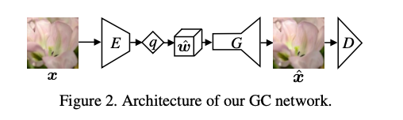
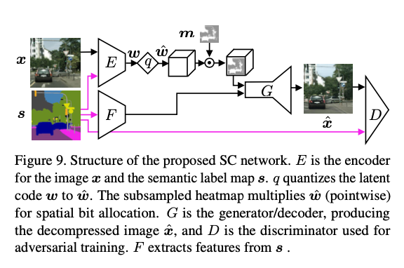

# Generative Adversarial Networks for Extreme Learned Image Compressiona

## Abstract

提出了一种基于对抗生成网络(GAN)可学习的极限压缩模型，在低比特率(bpp<0.1)时也能在视觉上获得令人满意的结果。极限压缩模型有两种方式，第一种称作生成压缩，第二种称作选择生成压缩，其中选择性压缩需要使用语义分割图。

## 生成压缩(Generative Compression, GC)

生成压缩模式下会保留整个图像的内容，生成不同规模的结构比如树上的树叶或者建筑物上的窗户，并且生成模式不需要语义图的参与，不论是训练还是实际的编解码过程。生成压缩模式典型用于带宽受限的情况下。

GC模式的基本结构和流程如下：    

流程：输入 → 编码器 → 量化 → 解码器 → 输出

结构：

- 编码器 c7s1=60，d120，d240，d480，d960，c3s1，C，q
- 解码器/生成器：c3s1-960,R960,R960,R960,R960,R960,R960,R960, R960,R960,u480,u240,u120,u60,c7s1-3

其具体的参数配置方式详见(Wang et al., 2018)[1]。量化器采用聚类量化方式，其中量化长度L=5，聚类中心为{-2，-1, 0, 1, 2}。对于编码最后一层bottleneck的通道数C可取2,4,8和16，其值越大，所对应的的bpp也越大，训练时默认C=8，相对应的bpp=0.08左右。

对于输入x编码和量化之后得到特征图 $\hat{w}$，此时有一个可选择的采样噪声特征图z(此特征图是由固定的先验分布比如高斯分布生成)与 $\hat{w}$ 相拼接，然后送入解码器/生成器生成重构图像。注意，此处的采样噪声时可选择的。

在训练模型时，都是由GAN模型训练方式，本文中一种是传统的训练方式，还有一种方式就是添加语义图作为额外信息送入判别器的方式。

## 选择生成压缩(Selective Generative Compression, SC)

选择生成压缩模式是当保留用户定义的具有高度细节的区域，由语义图来生成图像中不保留的那部分区域。SC模式可用于视频通话的场景，当视频流中需要完全保留人，而背景则可以合成。

选择生成模型的网络框架如下图所示：

其中图像编码器E(Image encoder)，语义图编码器(Semantic label map encoder)以及解码器(Generator/decoder)的具体结构如下：

- Encoder GC: c7s1-60, d120, d240, d480, d960, c3s1-C, q
- Encoders SC:
  -  Semantic label map encoder: c7s1-60, d120, d240, d480, d960
  - Image encoder: c7s1-60, d120, d240, d480, c3s1-C, q, c3s1-480, d960

The outputs of the semantic label map encoder and the image encoder are concatenated and fed to the generator/decoder.

- Generator/decoder: c3s1-960, R960, R960, R960, R960, R960, R960, R960, R960, R960, u480, u240, u120, u60, c7s1-3

对于SC模式，作者构建一个单通道的二值heatmap与量化后的特征图的空间尺寸(height与width)，其中0对应的区域应该完全合成，而1对应的区域则保留特征图中相应区域的内容。

然而对于压缩而言，要求完全合成的区域与原图的语义相同。假设语义s分别存储，将它们送入生成器之前先经过特征提取器F，为了由语义来引导网络，作者对失真d作mask操作，这样便可以只计算所保留区域的损失。而且，压缩后的特征图 $\hat{w}$ 中需要合成的区域的值置0。假设heatmap也被存储，那么只需要对 $\hat{w}$ 中需要保留的区域进行编码(指的是熵编码)，这样可以大大的减少需要存储的比特数。通常 $\hat{w}$ 的比特数要远大于存储语义与heatmap，这种方法在比特数上可以节省很多。

在训练时有两种模式：

1. Random Instance(RI)：在语义标签图中的实例随机选择25%，然后保存这部分；

2. Randim Box(RB)：随机均匀的选取一个图像位置然后一个随机维度的box；

RI模式适合大部分使用情况；而RB模式对生成器会造成更多具有挑战性的情形，因为它需要将所保存的box无缝的整合到生成的内容中。

### 训练细节

损失函数构成：

失真损失：MSE * 10

特征匹配损失：L_FM * 12

感知损失：L_VGG * 12

在OpenImages数据集上训练的后半部分(训练14W Iterations之后)，生成器/解码器的归一化(本方法使用的是Instance Normalization)操作固定，不进行参数更新，作者发现这样可以减少伪影和色差。

## 参考文献

- Ting-Chun Wang, Ming-Yu Liu, Jun-Yan Zhu, Andrew Tao, Jan Kautz, and Bryan Catanzaro. High resolution image synthesis and semantic manipulation with conditional gans. In IEEE Conference on Computer Vision and Pattern Recognition (CVPR), 2018.