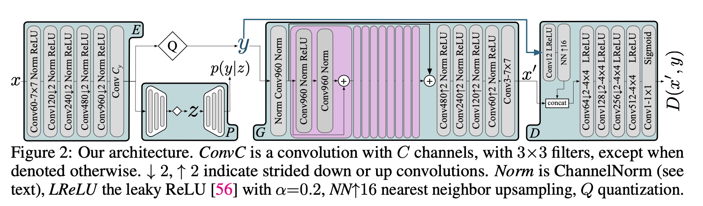
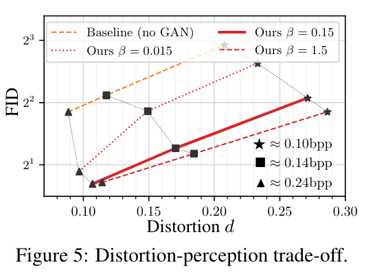
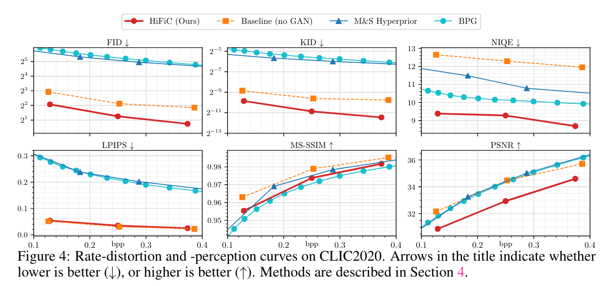
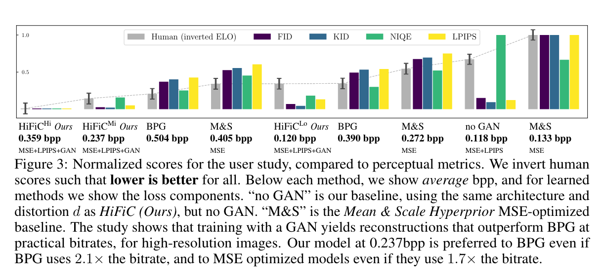

# High-Fidelity Generative Image Compression

重点关注归一化层、生成器和判别器架构、训练策略以及感知损失perceptual losses。

1. 视觉上重建效果更好，与原始输入图像更相似；
2. 适应的比特率范围更广；
3. 方法可以应用于高分辨率图像。

## 1. Introduction

传统图像压缩算法：

1. JPEG (Gregory K Wallace. The JPEG still picture compression standard. IEEE transactions on consumer electronics, 38(1):xviii–xxxiv, 1992.)
2. JPEG2000 (David S. Taubman and Michael W. Marcellin. JPEG 2000: Image Compression Fundamentals, Standards and Practice. Kluwer Academic Publishers, Norwell, MA, USA, 2001.)
3. WebP (WebP Image format. https://developers.google.com/speed/webp/.)

包括使用最新的视频压缩算法进行图像压缩：

- BPG (Fabrice Bellard. BPG Image format. https://bellard.org/bpg/.)

与此同时，基于深度学习图像有损压缩引起了人们的极大兴趣：

1. RNN (GeorgeToderici,SeanMO’Malley,SungJinHwang,DamienVincent,DavidMinnen,ShumeetBaluja, Michele Covell, and Rahul Sukthankar. Variable rate image compression with recurrent neural networks. arXiv preprint arXiv:1511.06085, 2015.)
2. Johannes Ballé, Valero Laparra, and Eero P Simoncelli. End-to-end optimized image compression. arXiv preprint arXiv:1611.01704, 2016.
3. Conditional probability models (Fabian Mentzer, Eirikur Agustsson, Michael Tschannen, Radu Timofte, and Luc Van Gool. Conditional probability models for deep image compression. In IEEE Conference on Computer Vision and Pattern Recognition (CVPR), 2018.)

其中神经网络直接对率失真权衡rate-distortion trade-off进行优化，效果更好led to new state-of-the-art。

然而，随着压缩比例的增高，这些方法会导致图像质量显著性的降低。经典算法会有特定于算法的伪影，如分块或带状blocking/banding，但基于学习的方法揭示了用于训练网络的失真度量的问题。distortion metric

尽管开发了大量的“感知度量”(例如，(多尺度)结构相似性指数((MS-)SSIM)[53，52]，学习感知图像块相似性(LPIPS)[57])，但是学习算法会掌握每个度量的弱点，例如，当以神经网络neural network derived metrics度量为目标时可能出现棋盘伪影，依赖MS-SSIM会导致较差的文本重构text reconstructions，而依赖MSE会产生模糊重构blurry reconstructions。

在[3]中，实现了用GAN来防止压缩伪影，该压缩模型的在极低的比特率(<0.08bpp)下生成了不错的重建图像。然而，重建图像往往只保留高级语义信息，与输入大不相同。

- [3] Eirikur Agustsson, Michael Tschannen, Fabian Mentzer, Radu Timofte, and Luc Van Gool. Generative adversarial networks for extreme learned image compression. In The IEEE International Conference on Computer Vision (ICCV), October 2019.

最近由Blau和Michaeli[9]的工作通过“rate-distortion-perception”权衡来描述这一现象，将“失真distortion”形式化为比较图像对的相似性度量，并将“感知质量perceptual quality”作为图像分布 $p_X$ 和解码器产生的重构图像分布 $p_{\hat{X}}$ 之间的距离来测量分布之间的距离。

**在固定压缩率的情况下，较好的感知质量总是意味着较差的失真。相反，仅将失真降到最低将会产生较差的感知质量**。通过最小化mismatch（输入和重建分布之间的mismatch）。虽然[9]给出了率失真感知权衡，但仅在toy数据集上进行了实证研究。

两项来自人类视觉系统(HVS) 领域的研究结论：

1. 人眼对纹理复杂区域的失真敏感度较低，对纹理平坦区域的失真敏感度较高；
2. 人眼对失真的敏感度受到背景亮度的刺激影响

本文贡献：

1. 生成式压缩方法，生成非常接近输入的高分辨率图像。在一项用户研究中，我们表明我们的方法在视觉上比以前的方法更受欢迎，即使压缩率比以前的方法高两倍。
2. 用FID[18]，KID[8]，NIQE[35]，LPIPS[57]和经典的失真度量PSNR，MS-SSIM对我们的方法进行了定量评估，并表明我们的结果与率失真感知理论是一致的。我们还证明，没有任何指标可以预测用户研究的完整排名，但FID和KID在指导探索方面很有用。考虑到这种包括无参考度量、成对相似性和分布相似性在内的各种感知度量的集成，以及来自不同网络架构的基于深度特征的度量，确保了稳健的感知评估。
3. 深入研究了所提出的体系结构及其组件，包括归一化层、生成器和鉴别器体系结构、训练策略以及感知度量和稳定性方面的损失。

## 2. Related work

Neural compression approaches directly optimize Shannon’s rate-distortion trade-off.

为了减少bitrate，使用各种方法来更准确的对auto-encoder latent自编码器隐空间的概率密度进行建模，以便更高效的进行算数编码（方法包括hierarchical priors，具有各种上下文形状的自动回归auto-regression with various context shapes）。

GAN 生成高分辨率图像：重要驱动因素包括训练数据的规模，模型规模的增大，网络架构的创新。以及新的normalization技术来稳定的训练。

除了条件生成之外，对抗性损失也推动了不同图像增强任务的进步，例如压缩伪影去除[15]、图像去噪[11]和图像超分辨率[25]。

此外，对抗性损失也被用来改善神经压缩系统的视觉质量[39，40，48，3，9]。

- [39]在他们的全分辨率压缩系统中将对抗性损失作为一个组成部分，但没有系统地消融和评估这种损失对其重建质量的好处。
- [40]提供了 GAN 鉴别器作为解码器的低分辨率压缩系统的概念验证实现，而[48，9]用概念上合理的方式将 GAN loss 合并到率失真目标中。
- [48]提出用分布约束来增强率失真目标，以确保重建的分布在所有比特率下都与输入分布匹配。
- [9]提出并研究了比特率、失真和分布匹配之间的三重权衡。
- 最后，[3]证明了在非常低的比特率下使用基于GAN的压缩系统可以比最先进的手工设计或基于学习的压缩算法节省2倍的比特率。

## 3. Method

### 3.1 Background

#### Conditional GANs

学习条件分布 $p_{X|S}$，每个数据点 $x$ 与附加条件 $s$ 相关联（比如分类标签或语义映射）。$x,s$ 通过未知的联合分布 $p_{X,S}$ 相关联。和标准的GAN一样，训练两个相互对抗的网络，生成器 $G$ 和判别器 $D$。生成器以 $s$ 为条件，将来自一个固定已知分布 $p_Y$ 的样本 $y$ 映射到 $p_{X|S}$；判别器将输入 $(x,s)$ 映射到来自 $p_{X|S}$ 样本而不是来自 $G$ 输出的概率。

固定 $s$，可以优化 “non-saturating” loss 非饱和损失：

$\mathcal L_G = \mathbb E_{y \sim p_y}[-\log(D(G(y,s),s)] $

$\mathcal L_D = \mathbb E_{y \sim p_y}[-\log(1-D(G(y,s),s)]+\mathbb E_{x\sim p_{X|s}}[-\log(D(x,s))]$

#### Neural Image Compression

神经网络图像压缩，基于学习的有损压缩是基于香农率失真理论。

通常使用一个由编码器 $E$ 和解码器 $G$ 组成的自动编码器来建模。对图像x编码得到量化隐空间 $y=E(x)$ ，解码得到有损重构 $x'=G(y)$，压缩产生失真 $d(x,x')$，如MSE。

中间只需存储 $y$，引入 $y$  的概率模型 $P$，使用 $P$ 和一个熵编码算法（如算数编码），使用bitrate $r(y)=-\log(P(y))$ 即可存储 $y$，（事实上熵编码器产生的比特开销可以忽略不计）。

将 $E,G,P$ 参数化为CNN，可以通过最小化**率失真trade-off**来联合训练，$\lambda$ 控制trade-off：

$\mathcal L_{EG}=\mathbb E_{x\sim p_X}[\lambda r(y)+d(x,x')]$

### 3.2 Formulation and Optimization

对于cGANs：$ y = E(x), s = y$，

除此之外，使用“perceptual distortion” $d_P=LPIPS$，使用基于VGG的loss帮助训练。我们将perceptual distortion和MSE失真结合起来，有：$d=k_MMSE+k_Pd_p$

$\mathcal L_{EGP}=\mathbb E_{x\sim p_X}[\lambda r(y)+d(x,x')-\beta\log(D(x',y))]$

$\mathcal L_D = \mathbb E_{x\sim p_X}[-\log(1-D(x',y)]+\mathbb E_{x\sim p_X}[-\log(D(x,y))]$

#### Constrained Rate

训练时，MSE, $d_P$ 和 $− log(D(x′))$ 都与比特率项 $r(y)$ 不一致，对于固定的 $\lambda$，不同的 $k_M,k_P,\beta$ 将产生不同比特率的模型，使得比较困难。因此引入超参数 “rate target” ：$r_t$，并且使用自适应项 $\lambda'$ 代替 $\lambda$，该自适应项使用两个超参数$\lambda^{(a)},\lambda^{(b)}$：$\lambda'=\lambda^{(a)}$ if $r(y)>r_t$， 否则$\lambda'=\lambda^{(b)}$

设置 $\lambda^{(a)} \gg \lambda^{(b)}$，使能学习到平均比特率接近 $r_t$ 的模型。

### 3.3 Architecture

包括encoder E, generator G, discriminator D 和 probability model P（hyper-prior model）。

其中概率模型 P，提取side information $z$ 来模拟 $y$ 的分布，在hyper-encoder中模拟均匀噪声 $\mathcal U(-\frac{1}{2},\frac{1}{2})$ 的量化，同时计算出 $p(y|z)$。

G：在将y送入G时，使用的是rounding而不是噪声。保证G在训练和推理时使用的是同样的quantization noise。

D：别人用的都是multi-scale patch-discriminator，我们只使用单尺度，用SpectralNorm代替InstaceNorm。

重点：将放大的y连接到D，将y作为D的condition。

## 4. Experiments

### Datasets

Kodak(24 images)，CLIC2020数据集(428 images)，DIV2k validation set (100 images)。

### Metrics

baseline：PSNR

perceptual distortions：LPIPS和MS-SSIM

perceptual quality：NIQE，FID和KID

### Model Variants and Baselines

Baseline：与HiFiC同样的架构，但是失真损失仅有 $d=k_M\text{MSE}+k_Pd_P$，而没有GAN损失。

M&S：Mean&Scale (M&S) Hyperprior，和我们的概率模型P有着相同的概率模型，MSE-trained network。本质是auto-encoder

### 实验结果

#### Distortion-perception trade-off

#### 率失真：

#### 感知质量：

## Conclusion

展示了如何优化GAN神经压缩网络，从而在视觉上产生接近输入的high perceptual fidelity的重建。

用不同的指标评估几种方法，同时用rate-distortion-perception理论作了解释。目前没有任何现有的指标能够完美地对任意模型进行排序，但是FID和KID可能会成为探索体系结构和其他设计选择的很有有价值的评价指标。

未来的工作重点是进一步研究感知得分指数和指标（以更好地预测人类偏好）

生成视频压缩是一个非常有趣的方向。为确保时间一致性，可借鉴增强平滑度的机制，例如，基于GAN的视频超分辨率模型。
