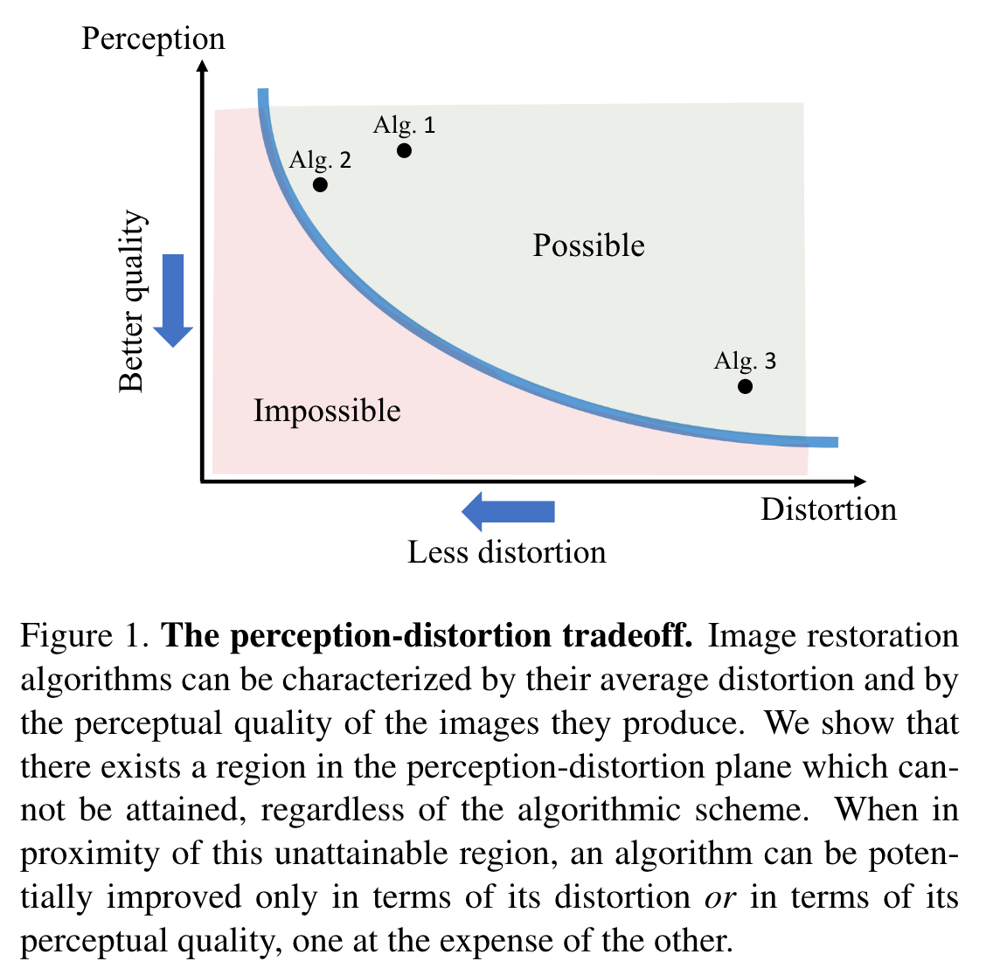
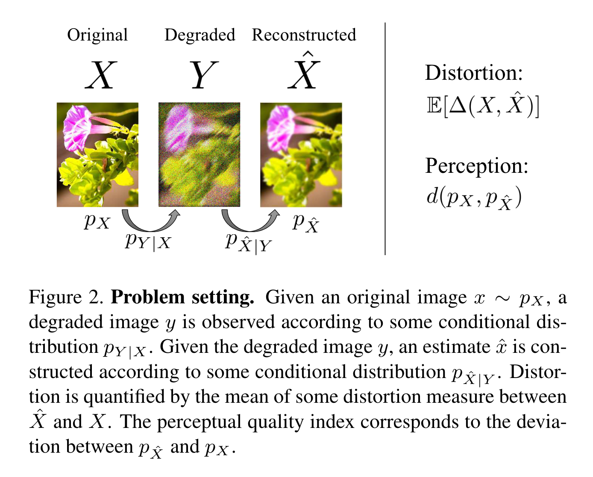
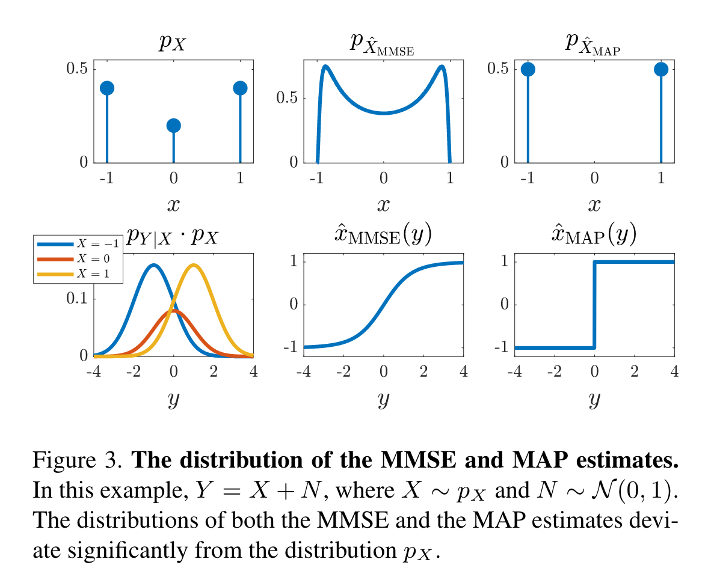
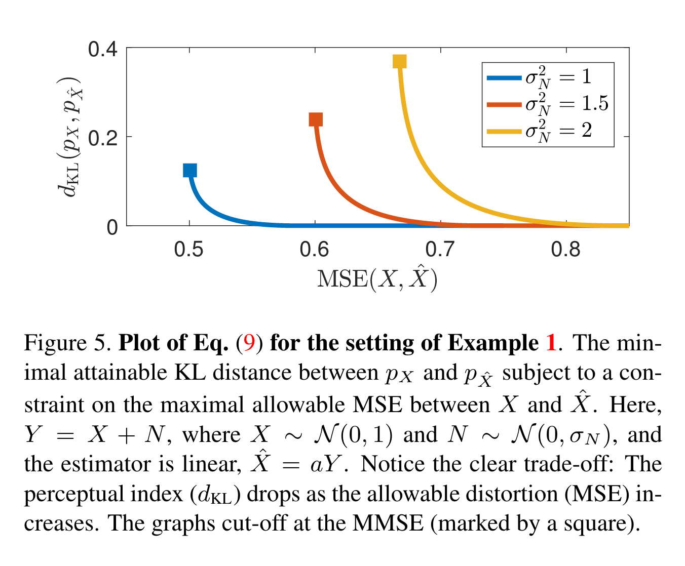
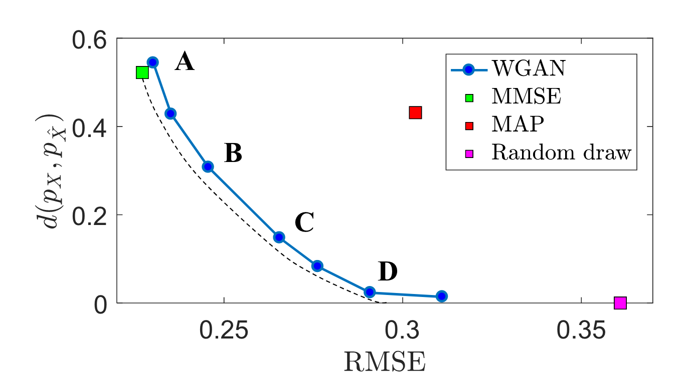
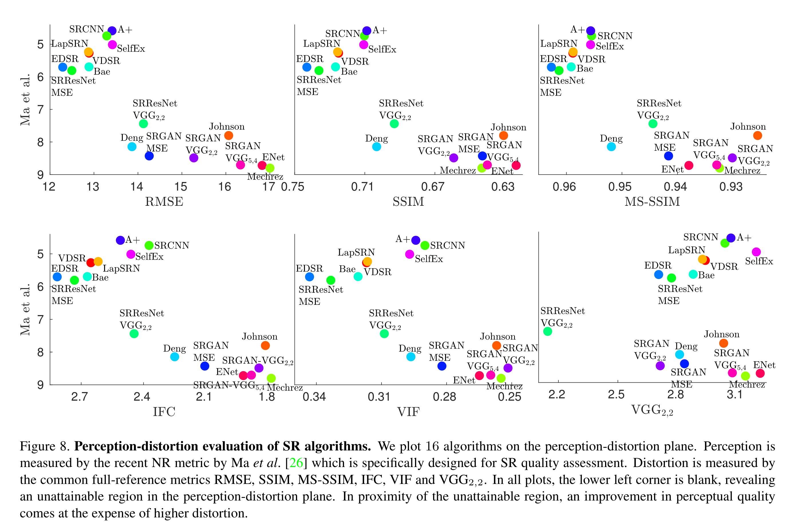
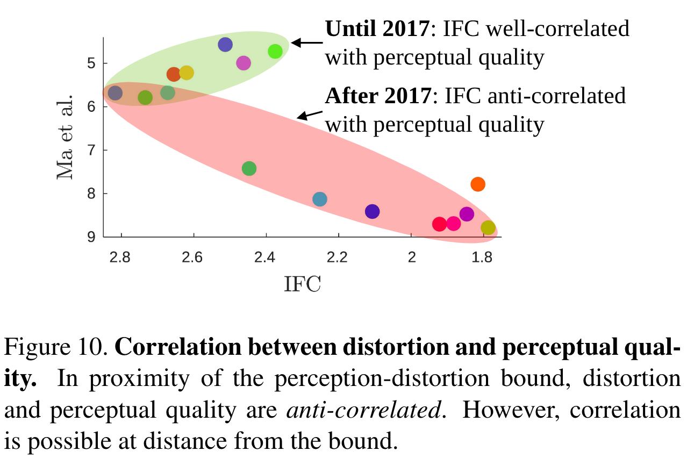

# The Perception-Distortion Tradeoff

论文主要说明感知质量和图像失真程度并不是完全对应的。基于深度网络的特征失真可能更好的表示图像感知质量的好坏，而使用GAN网络可以获得具有较好感知质量效果的图像。

超分问题中的loss分为以下几种：

- Distortion (fullreference) measures——指重建图像与原始图像之间的，重建图像的整体与参考图像越像，评价指标越高。以MSE为代表
- Perceptual quality（感知评判因子）——is the degree to which it looks like a natural image, and has nothing to do with its similarity to any reference image.
- Human opinion based quality assessment
- No-reference quality measures——No-reference quality measures are commonly based on estimating deviations from natural image statistics.，such as NIQE
- GAN-based image restoration——an adversarial loss，which minimizes some distance between the distribution of images produced by the generator and the distribution of images in the training dataset.（最小化了由生成器生成的图像的分布与训练数据集中的图像分布之间的一些距离。）

作者证明了perception和distortion之间存在下面这样的一条曲线，并且左下角的区域是任何算法都无法达到的。一些一味注重优化distortion的算法可能既不有效又损害视觉质量（在曲线的右上方区域），说明了GAN方法的有效性（去逼近这个bound）。对于不同的领域应该有不同的侧重点，比如对于医学领域可能会更注重distortion accuracy，即与原图像的接近程度。这个图像也指导给出了一个新的衡量算法的方法，将算法的表现绘制到该坐标轴上（同时考虑perceptual quality和distortion）。 

## 失真和感知质量

**distortion**：指的是重建图像 $\hat x$ 与原图像 $x$ 之间的不相似度。

失真用来衡量给定图像和参考图像之间的差异程度。在衡量distortion中使用的是full-reference方法，最常见的是MSE，但是与图像之间的语义相似性比较差。其他衡量失真的标准包括SSIM、MS-SSIM等，最近基于神经网络的距离误差可以捕获更多的语义信息，从而获得高质量的重建。 (IFC， VIF， VSNR， FSIM)

**perceptual quality**：仅指 $\hat x$ 的图像质量，与原图像无关。或者说是指 $\hat x$ 与真实图像的相似程度，实际上是与重建图像的分布和真实图像的分布的距离有关。

感知质量是使图像看起来和自然图像更像而不考虑其与参考图像之间的相似性。目前主要的评价方法包括基于人类评价的质量评估方法，无参评价方法（如KL散度，DIIVINE， BRISQUE， BLIINDS-II， NIQE等）和基于GAN网络的评价方法，这些方法基本都是利用统计学的知识进行评价。

## 问题定义

实际上自然图像可以看做是自然图像 $p(X)$ 的自然分布的一个实现，可以把失真后的图像 $y$ 看成是给定原图像 $x$ 在条件分布 $p(Y|X)$ 下产生的结果，失真后还原的图像$x’$ 可以看成 $y$ 在条件分布 $pX|Y$ 产生的结果。失真的公式可以表示如下： 
$$
E(\Delta(X,\hat X)) \tag{1}
$$
感知质量指标的表达式如下（值越低越好）： 
$$
d(p_X,p_{\hat X}) \tag{2}
$$
论文的目标是建立上面两个公式的平衡，首先说明为什么减少（1）不能必然导致较低的（2）。

这里论文主要使用了两种失真方式去衡量图像失真。一种是均方误差失真（MMSE），另外一种是0-1失真（MAP）。$x$ 的原始分布是 $\{-1,0,1\}$ 时，前者导致产生的结果是连续的，后者导致结果只有 $\{-1,1\}$。换言之就是失真评估的方法会使图像掉落自然分布的”流型“，从而使分布与原始图像不同。具体见下图所示： 

以MSE和MAP为例，说明了使用这两种方式进行复原的图像分布不一定等于原分布。虽然MAP在某些条件下 $p_{\hat X}=p_X$ 成立，但我们需要的是一个stable distribution peserving distortion measure， 即对每一个 $p_{X,Y}$ 都成立。作者证明了这样的衡量标准是不存在的， 并在附录中给出了相关证明。

**由于这样的stably distribution preserving的衡量方法并不存在，因此low distortion不一定会导致好的perception quality。**那么我们可以找到在某一个distortion level下的最佳perceptual quality吗？

## 感知-失真平衡

从上面可以看出低失真不一定能带来较好的感知质量，如何在给定失真的情况下得到最好的感知质量需要研究。信号恢复任务的感知-平衡函数由下式给出： 
$$
P(D)=\min_{P_{\hat X|Y}} d(p_X,p_{\hat X}),s.t.E[\Delta(X,\hat X)]\leq D \tag{3}
$$
distortion为MSE， $d(⋅,⋅)$ 为KL divergence

在这个曲线中，$D$ 增大， $P(D)$ 减小。曲线为convex并且对于更大的噪声现象更严重。

论文给了一个感知-失真平衡定理，即如果（2）中第二个参数是凸的（$d(p, λq_1 + (1 − λ)q_2) ≤ λd(p, q_1) + (1 − λ)d(p, q_2), ∀λ ∈ [0, 1]$），那么感知-失真平衡函数是：

1. 不单调增的；
2. 凸的。 

该定理不需要对失真度量进行假设，也就是对任意的感知-失真都存在这样的度量。虽然这并不意味着所有的失真都存在相同的感知-失真函数。

$P(D)$ 的凸特性说明其在低失真和高感知的情况下存在非常严重的平衡。例如低失真情况下略微的失真改善会导致感知质量大幅度下降，同理，高感知情况下略微的感知改善会导致失真大量增加。 

然后讨论了感知-失真和速率失真理论的联系。信号的率失真函数和互信息密切相关。当然率失真和要讨论的情况有一些不同。

### 通过GAN进行平衡

GAN损失函数定义为：
$$
\min_G \max_D \mathbb E_{X\sim p_{data}}[\log D(x)] + \mathbb E_{Z\sim p_{z}}[\log (1-D(G(z)))]
$$
可以通过GAN来设计接近感知-失真平衡曲线的估计器，实际上使用GAN方法就是一个systematic way来设计estimator逼近这个界限。具体可以通过修改损失函数得到：
$$
\ell_{gen}= \ell_{distortion} + \lambda\ell_{adv}\tag{4}
$$
第一项表示失真，第二项的生成器学习 $d(p_X,p_{\hat X})$，所以（4）式接近于学习目标：
$$
\ell_{gen}=E(\Delta(X,\hat X))+\lambda d(p_X,p_{\hat X})\tag{5}
$$
这里最小化（5）可以等效为最小化（3）,变化的 $λ$ 产生变化的 $D$，从而产生感知-失真函数的估计量。可以使用这种方法去获得感知-失真平衡，将 $λ$ 设定为[0,0.3]之间，改变参数可得到曲线，如下图所示： 

同样可以看出，失真函数使用MMSE比使用MAP在产生相同失真情况下，感知质量更好，同时也比Random draw的失真要小。

去噪WGAN estimator（D）与MAP estimator具有相同的失真，但具有更好的感知质量；与Random draw estimator有几乎相同的感知质量，但失真显著降低。

## 实用的评估算法

定义：如果算法A在失真和感知质量上优于算法B，则称算法A dominate算法B。（注意：如果无法同时在失真和感知质量上有较好的效果，那么算法A和算法B无法一方dominate另一方，认为它们具有同样好的效果）。 

定义：如果一个算法不被一组算法中的其他算法dominate，那么这个算法被认为是可以接受的。 

论文这里说明失真一般通过全参考（FR）方式来度量，包括（RMSE/SSIM/MS-SSIM/IFC/VIF/VGG2.2)等。为了评价图像的感知质量，这里采用了无参考（NR)指标。这里对16种SR算法从FR和NR进行评估，结果如下图所示： 

上图各部分都有共同的特点：

1. 左下方是空白的，这反映感知-失真平面中的不可到达区域。
2. NR和FR指标是负相关的，这反映感知-失真的平衡。虽然IFC和VIF相比于SSIM和MSE可以更好的捕获视觉质量，但是也存在这种平衡。VGG2.2的平衡现象比MSE略弱，说明其是一个相对更感知评价指标。从上图中还可以看出，从左到右失真增加，但是感知质量是提高的。 

当远离不可到达区域时，FR和感知质量可以达到正相关，接近不可达达区域时却不符合，FR此时不能用来衡量图像感知质量，而NR可以用来表示感知质量好坏。因此在评估时需要对FR和NR统一进行评估，兼顾失真和感知质量。具体如下图所示： 

在2017年之前，IFC指标可以很好的匹配感知质量，2017年以后就开始反相关。这篇论文说明了失真和感知质量之间存在矛盾，可以使用一对NR和FR指标进行评价比较。