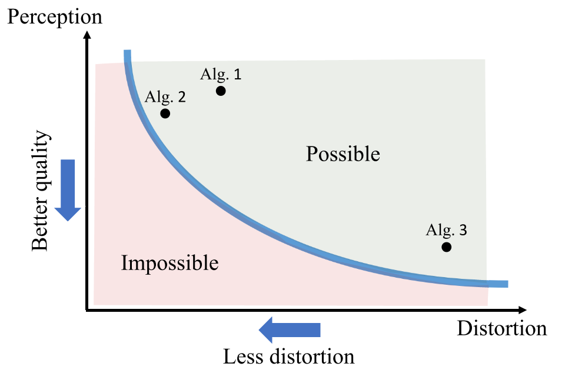
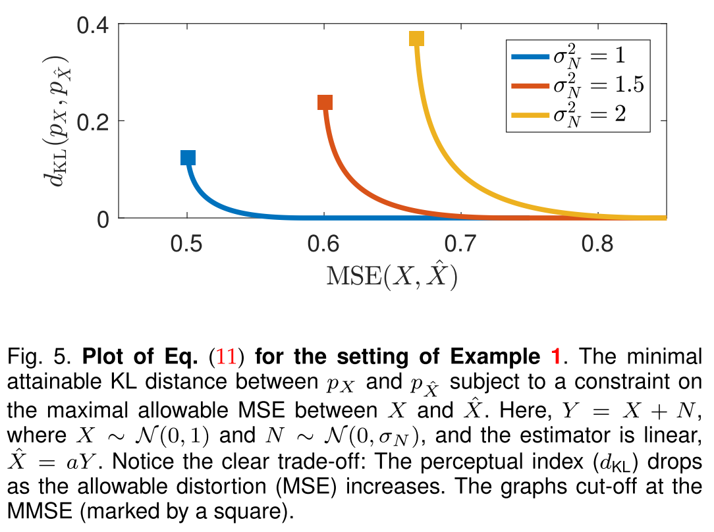
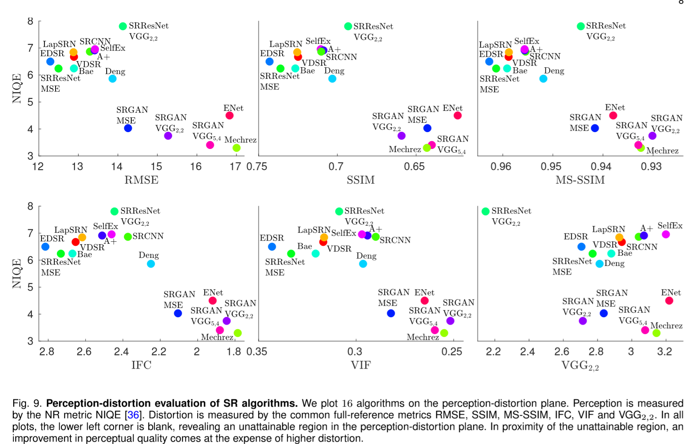

# The Perception-Distortion Tradeoff

Image restoration algorithms are typically evaluated by some distortion measure (e.g. PSNR, SSIM, IFC, VIF) or by human opinion scores that quantify perceived perceptual quality.

SR问题，对于算法的评估主要是分为两类，一类是是像素维度上的，对于MSE的优化，但这会导致过平滑、模糊等效应。而另外一类，就是基于人眼的直观感受，比如MOS tset、NIQE，图片更加的sharp，更加符合人眼的直观感受，更加的自然，但是会存在的问题，比如原来是直的线，会变成倾斜等。而这篇论文就是为了证明mathematically that distortion and perceptual quality are at odds with each other（就是MSE loss和感知损失是对立的）

The goal in image restoration is to estimate an image from its degraded version. Distortion refers to the dissimilarity between the reconstructed image and the original image. Perceptual quality, on the other hand, refers only to the visual quality of reconstructed image, regardless of its similarity to original image.

**Distortion**：指的是重建图像 $\hat{x}$ 与原图像 $x$ 之间的不相似度

**Perceptual quality** ：仅指 $\hat{x}$ 的图像质量，与原图像无关。或者说是指 $\hat{x}$ 与真实图像的相似程度，实际上是与重建图像的分布和真实图像的分布的距离有关。

超分问题中的loss分为以下几种：

- Distortion (full reference) measures：指重建图像与原始图像之间的，重建图像的整体与参考图像越像，评价指标越高。以MSE为代表，PSNR，MS-SSIM
- Perceptual quality（感知评判因子）：is the degree to which it looks like a natural image, and has nothing to do with its similarity to any reference image.
- Human opinion based quality assessment
- No-reference quality measures: No-reference quality measures are commonly based on estimating deviations from natural image statistics, such as NIQE
- GAN-based image restoration: an adversarial loss，which minimizes some distance between the distribution of images produced by the generator and the distribution of images in the training dataset.（最小化了由生成器生成的图像的分布与训练数据集中的图像分布之间的一些距离。）

作者证明了perception和distortion之间存在下面这样的一条曲线，并且左下角的区域是任何算法都无法达到的，一些一味注重优化distortion的算法可能既不有效又损害视觉质量（在曲线的右上方区域）

同时说明了GAN方法的有效性（去逼近这个bound）。对于不同的领域应该有不同的侧重点，比如对于医学领域可能会更注重distortion accuracy，即与原图像的接近程度。这个图像也指导给出了一个新的衡量算法的方法，将算法的表现绘制到该坐标轴上（同时考虑perceptual quality和distortion）

**问题定义**

首先证明了最小化平均 distortion 并不一定会导致 a low perceptual quality index。作者首先以MSE和MAP为例，说明了使用这两种方式进行复原的图像分布不一定等于原分布。虽然 MAP 在某些条件下 $p_{\hat{x}} = p_x$ 成立，但我们需要的是一个 stable distribution peserving distortion measure， 即对每一个 $p_{x,y}$ 都成立。作者证明了这样的衡量标准是不存在的， 并在附录中给出了相关证明。

**由于这样的 stably distribution preserving 的衡量方法并不存在，因此 low distortion 不一定会导致好的 perception quality。** 那么我们可以找到在某一个 distortion level 下的最佳 perceptual quality 吗？

这样的任务可以被定义为：

$P(D) = min_{p_{\hat{x}|y}} d(p_x,p_{\hat{x}}), s.t. E[\Delta(x,\hat{x})] \leq{D}$

作者以选择了distortion为MSE，$d(\cdot,\cdot)$ 为KL divergence为例子，进行了实验，绘制除了下面这样的曲线。在这个曲线中，$D$ 增大，$P(D)$ 减小。曲线为convex并且对于更大的噪声现象更严重。

作者指出虽然这个任务很难进行分析，但上面例子的现象普遍存在，并在附录中给出了一定的证明。并且不是所有的distortion measure都有相同的tradeoff function。对于一些捕捉了图像间语义关系的衡量方法，这个现象是less severe的。

**定理**：如果 $d(p,q)$ 对于他的第二个参数是convex的(对任意的 $𝑝,q1,q2,\lambda \in[0,1]$ 有 $d(p,\lambda q1+(1−\lambda)q2)≤\lambda d(p,q1)+(1−\lambda)d(p,q2))$， 那么 $P(D)$ 是monotonically non-increasing且convex的。这条定理中的假设 $d(p,q)$ 是convex的条件并不是非常严苛，即使没有这个条件 $P(D)$ 也是monotonically non-increasing的。

那么如何可以使一个算法逼近这个界限呢？

我们定义图像复原任务中可以达到的最小的distortion为 $D_{min}=min_{p_{\hat{X}|Y}}E[\Delta(X,\hat{X})]$，此时的estimator一般都是非distribution preserving的。于是作者考虑当estimator有最佳的视觉质量时可以达到的最小的distortion，将其定义为 $D_{max}=min_{p_{\hat{x}|y}}E[\Delta(X,\hat{X})] s.t.p_{\hat{X}}=p_X$ ，作者证明，**存在下面一条定理：**

对于 MSE $\Delta(𝑋,\hat{X})=||\hat{X}−𝑋||^2, D_{max}≤2D_{min}$。也就是说对于MSE来说，最多只需要牺牲3dB的PSNR来达到最佳的视觉效果。

实际上使用 GAN 方法就是一个 systematic way 来设计 estimator 逼近这个界限。如果将 GAN 中生成器的loss改为 $l_{gen}=l_{distortion}+\lambda l_{adv}$。由于 $l_{adv}$ 是与 $d(p_x,p_{\hat{x}})$ 成比例的， 所以实际上$l_{gen} \approx E[\Delta(x,\hat{x})]+\lambda d(p_x,p_{\hat{x}})$，将$\lambda$ 视为拉格朗日算子，那么最小化 $l_{gen}$ 就相当于最小化了 $D$，调整 $l_{gen}$ 也调整了 $D$，从而是在perception-distortion曲线上产生estimator。

基于以上的发现，**作者提出评价一个图像复原算法的新的标准，也就是考虑算法在perception-distortion曲线中的位置**。当算法A比算法B有更好的视觉质量且更少的distortion时，称算法A dominate B。当一组算法中没有算法dominate算法A时，称A为这组算法中可接受的算法。

作者在实验中选择了no-reference的方法NIQE来衡量图像的视觉质量，考虑了五种FR metrics来评价distortion（RMSE，SSIM，MS-SSIM，IFC，VIF），再加上一个 $VGG_{2,2}$，将一些目前SR领域常用的算法绘制到perception-distortion plane上。结果如下：

**得到了以下一些结论：**

* 左下角都是不可达的
* 在接近左下角不可达的区域，NR和FR metrics都是anti-correlated的，这表明了perception和distortion之间存在一个tradeoff。这个tradeoff即使在一些能捕捉视觉质量的评价标准中也存在。
* 通过计算FR和NR与human opinion score的相关性。FR在远离不可达区域时与视觉质量有较好的相关性， NR方法则总是有较好的相关性。SRGAN在perceptual quality方面是最好的。

作者认为，在图像复原类算法中都应该同时用一对FR和NR方法，既保证perceptual quality又保证distortion。
