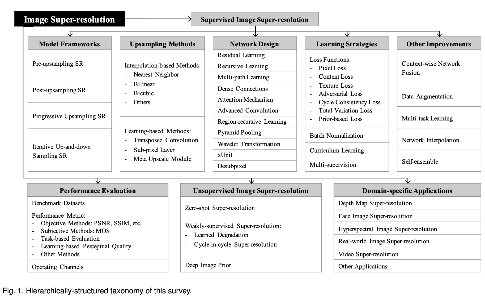
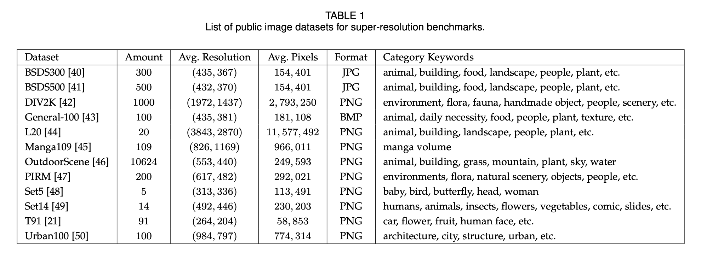
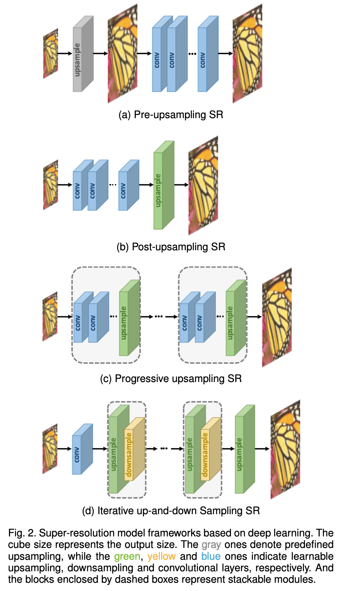
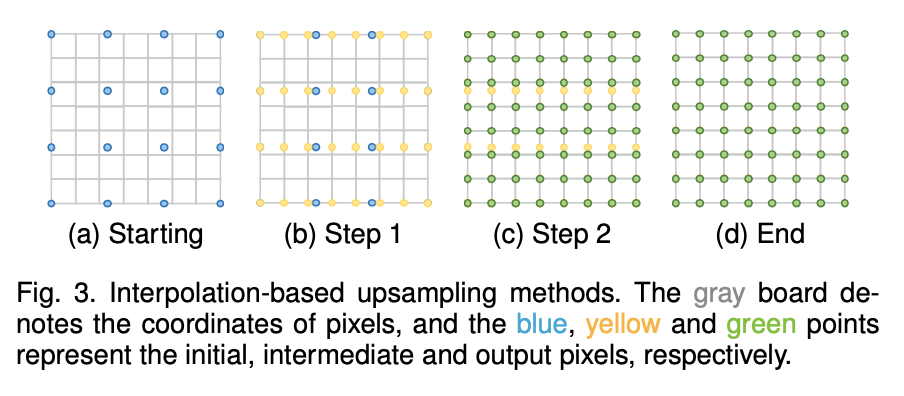
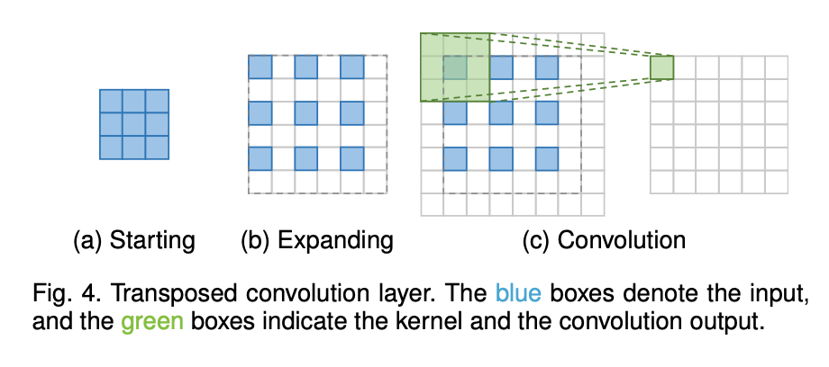
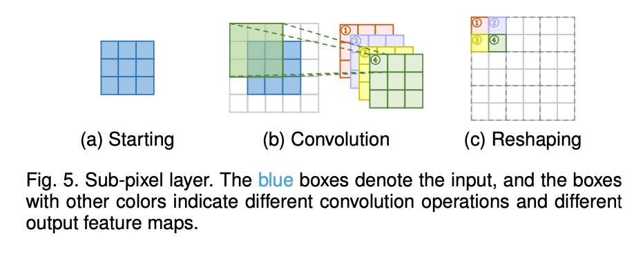
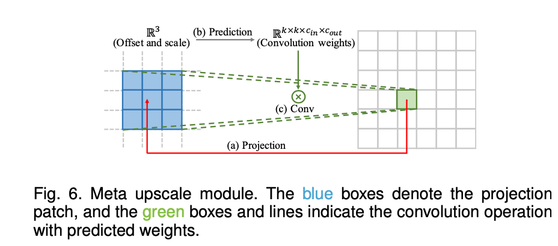
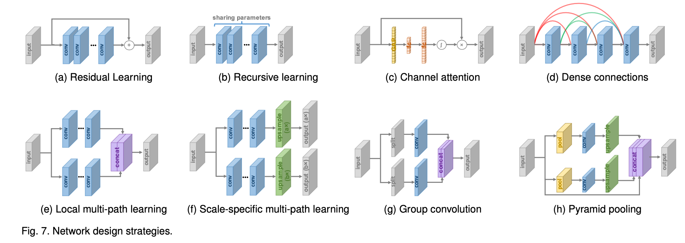
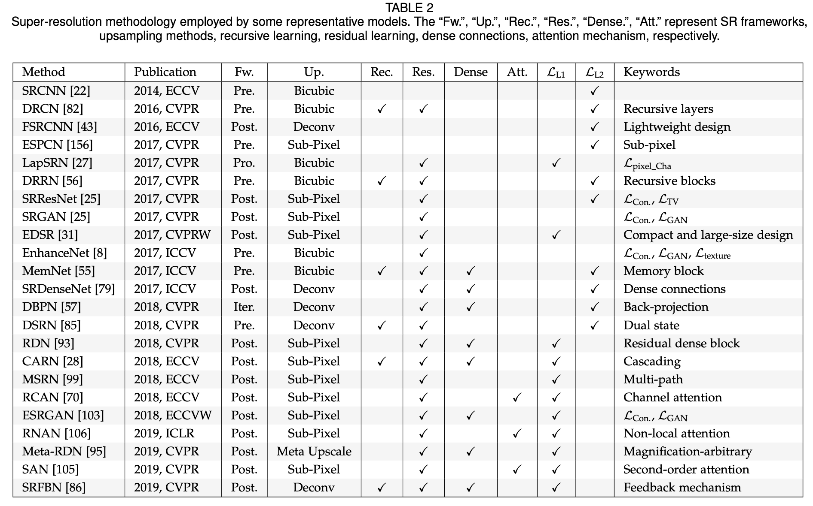
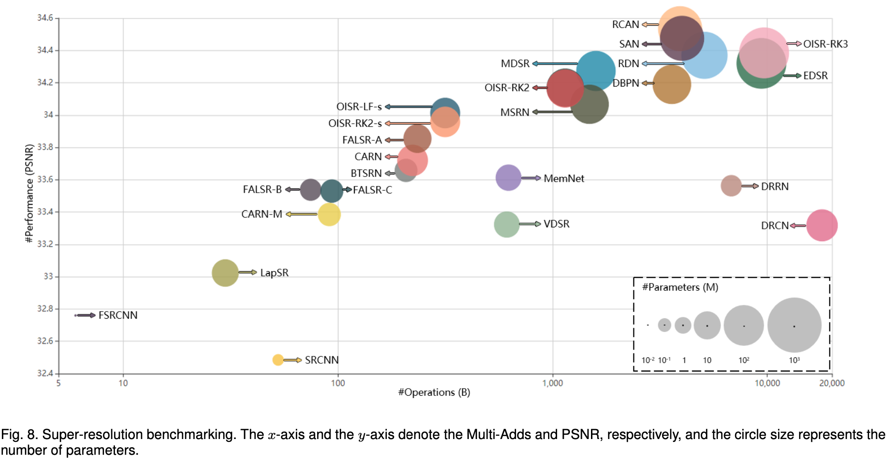

# 图像超分综述

[TPAMI 2020] Deep Learning for Image Super-resolution: A Survey

## Abstract

全面综述基于深度学习算法的图像超分辨率研究的最新进展，将现有的超分算法大致分为三大类：

1. 有监督SR
2. 无监督SR
3. 特定领域的SR(domain-specific SR)

此外，讨论公开可用的基准数据集和性能评估指标。

最后，总结了几个未来的方向和进一步需要解决的问题。

## 1. Introduction

天生不适定，可以有好多HR图像对应一张LR图像。

经典的传统观念超分算法：prediction-based methods ([10], [11], [12]), edge-based methods ([13], [14]), statistical methods ([15], [16]), patch-based methods ()[13], [17], [18], [19]),  sparserepresentation methods ([20], [21])等。

目前深度学习SR算法主要不同：

1. 不同的网络架构
2. 不同的Loss Fuction
3. 不同的Learning principles和strategies

不同于以往的超分综述，该篇仅关注深度学习超分方法，以独特的基于深度学习的视角，系统全面地回顾超分算法的最新进展。

### Contributions：

1. 全面回顾了基于深度学习的图像超分算法，包括problem settings, benchmark datasets, 性能度量标准，深度学习超分方法系列，特定领域的超分应用。
2. 以分层和结构化（hierarchical and structural manner）的方式，系统地展示了基于深度学习的超分算法的最新进展，并且总结了每个组件的优势和局限性。
3. 讨论挑战和有待解决的问题，找出新趋势和未来方向，提供有洞察力的指导。

### 分类Taxonomy

Learning-based Methods:

1. Transposed Convolution
2. Sub-pixel Layer
3. Meta Upscale Module

* **Section2: problem definition, mainstream datasets and evaluation metircs**
* **Section3: main components of supervised SR modularly**
* **Section4: unsupervised SR**
* **Section5: popular domain-specific SR applications**
* **Section6: future directions and open issues**

## 2. Problem Setting and Terminology

LR images: $I_x = \mathcal{D}(I_y; \delta)$

$I_y$表示对应的HR图像，$\mathcal{D}$表示degradation退化函数，$\delta$表示退化过程，例如scaling factor或noise。

Blind SR：即只有LR图像，不知道退化过程是怎样的。

预测HR：$\hat{I_y} = \mathcal{F}(I_x; \theta)$，尽可能接近真实HR：$I_y$。

其中$\mathcal{F}$为超分模型，$\theta$为超分模型的参数。

由于退化过程未知，大多数研究直接将退化看作一个单纯的下采样过程：$\mathcal{D}(I_y; \theta) = (I_y), \downarrow_s, {s}\subset\theta$

$\downarrow_s$下采样，scaling factor $s$，大多数数据集使用的是bicubic interpolation下采样方法，另外也有一些其他退化方法：$\mathcal{D}(I_y,\delta) = (I_y\otimes \kappa)\downarrow_s + \mathcal{n}_\varsigma, \left\{\kappa, s, \varsigma \right\}\subset \delta$

其中$I_y\otimes \kappa$表示blue kernel $\kappa$ 和HR图像 $I_y$ 之间的卷积操作，$\mathcal{n}_\varsigma$ 是附加的高斯白噪声，其标准差为 $\varsigma$。

SR的目标：$\hat{\theta}=\mathop{\arg\min}\limits_\theta \mathcal L(\hat{I}_y,I_y)+\lambda \Phi(\theta)$

$\mathcal L(\hat{I}_y,I_y)$ 表示生成的HR图像 $\hat{I}_y$ 和GT图像 $I_y$ 之间的损失函数，$\Phi(\theta)$ 是正则化项，$\lambda$ 是权衡参数。

SR最常用的损失函数是像素均方误差（即像素损失），但更强大的模型倾向于使用多个损失函数的组合。

### 超分数据集

除此之外，还有许多其他视觉任务的数据集，如ImageNet，MS-COCO，VOC2020，CelebA。

结合使用多个数据集，如结合 T91和 BSDS300，结合 DIV2K 和 Flickr2K。

### 图像质量评估

#### PSNR

#### SSIM

#### MOS

Mean opinion score，主观IQA方法，要求人类评分员为测试图像打出感知质量分数。通常，分数从1分（差）到5分（好）。最终MOS计算为所有评级的算术平均值。

虽然MOS测试看起来是一种可靠的IQA方法，但它存在一些固有的缺陷，如非线性感知尺度、偏差和评级标准的差异。实际上，有些SR模型在普通IQA指标（如PSNR）中表现不佳，但在感知质量方面远远超过其他模型，在这种情况下，MOS测试是准确测量感知质量的最可靠IQA方法[8]、[25]、[46]、[62]、[63]、[64]、[65]。

#### Learning-based Perceptual Quality

为了更好地评估图像感知质量，同时减少人工干预，研究人员试图通过在大型数据集上学习来评估感知质量。

- Ma提出无参考Ma，Talebi提出无参考NIMA。从视觉感知分数中学习的，直接预测质量分数，而无需GT真实图像。
- Kim提出DeepQA，通过训练三组扭曲图像、客观误差图和主观分数来预测图像的视觉相似性。
- Zhang收集了一个大规模的感知相似度数据集，通过训练的深度网络根据深度特征的差异来评估感知图像块相似性（LPIPS），并表明CNN学习的深度特征对感知相似性的建模要比没有CNN的度量好得多。

虽然这些方法在捕获人类视觉感知方面性能更好，但我们需要什么样的感知质量（例如，更真实的图像，或与原始图像一致的特点）仍然是一个有待探索的问题，因此客观IQA方法（例如，PSNR、SSIM）仍然是当前的主流。

#### 面向任务Task-based Evaluation

通过其他任务评估重建性能是另一种有效的方法。比如，将原始和重建的HR图像输入训练模型，并通过比较对预测性能的影响来评估重建质量，这些任务可以是对象识别、人脸识别、人脸对齐和解析等。

#### 其他

多尺度结构相似性（MS-SSIM）比单尺度结构相似性（SSIM）在观察条件变化时更灵活。

特征相似性（FSIM）基于相位一致性和图像梯度大小提取人类感兴趣的特征点，以评估图像质量。自然图像质量评估器（NIQE）利用自然图像中观察到的统计规律的可测量偏差，而不关注失真图像。

信息保真度准则(IFC)、视觉信息保真度(VIF)

- Blau等人[77]从数学上证明了失真（例如，PSNR、SSIM）和感知质量（例如，MOS）是相互矛盾的，并表明随着失真的减少，感知质量必然会变差。因此，如何准确地测量SR质量仍然是一个亟待解决的问题。

### 超分竞赛

#### NTIRE

The New Trends in Image Restoration and Enhancement，CVPR workshop。包括超分，去噪和着色。对于图像SR，NTIRE竞赛提出DIV2K[42]数据集，由双三次降采样赛道和具有真实未知退化的盲超分赛道组成。

#### PIRM

The Perceptual Image Restoration and Manipulation，ECCV workshop。其中一个赛道在生成准确性和感知质量之间trade-off。以失真为目标的模型通常视觉上效果不好，而以感知质量为目标的模型在信息保真度方面表现不佳。PIRM根据均方根误差（RMSE）阈值将感知失真平面划分为三个区域。在每个区域中，获胜的算法都达到了以NIQE[76]和Ma[66]评估的最佳感知质量[77]。

在另一个子挑战[81]中，赛道关注在智能手机上超分，要求参与者使用有限的智能手机硬件（包括CPU、GPU、RAM等）执行SR，评估方法包括PSNR、MS-SSIM和MOS测试。通过这种方式，PIRM鼓励对感知-失真权衡进行高级研究，并推动智能手机上的轻量级高效图像增强。

## 3. 有监督超分

虽然不同的网络差别很大，但是大多都是几种必要组件的结合。基于模块分析超分网络基本组件，例如模型框架、上采样方法、网络设计和学习策略。我们重点关注模块分析，总结他们的优势和不足，而不是单独的介绍某个模型。

### 3.1 网络框架

由于超分ill-posed问题，因此如何上采样是一个关键问题。基于所采用的上采样操作及其在模型中的位置将这些超分算法分为四种。

#### 3.1.1 前置上采样超分

由于难以直接学习低维空间到高维空间的映射，因此pre型方法使用传统的上采样算法获得高分辨率图像，然后使用深度神经网络对其细化。

- Dong，SRCNN学习从LR图像到HR图像的端到端映射。用传统方法（如bicubic）对低分辨率图像做上采样操作，使上采样后的coarse HR图像尺寸与高分辨率相同，再通过神经网络优化重建高质量的细节，对coarse HR图像精细化处理，极大地降低了学习难度。

优点：通过传统算法进行上采样，神经网络只需要对coarse HR图像进行精细化处理，大大降低了学习难度。可以将任意大小的插值处理后的图像作为输入，效果与单尺度模型相当。

预先上采样方法的副作用：噪声放大、模糊、在高维空间计算造成的时间和空间成本大。由于这里没有使用转置卷积，checkerboard artifacts可能会被绕过。

#### 3.1.2 后置上采样超分

为了提高计算效率，充分利用深度学习技术自动提高分辨率，研究人员尝试在低维空间进行大多数的运算，用模型末尾的端到端可学习层替换预定义的上采样。

该做法的好处是，由于具有巨大计算成本的特征提取过程仅发生在低维空间中，大大降低了计算量和空间复杂度，该框架也已成为最主流的框架之一，在近年的模型中被广泛应用。

#### 3.1.3 渐进上采样超分

虽然后上采样超分框架极大地降低了计算成本，但它仍然存在一些不足。一方面，上采样仅在一个步骤中执行，对于比例因子较大的情况（4倍、8倍超分），使用Post-upsampling SR方法有较大的学习难度；另一方面，每个比例因子需要训练一个单独的SR模型，该模型不能满足多尺度SR的需要。

为了解决这些缺点，LapSRN[27]采用渐进式上采样框架。该模型基于CNN级联，并逐步重建更高分辨率的图像。在每个阶段，图像被上采样到更高的分辨率，并通过CNN进行细化。其他工作如MS LapSRN[65]和progressive SR（ProSR）[32]也采用了该框架，并实现了相对较高的性能。与Lap-SRN和MS-LapSRN使用中间重建图像作为后续模块的“基础图像”不同，ProSR保留了主要信息流，并使用 individual heads重建中间分辨率图像。

通过将一个困难的任务分解为简单的任务，该框架下的模型大大降低了学习难度，特别是在大比例因子的情况下，能够达到较好的学习效果。然而，这类模型也存在着模型设计复杂、训练稳定性差等问题，需要更多的建模指导和更先进的训练策略。

#### 3.1.4 迭代上下采样超分

为了更好地捕捉LR-HR图像对的相互依赖关系，在SR中引入了一种高效的迭代过程，称为反投影。迭代上下采样SR，尝试迭代地应用反投影细化，即计算重建误差，然后将其融合回去以调整HR图像强度。

- Haris等人[57]利用迭代上下采样层并提出DBPN，它交替连接上采样层和下采样层，并使用所有中间重建来重建最终HR结果。
- SRFBN[86]采用了更多dense skip connections的迭代上下采样反馈块，能够学习到更好的表示。
- RBPN[87]在视频超分辨率中，从连续视频帧中提取上下文，并通过反投影模块组合这些上下文以产生循环输出帧。

该框架下的模型能够更好地挖掘LR-HR图像对之间的深层关系，从而提供更高质量的重建结果。然而，反投影模块的设计标准仍不清楚。由于这一机制刚刚被引入到基于深度学习的SR中，因此该框架具有很大的潜力，需要进一步探索。

### 3.2 上采样方法

#### 3.2.1 基于插值的上采样

图像插值，也称为图像缩放，指的是调整数字图像的尺寸大小，被图像相关应用广泛使用。传统的插值方法包括最近邻插值、双线性和双三次插值、Sinc和Lanczos重采样等。由于这些方法易于解释和实现，其中一些方法仍然广泛应用于基于CNN的SR模型中。

##### 最邻近插值

Nearest-neighbor，为要插值的每个位置选择最近的像素值，而不考虑任何其他像素。速度快，但质量低，blocky块伪影。

##### 双线性插值

Bilinear Interpolation，在图像的一个轴上执行线性插值，然后在另一个轴上执行线性插值。保持速度较快的同时，性能比最近邻插值好得多。感受野为2 × 2。

##### 双三次插值

双三次插值对图像的两个维度进行三次插值，需要4 × 4的像素进行计算，计算速度慢，效果更平滑，伪影更少。**anti-aliasing的双三次插值是目前构造SR数据集的主流方法。**

基于插值的上采样方法只能通过图像的本身内容提高图像的分辨率，并没有带来更多信息，相反还有噪声放大、计算复杂度增加、结果模糊等副作用。

#### 3.2.2 基于学习的上采样

##### 转置卷积

与正常卷积相反的变换，通过插入零值，进行卷积来提高图像的分辨率。由于转置卷积在保持与卷积兼容的连接模式的同时以端到端的方式放大了图像大小，因此它被广泛用作SR模型的上采样层。

操作分为两步，首先对输入图像进行插值（零）使图像尺寸放大，然后对放大后的图像进行卷积操作。以上图为例，输入图像尺寸为3 × 3，对图像进行补零操作后，尺寸变为6 × 6，对该图像进行卷积处理，就能得到尺寸为6 × 6的目标图像，也就实现了二倍上采样。转置卷积的缺点是容易在每个轴上引起“不均匀重叠”，产生棋盘格现象。

##### 亚像素层

端到端可学习的上采样层，通过卷积生成多个通道，然后对其进行整形，来执行上采样。亚像素卷积的原理如图所示，首先对输入图像做卷积处理，生成 $s^2$ 个特征图（s为上采样因子），然后对 $s^2$ 个特征图做reshape操作，得到目标图像（reshape方法即shuffle）。在这种情况下，感受野可达3 × 3。

与转置卷积层相比，**亚像素层具有更大的感受野，它提供了更多的上下文信息以帮助生成更多逼真的细节。**然而，由于感受野的分布是不均匀的，并且块状区域实际上共享相同的感受野，因此可能会导致在不同块的边界附近出现一些伪影。另一方面，独立预测块状区域中的相邻像素可能会导致输出不平滑。因此，Gao等人[94]提出了PixelTCL，它将独立预测替换为相互依赖的顺序预测，并产生更平滑、更一致的结果。

##### Meta upscale module

以前的方法需要预先定义缩放因子，即针对不同的因子训练不同的上采样模块，效率低下，而且不符合实际需求。

- Hu等人[95]提出了meta upscale module，首先基于元学习解决任意比例因子的SR。

对于HR图像上的每个目标位置，该模块将其投影到LR特征图上的一个小块（$k×k×c_{in}$），根据投影偏移和稠密层的缩放因子预测卷积权重（$k×k×c_{in}×c_{out}$），并执行卷积。

这样，meta upscale module可以通过单个模型以任意因子连续放大。由于大量的训练数据（同时训练多个因子），该模块可以在固定因子上表现出相当甚至更好的性能。尽管需要在推理过程中预测权重，但上采样模块的执行时间仅占特征提取时间的1%左右[95]。然而，该方法基于与图像内容无关的多个值预测每个目标像素的大量卷积权重，因此当放大率较大时，预测结果可能不稳定且效率较低。

如今，这些基于学习的上采样层已成为应用最广泛的上采样方法，特别是在后置上采样框架中，这些层通常用于最终上采样阶段，基于在低维空间中提取的高层表示来重构HR图像，从而实现端到端SR，同时避免在高维空间中进行过复杂操作。

### 3.3 网络设计

除了经典的2D卷积，网络中还可以使用一些有趣的变体来改进结果。Dilated卷积可以提供更有效的感受野，因此可以使用长距离依赖的信息。Skip connections、Spatial Pyramid Pooling和Dense Blocks推动了低级特征和高级特征的结合，以提高性能。

#### 3.3.1 残差学习

在何恺明提出ResNet学习残差而不是全部映射之前，残差学习已广泛应用于SR模型。残差学习大致可分为全局残差学习和局部残差学习。

##### 全局残差学习

由于图像SR是一种图像到图像的转换任务，其中输入图像与目标图像高度相关，因此可以只学习LR图像和HR图像之间的残差，这就是全局残差学习。在这种情况下，可以避免学习从一个完整图像到另一个图像的复杂变换，而只需要学习一个残差图来恢复丢失的高频细节。由于大部分区域的残差接近于零，模型的复杂度和学习难度大大降低。

##### 局部残差学习

类似于ResNet中的残差学习，shortcut连接可以用于缓解网络深度不断增加所带来的模型退化问题，降低了训练难度，被广泛应用在超分任务中。

实际上，残差学习都是由shortcut connections和逐像素加法实现，前者连接输入与输出，后者在不同网络层之间进行连接。

#### 3.3.2 递归学习

为了在不引入过多参数的情况下实现更大的感受野和学习到更高级的特征，递归学习（即以递归方式多次应用相同模块）被应用到超分任务中，如图所示。

- 16个循环的DRCN采用单卷积层递归，感受野达到41×41，远大于SRCNN的13×13，并且没有过多参数。

- DRRN将残差块作为递归单元进行25次递归，性能优于17个残差块的非递归基线。

- 后来Tai等人[55]提出了基于记忆块的MemNet，记忆块由6个递归残差块组成，每个递归的输出连接起来，再经过一个额外的1×1卷积进行记忆和遗忘。
- CARN也采用了包含多个残差块的递归单元。
- 最近Li等[86]采用迭代上下采样SR框架，提出了一种基于递归学习的反馈网络，整个网络的权值在所有递归中共享。

此外，研究人员还在不同的部分使用不同的递归模块。

- Han等[85]提出了双状态递归网络（dual-state network, DSRN），用于交换HR状态和LR状态之间的信号。在每个时间步骤（即递归），根据当前LR状态和HR状态更新LR状态，然后将其传输到HR状态进行更新。通过双态递归学习(最多7次递归)，更好地探索了LR-HR图像对之间的深层关系。
- Lai等人[65]不仅将卷积层作为递归层，还将特征嵌入模块、特征上采样模块和图像上采样模块作为递归模块，对每个子问题共享参数，从而大大减少了模型大小，但性能损失很小。

**递归学习使得参数的数量大大减少，但带来了梯度消失和梯度爆炸的问题。因此通常将残差学习和递归学习结合来缓解这些问题。**

#### 3.3.3 多路径学习

多路径学习是指通过模型的多个路径传递特性，这些路径执行不同的操作，以提供更好的建模能力。多路径学习分为三种类型：全局、局部和特定尺度的多路径学习。

##### Global Multi-path Learning

全局多路径学习是指利用多个路径提取图像不同方面的特征。这些路径在传播过程中可以相互交叉，从而大大提高了特征提取的能力。

- LapSRN包含一种从粗到细预测sub-band residuals残差的特征提取路径，以及一种基于两种路径信息重构可见HR图像的图像重建路径。
- 同样，DSRN利用LR路径和HR路径分别在低维空间和高维空间中提取信息。这两条路径不断交换信息，进一步提高学习能力。
- pixel recursive super-resolution [64] 使用条件路径捕获图像的全局结构，使用先验路径捕获生成像素的序列相关性。
- Ren等人[100]用具有不平衡结构的多条路径来执行上采样，并在模型末尾对其进行融合。

##### Local Multi-path Learning

- 受Inception启发，MSRN使用了一种新的多尺度特征提取块，如上图所示，在该块中，采用核大小为3×3和5×5的两个卷积运算同时提取特征，然后将输出串接起来，再次进行相同的运算，最后再进行一个额外的1×1卷积。通过逐元素加法 shortcut connect 输出和输入。通过这种局部多路径学习，SR模型可以更好地从多个尺度提取图像特征，进一步提高性能。

##### Scale-specific Multi-path Learning

- 考虑到不同scale要经历相同的特征提取过程，Lim等人[31]提出了scale特定的多路径学习，来处理单一网络下的multi-scaleSR问题。他们共享模型的主要组件（即特征提取的中间层），并分别在网络的开始和结束处附加特定scale的预处理路径和上采样路径（如图7f所示）。在训练期间，仅启用和更新与选定scale相对应的路径。通过这种方式，MDSR[31]通过共享不同scale的大部分参数，大大减小了模型尺寸，并表现出与单scale模型相当的性能。CARN[28]和ProSR[32]也采用了类似的特定scale的多路径学习。（**每个超分倍率对应一条路，每条path的网络开头预处理模块和最后的上采样模块是分别训练的，但是网络中间的特征提取部分可以共用。**）

#### 3.3.4 Dense Connections 

自从Huang等人提出基于稠密块的DenseNet以来，稠密连接在视觉任务中的应用越来越广泛。对于稠密块体中的每一层，将所有前一层的特征图作为输入，并将其自身的特征图作为输入传递到所有后续层，$l$ 层网络就有 $l\cdot (l-1)/2$ 个连接。稠密连接不仅有助于减轻梯度消失、增强信号传播和鼓励特征重用，而且还通过采用小增长率（即稠密块中的信道数）和在连接所有输入特征映射后压缩通道数来显著减小模型尺寸。

将稠密连接引入超分，可以融合low-level和high-level特征，为重建高质量细节提供更丰富的信息。

- Tong等人[79]不仅使用稠密块体构建69层SRDenseNet，而且在不同稠密块体之间插入稠密连接，即对于每个稠密块，所有前面块的特征图都用作输入，其自身的特征图用作所有后续块的输入。
- MemNet[55]、CARN[28]、RDN[93]和ESRGAN[103]也采用了这些层级和块级密集连接。
- DBPN[57]也采用稠密连接，但其稠密连接在所有上采样单元和下采样单元之间。

#### 3.3.5 注意力机制

##### Channel Attention

- 考虑到不同通道之间特征的相互依赖关系，Hu等人提出了SENet（“squeeze-and-excitation” block），通过显式建模通道之间的相互依赖关系来提高网络的学习能力。在该模块中，使用全局平均池化（GAP）将每个输入信道压缩成一个通道描述符（即常数），然后将这些描述符输入到两个稠密层中，以产生逐通道的权重因子。
- 最近，Zhang等人将通道注意机制应用在超分中，提出了RCAN，显著提高了模型的表达能力。
- 为了更好地探究特征之间的相关性，Dai等人进一步提出二阶通道注意力（SOCA）模块。SOCA通过使用二阶特征统计量代替了全局平均池化自适应地逐通道重新缩放特征，以提取更加精细的特征。

##### Non-local Attention

大多数现有的SR模型具有非常有限的局部感受野。但是，某些远处的对象或纹理对于局部patch生成可能非常重要，因此需要扩大感受野捕捉更远的关联信息。

- Zhang等人[106]提出了局部和非局部注意块来提取能够捕捉像素之间长期依赖关系的特征。他们提出了用于提取特征的主干分支，以及用于自适应地重新缩放主干分支的特征非局部掩码分支。局部分支采用编码器-解码器结构来学习局部注意，而非局部分支使用嵌入的高斯函数来评估特征映射中每两个位置索引之间的成对关系来预测缩放权重。通过这种机制，该方法很好地捕获了空间注意，并进一步提高了表征能力。
- 类似地，Dai等人[105]也采用了非局部注意机制来捕捉远距离空间上下文信息。

#### 3.3.6 高级卷积

由于卷积运算是深层神经网络的基础，研究人员还试图改进卷积运算以获得更好的性能或更高的效率。

##### 空洞卷积

Dilated Convolution，增大感受野，上下文信息有助于生成逼真的细节。

- Zhang等人[107]将SR模型中的普通卷积替换为空洞卷积，将感受野增加两倍以上，并获得更好的性能。

##### 群卷积

Group Convolution，受轻量化CNN推动，Hui等人[98]和Ahn等人[28]分别提出IDN和CARN-M，方法是用群卷积代替vanilla卷积。正如以前的一些工作所证明的那样，群卷积大大减少了参数和操作的数量，但会牺牲一点性能[28]，[98]。

##### 深度可分离卷积

Depthwise Separable Convolution，Howard等人[110]提出用于高效卷积的深度可分离卷积，现已扩展到各个领域。具体地说，它由分解的深度卷积和1×1卷积组成，因此在精度降低很小的情况下减少了大量的参数和操作[110]。最近，Nie等人[81]采用了深度可分离卷积，大大加速了SR结构。

#### 3.3.7 区域递归学习

Region-recursive Learning

大多数SR模型将SR视为独立于像素的任务，因此无法正确地获取生成像素之间的相互依赖关系。

- 受PixelCNN [111] 的启发，Dahl等人[64]首先提出了像素递归学习，使用两个网络分别捕获全局上下文信息和序列生成依赖性，然后逐像素生成。通过这种方式，在极低分辨率人脸图像（例如8×8）上合成逼真的头发和皮肤细节，远远超过了MOS测试[64]。
- 在人类注意力转移机制[112]的激励下，Attention-FH[113]也采用了这种策略，借助于递归策略网络来顺序地发现参与的patch并局部增强。通过这种方式，它能够根据图像自身的特点自适应地为每幅图像定制一条最佳搜索路径，从而充分利用图像的全局内部依赖性。

虽然这些方法在一定程度上表现出更好的性能，但递归过程需要较长的传播路径，这大大增加了计算成本和训练难度，特别是对于超分高分辨率图像。

#### 3.3.8 金字塔池化

Pyramid Pooling

- 受空间金字塔池化层[114]的启发，Zhao等人[115]提出了金字塔池化模块，以更好地利用全局和局部上下文信息。对于大小为h×w×c的特征图，每个特征图被划分为M×M个单元，经过全局平均池化产生M×M×c输出，然后使用1×1卷积以将输出压缩到单个通道。通过双线性插值将低维特征图向上采样到与原始特征映射相同的大小。使用不同的M，该模块有效地集成了全局和局部上下文信息。
- 同样引入该模块的EDSR-PP模型[116]进一步提高了基线性能。

#### 3.3.9 小波变换

Wavelet Transformation

小波变化将图像信号分解为表示纹理细节的高频子带和包含全局拓扑信息的低频子带，高效地表示图像。

- Bae等人[119]首先将小波变换与基于深度学习的SR模型相结合，将插值LR小波的子带作为输入，预测相应HR子带的残差。小波变换和逆小波变换分别用于分解LR输入和重构HR输出。
- 类似地，DWSR[120]和Wavelet-SRNet [121]也在小波域中执行SR，但结构更复杂。
- 与上述独立处理每个子带的工作相反，MWCNN[122]采用多级小波变换，将级联子带作为单个CNN的输入，以便更好地捕获它们之间的依赖关系。

得益于小波变换的高效表示，模型通常会大大减少模型大小和计算成本，同时保持不错的超分效果[119]，[122]。

#### 3.3.10 逆亚像素卷积

Desubpixel

- 为了加快推理速度，Vu等人[123]提出在较低维空间中进行耗时的特征提取，并提出逆亚像素，即亚像素层shuffle操作的逆操作。逆亚像素操作将图像分割，并将其堆叠为额外通道，从而避免信息丢失。通过这种方式，在模型开始时通过去亚像素对输入图像进行降采样，在低维空间中学习表示，并在最后上采样到目标尺寸大小。该模型在智能手机上的PIRM挑战中取得了最佳分数[81]，推理速度非常快，性能也很好。

#### 3.3.11 xUnit

- 为了将空间特征处理和非线性激活相结合以更有效地学习复杂特征，Kligvasser等人[124]提出了xUnit来学习空间激活函数。ReLU是确定权重映射以对输入逐元素级相乘，而xUnit通过卷积和 Gaussian gating 直接学习权重映射。虽然xUnit在计算上要求更高，但其对性能有很大提升，在性能与ReLU匹配的同时大大减小模型大小。通过这种方式，模型大小减少了近50%，而没有任何性能下降。

### 3.4 学习策略

#### 3.4.1 损失函数

损失函数用于计算重建误差，指导模型优化。早期，研究人员通常采用像素级L2损失，但后来发现它无法非常准确地测量重建质量。因此，为了更好地测量重建误差并产生更真实和更高质量的结果，采用了各种损失函数（例如内容损失[29]，对抗性损失[25]）。

##### 像素损失

$$
\mathcal L_{pixel-L1}(\hat{I},I)=\frac{1}{hwc}\sum\limits_{i,j,k} |\hat{I}_{i,j,k}-I_{i,j,k}|
$$

$$
\mathcal L_{pixel-L2}(\hat{I},I)=\frac{1}{hwc}\sum\limits_{i,j,k} (\hat{I}_{i,j,k}-I_{i,j,k})^2
$$

除了L1损失，还有一种L1损失的变体，Charbonnier损失。
$$
\mathcal L_{pixel-Cha}(\hat{I},I)=\frac{1}{hwc} \sqrt {\sum\limits_{i,j,k}(\hat{I}_{i,j,k}-I_{i,j,k})^2+\epsilon^2}
$$
其中 $\epsilon$ 是一个常数（如 $10^{-3}$）保证数值稳定性。

像素丢失约束生成的HR图像在像素值上足够接近GT。与L1损失相比，L2损失会惩罚较大的错误，但更能容忍较小的错误，因此结果往往过于平滑。

在实践中，L1损失比L2损失[28]、[31]、[126]表现出更好的性能和收敛性。由于PSNR的定义与像素差异高度相关，最小化像素损失会直接最大化PSNR，因此像素损失逐渐成为最广泛使用的损失函数。然而，由于像素损失没有考虑图像质量（例如，感知质量[29]，纹理[8]），因此结果通常缺乏高频细节，并且对于过度平滑的纹理[25]、[29]、[58]、[74]在感知上效果不好。

##### 内容损失

使用预训练的图像分类网络衡量图像之间的语义差异。将该网络表示为 $\phi$，并将第 $l$ 层上提取的高层high-level表示为 $\phi^{(l)}(I)$，内容损失表示为两幅图像高层表示之间的欧氏距离，如下所示：
$$
\mathcal L_{content}(\hat{I},I;\phi,l)=\frac{1}{h_lw_lc_l}\sqrt {\sum \limits_{i,j,k}(\phi^{(l)}_{i,j,k}(\hat{I})-\phi^{(l)}_{i,j,k}(I))^2}
$$
本质上，内容损失将学习到的分层图像特征的知识从分类网络 $\phi$ 转移到SR网络。与像素损失相反，内容损失鼓励输出图像在感知上与目标图像相似，而不是强迫其精确匹配像素。因此可以产生更直观的结果，并且也广泛应用于该领域[8]、[25]、[29]、[30]、[46]、[103]，其中VGG[128]和ResNet[96]是最常用的预训练CNN。

##### 纹理损失

为了使生成的图像具有与ground-truth图像相同的样式(纹理、颜色、对比度等)，使用纹理损失(或样式重建损失)。根据Gatys等人的描述，图像的纹理被定义为不同特征通道之间的相关性，用Gram矩阵 $G^{(l)}\in \mathbb R^{c_l\times c_l}$ 表示，其中 $G^{(l)}_{i,j}$ 是矢量化特征图 $i$ 和 $j$ 在第 $l$ 层的内积：
$$
G^{(l)}_{i,j}(I)=vec(\phi^{(l)}_i(I))\cdot vec(\phi^{(l)}_j(I))
$$
$\phi^{(l)}_i(I)$ 表示图像 $I$ 的第 $l$ 层第 $i$ 个通道的特征图。

纹理损失为：
$$
\mathcal L_{texture}(\hat{I},I;\phi,l)=\frac{1}{c_l^2}\sqrt {\sum \limits_{i,j}(G^{(l)}_{i,j}(\hat{I})-G^{(l)}_{i,j}(I))^2}
$$
Sajjadi等人提出的EnhanceNet使用纹理损失重建出更逼真的纹理，且效果在视觉上的更令人满意。尽管如此，确定patch大小以匹配纹理仍然是经验性的。因为纹理统计信息是对不同纹理区域的平均值，太小的patch会导致纹理区域中出现伪影，而太大的patch会导致整个图像中出现伪影。

##### 对抗损失

GAN在训练过程中，两个步骤交替进行：

1. 固定生成器并训练鉴别器以更好地辨别
2. 固定鉴别器并训练发生器以欺骗鉴别器。

通过充分的迭代对抗训练，生成的生成器可以产生与真实数据分布一致的输出，而鉴别器无法区分生成的数据和真实数据。

在超分辨率方面，采用对抗学习非常简单，只需将SR模型视为生成器，并定义额外的鉴别器来判断输入图像是否由生成器生成。因此，Ledig等人[25]首先提出了使用基于交叉熵的对抗性损失的SRGAN，如下所示：
$$
\mathcal L_{GAN\_ce\_g}(\hat{I};D)=-\log D(\hat{I})
$$

$$
\mathcal L_{GAN\_ce\_d}(\hat{I},I_s;D)=-\log D(I_s)-\log \left(1-D (\hat{I})\right)
$$

$I_s$ 表示从GT中随机取样的图像。

此外，EnhanceNet[8]也采用了类似的对抗性损失。

- Wang等人[32]和Yuan等人[131]使用基于最小二乘误差的对抗损失，实现更稳定的训练过程和更高质量的结果[132]：

$$
\mathcal L_{GAN\_ls\_g}(\hat{I};D)=(D(\hat{I})-1)^2
$$

$$
\mathcal L_{GAN\_ls\_d}(\hat{I},I_s;D)=(D(\hat{I}))^2+(D(I_s)-1)^2
$$

- 与上述专注于特定形式的对抗性损失的工作相反，Park等人[133]认为像素级鉴别器会产生无意义的高频噪声。他额外附加另一个特征级鉴别器，以对预训练的CNN提取的高级表示进行操作，该CNN捕获真实HR图像的更多有意义的属性。
- Xu等人[63]结合了一个multi-class GAN，由一个生成器和多个class-specific的鉴别器组成。
- ESRGAN[103]利用relativistic GAN[134]预测真实图像比假图像更真实的概率，而不是预测输入图像是真或假的概率，从而指导恢复更多细节的纹理。

广泛的MOS测试表明，尽管使用对抗性损失和内容损失训练的SR模型与使用像素损失训练的SR模型相比，PSNR较低，但它们的感知质量显著的提高[8]，[25]。事实上，鉴别器会提取真实HR图像的一些难以学习的潜在模式，并使生成的HR图像趋向真实HR图像，从而生成更真实的图像。

然而目前GAN的训练过程仍然困难且不稳定。尽管已经有一些关于如何稳定GAN训练的研究[135]、[136]、[137]，但如何确保整合到SR模型中的GAN得到正确训练并发挥积极作用仍然是一个问题。

##### 循环一致性损失

Cycle Consistency loss，受CycleGAN启发，Zhu等人和Yuan等人提出用于超分的cycle-in-cycle方法。不仅将LR图像 $I$ 超分为HR图像 $\hat{I}$，而且还通过另一个CNN将样本 $\hat{I}$ 下采样为另一个LR图像 $I'$。重新生成的 $I'$ 必须与输入 $I$ 相同，由此引入循环一致性损失来约束其像素级一致性：
$$
\mathcal L_{cycle}(\hat{I},I)=\frac{1}{hwc} \sqrt{\sum\limits_{i,j,k}(I'_{i,j,k}-I_{i,j,k})^2}
$$

##### 总变差损失

为了抑制生成图像中的噪声，Aly等人[140]将总变差（TV）损失[139]引入SR。它被定义为相邻像素之间绝对差值的总和，并衡量图像中的噪声量，如下所示：
$$
\mathcal L_{TV}(\hat{I})=\frac{1}{hwc}\sum\limits_{i,j,k} \sqrt{(\hat{I}_{i+1,j,k}-\hat{I}_{i,j,k})^2+(\hat{I}_{i,j+1,k}-\hat{I}_{i,j,k})^2}
$$
Lai等人[25]和Yuan等人[131]也采用TV损失来利用空间平滑度。

##### 基于先验损失

除上述损失函数外，还引入了外部先验知识来约束生成。

- Bulat等人[30]关注人脸图像SR，并引入人脸对齐网络（FAN）来约束人脸标记的一致性。FAN经过预训练和集成，以提供人脸对齐先验知识，然后与SR联合训练。这样，提出的Super-FAN可以提高LR人脸对齐和人脸图像SR的性能。

事实上，引入分类网络的内容损失和纹理损失本质上为SR提供了分层图像特征的先验知识。通过引入更多的先验知识，SR性能可以进一步提高。

在实践中，研究人员通常通过加权平均[8]、[25]、[27]、[46]、[141]组合多个损失函数，以约束生成过程的不同方面，特别是在失真感知权衡[25]、[103]、[142]、[143]、[144]方面。然而，不同损失函数的权重需要大量的实证探索，如何合理有效地组合仍然是一个问题。

#### 3.4.2 批量归一化

- 为了加速和稳定深度CNN的训练，Sergey等人[145]提出批量归一化（BN）以减少网络的内部covariate偏移。它们对每个mini-batch执行归一化，并为每个通道训练两个额外的转换参数，以保持表征能力。由于BN calibrates校准了中间特征分布并缓解了消失梯度，因此可以使用更高的学习率，并且在初始化时不必太小心。因此这种技术被SR模型[25]、[39]、[55]、[56]、[122]、[146]广泛使用。
- 然而，Lim等人[31]认为BN丢失了每幅图像的尺度信息，失去了网络的范围灵活性。因此他们去除了BN，并使用节省的内存成本（高达40%）来开发更大的模型，从而大大提高了性能。其他一些模型[32]、[103]、[147]也采用了这一经验并实现了性能改进。

#### 3.4.3 Curriculum Learning

课程学习[148]是指从一项较容易的任务开始，逐渐增加难度。由于超分辨率是一个不适定问题，并且总是会遇到大比例因子、噪声和模糊等不利情况，因此采取课程学习以降低学习难度。

- 为了降低大比例因子的SR的难度，Wang等人[32]、Bei等人[149]和Ahn等人[150]分别提出了ProSR、ADRSR和 progressive CARN，它们不仅在体系结构上是渐进的，而且在训练过程中也是渐进的。训练从2倍上采样开始，训练结束后，逐步增加具有4倍或更大比例因子的部分，并与之前的部分结合。具体来说，ProSR通过线性组合[151]，ADRSR将它们连接起来并附加另一个卷积层，而 progressive CARN将先前的重建块替换为产生double分辨率图像的重建块。
- 此外，Park等人[116]将8倍SR问题划分为三个子问题（即1倍到2倍，2倍到4倍，4倍到8倍），并为每个问题训练独立的网络。然后将其中两个连接起来并进行微调，然后与第三个连接并微调。此外，他们还将不利条件下的4倍SR分解为1倍到2倍，2倍到4倍两个过程，以及去噪或去模糊子问题。
- 相反，SRFBN[86]在不利条件下对SR使用课程学习，即从容易退化开始并逐渐增加退化复杂性。

与普通训练过程相比，课程学习大大降低了训练难度，缩短了总训练时间，特别是对于大比例超分因子。

#### 3.4.4 多重监督

Multi-supervision 多重监督是指在模型中添加多重监督信号，以增强梯度传播，避免梯度消失和爆炸。

- 为了防止递归学习带来的梯度问题，DRCN[82]将多重监督与递归单元结合起来，把递归单元的每个输出送到重建模块以生成HR图像，合并所有中间重建来构建最终结果。
- MemNet[55]和DSRN[85]也采取了类似的策略，也基于递归学习。

- 此外，由于渐进式上采样框架下的LapSRN[27]，[65]在传播过程中产生不同尺度的中间结果，因此可以直接采用多重监督，即强制中间结果与从真实HR图像向下采样的中间图像相同。

在实际应用中，这种多监督技术通常是通过在损失函数中加入一些项来实现的，这样可以更有效地对监督信号进行反向传播，从而降低训练难度，增强模型训练效果。

### 3.5 其他技术

#### 3.5.1 基于上下文的网络融合

上下文网络融合（CNF）[100]是指将来自多个SR网络的预测进行融合的叠加技术（即第3.3.3节中多路径学习的特例）。它们分别训练具有不同体系结构的单个SR模型，将每个模型的预测结果送入到单独的卷积层，最后将输出相加，得到最终的预测结果。在此CNF框架内，由三个轻量级SRCNN构建的最终模型以可接受的效率实现了与最先进模型相当的性能[100]。

#### 3.5.2 数据增广

Data Augmentation，是通过深度学习提高性能的最广泛使用的技术之一。对于图像超分辨率，一些有用的增广选项包括裁剪、翻转、缩放、旋转、颜色抖动等[27]、[31]、[44]、[56]、[85]、[98]。此外，Bei等人[149]还对RGB通道进行随机shuffle，这不仅增加了数据量，还缓解了数据集颜色不平衡造成的颜色偏差。

#### 3.5.3 多任务学习

多任务学习[152]是指利用诸如目标检测和语义分割[153]，头部姿势估计和面部属性推断[154]等相关任务的训练信号中包含的特定领域信息来提高泛化能力。

- 在SR领域，Wang等人[46]整合了一个语义分割网络，用于提供语义知识和生成特定语义细节。他们提出了空间特征变换，以语义图作为输入，预测在中间特征图上执行仿射变换的空间参数。因此提出的SFT-GAN可以在具有丰富语义区域的图像上生成更真实和视觉愉悦的纹理。
- 此外，考虑到直接超分辨率带有噪声图像可能会导致噪声放大，DNSR[149]提出分别训练去噪网络和SR网络，然后将它们连接在一起并进行微调。
- 类似地，cycle-in-cycle GAN（CinCGAN）[131]结合了cycle-in-cycle去噪框架和cycle-in-cycle SR模型，以同时降噪和超分辨率。

由于不同的任务往往侧重于数据的不同方面，因此将相关任务与SR模型相结合通常可以通过提供额外的信息和知识来提高SR性能。

#### 3.5.4 网络插值

基于PSNR的模型产生的图像更接近真实情况，但会产生模糊问题，而基于GAN的模型带来更好的感知质量，但会产生伪影（例如产生无意义的噪声使图像更“真实”）。

- 为了更好地平衡失真和感知，Wang等人[103]，[155]提出了一种网络插值策略，通过微调来训练基于PSNR的模型和基于GAN的模型，然后插值两个网络的所有相应参数以导出中间模型。通过在不重新训练网络的情况下调整插值权重，可以产生更真实的，伪影更少的结果。

#### 3.5.5 Self-Ensemble

即增强预测，是SR模型常用的一种推理技术。具体来说，对LR图像应用不同角度（0◦, 90◦, 180◦, 270◦) 的旋转和水平翻转，得到一组8幅图像，然后将这些图像送入SR模型，对重建的HR图像进行相应的逆变换，得到输出。计算均值[31]、[32]、[44]、[70]、[78]、[93]或中位数[83]得到最终的预测结果。通过这种方式，这些模型进一步提高了性能。

### 3.6 SoTA超分模型

事实上，当今大多数最先进的SR模型基本上可以归结为我们上面总结的多种策略的组合。

例如，RCAN[70]的主要利用通道注意力机制（3.3.5），同时还采用了其他策略，如亚像素上采样（3.2.2）、残差学习（3.3.1）、像素L1损失（3.4.1）和self-ensemble（3.5.5）。以类似的方式，我们总结了一些有代表性的模型及其关键策略，如表2所示。

除了超分准确性之外，效率是另一个重要的考量因素，不同的策略或多或少会影响效率。因此，在前面的章节中，我们不仅分析了所提出策略的超分准确性，还指出了对效率影响较大的策略对效率的具体影响，如后上采样（3.1.2）、递归学习（3.3.2）、Dense connections（3.3.4）、xUnit（3.3.11）。我们还对一些具有代表性的SR模型进行了SR准确度（即PSNR）、模型尺寸（即参数数量）和计算成本（即Multi-Adds的数量）的基准测试，如图8所示。精度通过4个基准数据集（即Set5[48]、Set14[49]、B100[40]和Urban100[50]）上的PSNR进行测量。使用PyTorch-OpCounter [157]计算模型尺寸和计算成本，其中输出分辨率为720p（即1080×720）。所有统计数据均来自原始论文或根据官方模型计算，模型为2倍超分。

## 4. 无监督超分

现有的超分辨率研究主要集中于有监督学习，即利用匹配的LR-HR图像对进行学习。然而，由于同一场景不同分辨率的图像难以采集，因此通常通过对HR图像进行预先降质处理来获得SR数据集中的LR图像。因此，经过训练的SR模型实际上学习了预定义退化的逆过程。

为了在不引入人工退化先验的情况下学习真实世界的LR-HR映射，研究人员越来越关注无监督SR，在这种情况下，只提供未配对的LR-HR图像进行训练，因此生成的模型更有可能处理真实场景中的SR问题。

### 4.1 Zero-shot超分

- 考虑到单个图像内的内部统计信息已经为SR提供了足够的信息，Shocher等人[83]提出了Zero-shot 超分辨率（ZSSR），既不需要先验的图像样本也不需要先验的训练，利用单张图片的内部重复信息在测试期间训练一个小型针对特定图片的CNN，而不是在大型数据集上训练通用模型。使用[158]从单个图像估计退化核，并使用退化核通过对该图像执行不同比例因子的退化和增强来构建一个小数据集。然后在该数据集上训练一个用于SR的小型CNN，并用于最终预测。

  通过这种方式，ZSSR利用了每个图像内部的cross-scale internal recurrence，因此在非理想条件下的图像上比以前的方法有很大的优势（估计核时提高1dB，已知核时提高2dB），非理想条件即不是通过双三次退化获得的图像，受到模糊、噪声、压缩伪影等影响，更接近真实场景，同时在理想条件下也能得到 competitive结果，即通过双三次退化获得的图像。但是，由于测试过程中需要针对不同的图像训练不同的网络，因此推理时间要比其他网络长得多。

ZSSR有以下几点贡献：

1. 第一篇采用无监督方式搭建的CNN超分辨率算法；
2. 能对非理想条件下的图像进行处理；
3. 不需要进行预训练，并且计算量小；
4. 没有任何的尺寸限制，可以应用到任何比例的SR任务；

### 4.2 弱监督学习

为了在不引入预定义退化的情况下处理超分辨率问题，研究人员尝试使用弱监督学习（即使用未配对的LR-HR图像）来学习SR模型。其中，一些研究人员首先学习HR-to-LR退化并使用它构建训练SR模型的数据集，而另一些研究人员设计cycle-in-cycle网络以同时学习LR-to-HR和HR-to-LR映射。

#### 学习退化

由于预定义的退化不是最优的，从未配对的LR-HR数据集中学习退化是一个可行的方向。

- Bulat等人[159]提出了一个两阶段的过程，首先使用未配对的LR-HR图像训练HR-LR GAN学习退化，然后使用这个GAN生成的成对LR-HR图像训练LR-HR GAN进行SR。对于HR-LR GAN，HR图像被送入生成器以产生LR输出，这不仅需要匹配通过缩小HR图像（average pooling）获得的LR图像，而且还需要匹配真实LR图像的分布。在完成训练后，使用生成器作为退化模型生成LR-HR图像对。对于LR-HR GAN，生成器（即SR模型）将生成的LR图像作为输入并预测HR输出，这不仅需要匹配相应的HR图像，还需要匹配HR图像的分布。

  通过这两个阶段，提出的无监督模型有效地提高了超分辨率真实世界LR图像的质量，并且与以前的最新研究成果相比获得了很大的改进。

#### Cycle-in-cycle超分

另一种无监督超分辨率方法是将LR空间和HR空间视为两个域，并使用cycle-in-cycle结构来学习二者之间的映射。在这种情况下，训练目标包括推动映射结果匹配目标域分布，使图像可以通过反向映射恢复。

- 受CycleGAN[138]的启发，Yuan等人[131]提出了一种由4个生成器和2个鉴别器组成的cycle-in-cycle SR网络CinCGAN，构造了两个CycleGANs，一个用于noisy LR $\Leftrightarrow$ clean LR映射，另一个用于clean LR $\Leftrightarrow$ clean LR映射。第一个CycleGAN，noisy LR图像被送入生成器，其输出要与真实无噪声LR图像的分布一致。然后它被送入另一个生成器去恢复原始输入。

  为了保证循环一致性、分布一致性和映射有效性，采用了几种损失函数（如对抗性损失、循环一致性损失、identity损失）。另一个CycleGAN的设计类似，只是映射域不同。

由于避开了预定义的退化，非监督CinCGAN不仅实现了与有监督方法相当的性能，而且即使在非常不利的条件下也适用于各种情况。然而，由于SR问题的ill-posed本质和CinCGAN的复杂结构，需要一些先进的策略来降低训练难度和不稳定性。

### 4.3 Deep Image Prior

- 考虑到CNN结构足以在反问题之前获得大量 low-level 图像统计先验，Ulyanov等人[160]在执行SR之前，使用随机初始化CNN作为手工制作的先验信息，该CNN为一个生成器网络，将随机向量z作为输入，尝试生成目标HR图像 $I_y$。目标是训练网络找到一个 $\hat{I_y}$，下采样 $\hat{I_y}$ 于LR图像 $I_x$ 相同。由于网络是随机初始化，没有被训练过的，所以唯一的先验信息就是CNN结构本身。

  虽然这种方法的性能仍然比监督方法差2dB，但它在一定程度上优于传统的双三次上采样1dB。此外，它还证明了CNN结构本身的合理性，并指导将深度学习方法与手工制作的先验知识（如CNN结构或自相似性）相结合来改进SR。

## 5. 特殊领域超分

### 5.1 深度图超分

深度图记录了场景中viewpoint 视点和目标之间的距离，深度信息在姿态估计 、语义分割等许多任务中发挥着重要作用。然而，由于生产力和成本方面的限制，由深度传感器生成的深度图通常分辨率较低，并饱受噪声、量化、缺失值等方面的退化影响。为了提高深度图的空间分辨率，研究人员引入了超分辨率。

目前，深度图超分辨率最流行的做法之一是使用另一种便宜的RGB相机获取相同场景的HR图像，以指导LR深度图进行超分辨率。

- Song等人[165]利用深度图与RGB图像之间深度场统计和的局部相关性来约束全局统计信息和局部结构。
- Hui等人[166]利用两个CNN同时向上采样LR深度图和向下采样HR RGB图像，然后使用RGB特征指导深度图上采样到相同分辨率。
- Haefner等人[167]进一步利用颜色信息，并借助于shape-from-shading明暗形状指导SR。
- 相比之下，Riegler等人[168]将CNN与能量最小化模型以强大的变分模型的形式结合起来，在不需要其他参考图像的情况下恢复HR深度图。

### 5.2 人脸图像超分

人脸图像超分辨率（又名 face hallucination，FH）通常有助于完成其它与人脸相关的任务[72], [73], [169]。与一般图像相比，人脸图像拥有更多与人脸相关的结构化信息，因此将人脸先验知识（如landmarks, parsing maps, identities）整合到 FH 中是一种非常流行且颇有前景的方法。

最直接的方法之一是约束生成的图像具有与GT图像相同的与面部相关的属性。

- CBN[170]通过交替优化FH和dense 对应场估计来利用人脸先验。
- Super-FAN[30]和MTUN[171]都引入了FAN，通过端到端的多任务学习来保证面部标志的一致性。
- FSRNet[73]不仅使用面部标志heatmaps，还使用面部解析图作为先验约束。
- SICNN[72]以恢复真实身份为目标，采用super-identity损失函数和domain-integrated 域集成训练方法来稳定联合训练。

除了显式使用人脸先验知识外，隐式方法也有广泛的研究。

- TDN[172]结合了用于自动空间转换的空间转换器网络[173]，从而解决了人脸不对齐问题。
- 基于TDN，TDAE[174]采用了解码器-编码器-解码器框架，第一个解码器学习上采样和去噪，编码器将其投影回对齐且无噪声的LR人脸，最后一个解码器生成虚构的HR图像。
- LCGE[175]使用特定器官的CNN对五个人脸器官执行SR，对HR面部器官数据集使用k-NN搜索以找到相应的patches，合成细粒度组件，最终将其与FH结果融合。
- 类似地，Yang等人[176]将deblocked 人脸图像分解为人脸器官和背景，使用器官标记在外部数据集中检索足够的HR样本，在背景上执行通用SR，最后将其融合为完整的HR人脸。

此外，研究人员还从其他角度改进FH。

- 在人类注意力转移机制[112]的启发下，Attention-FH[113]借助于一个recurrent policy network ，以顺序地发现参与的人脸patches，同时对局部增强，从而得以充分利用人脸图像的全局相关性。
- UR-DGN[177]采用了类似于SRGAN[25]对抗性学习网络。
- Xu等人[63]提出了一种基于GAN的multi-class FH模型，该模型由通用生成器和特定类的鉴别器组成。
- Lee等人[178]和Yu等人[179]都利用额外的面部属性信息，基于conditional GAN[180]使用指定属性进行FH。

### 5.3 超光谱图像超分 Hyperspectral

与全色图像（panchromatic images，PANs，即具有3个波段的RGB图像）相比，包含数百个波段的高光谱图像（HSI）具有丰富的光谱特征，有助于完成各种视觉任务[181]、[182]、[183]。然而，由于硬件限制，收集高质量的HSI比PAN困难得多，分辨率也较低。因此将超分辨率引入HSI，研究者倾向于结合HR PANs和LR HSI来预测HR HSI。

- Masi等人[184]采用SRCNN[22]，并结合了几种非线性辐射指数图，以提高性能。
- Qu等人[185]联合训练两个编码器-解码器网络，分别在PAN和HSI上执行SR，通过共享解码器和应用角度相似性损失和重建损失等约束，将SR知识从PAN传输到HSI。
- 最近，Fu等人[186]评估了摄像机光谱响应（CSR）函数对HSI SR的影响，提出了一种CSR优化层，该层可以自动选择或设计最佳CSR，并优于现有技术。

### 5.4 真实图像超分

通常用于训练SR模型的LR图像通过手动下采样RGB图像生成（如bicubic下采样），然而现实世界中的摄像机实际捕获12位或14位原始图像，并通过摄像机ISP（图像信号处理器）执行一系列操作（如去噪、去噪和压缩），最终生成8位RGB图像。在这个过程中RGB图像丢失了很多原始信号，并且与相机拍摄的原始图像有很大的不同。因此，直接使用手动降采样的RGB图像进行SR不是最优的。

为了解决这个问题，研究人员研究如何使用真实世界的图像进行SR。

- Chen等人[187]分析了成像系统中image resolution R 和field- of-view V之间的关系（即R-V退化），提出了data acquisition strategies来构建实际数据集City100，并通过实验验证了该图像合成模型的优越性。
- Zhang等人[188]通过摄像机的光学变焦构建了另一个真实世界的图像数据集SR-RAW（即成对的HR RAW图像和LR RGB图像），并提出了上下文双边损失来解决错位问题。
- Xu等人[189]提出了一种通过模拟成像过程生成真实训练数据的pipeline，并开发了一种dual CNN来利用原始图像中最初捕获的辐射信息。他们还提出学习一种空间变化的颜色变换，以便对其他传感器进行有效的颜色校正和推广。

### 5.5 视频超分

对于视频超分辨率，多帧提供了更多的场景信息，并且不仅存在帧内空间相关性，还存在帧间时间相关性（如运动、亮度和颜色变化）。因此，现有的工作主要集中在更好地利用时空相关性，包括显式运动补偿（如基于光流的、基于学习的）和递归方法等。

#### 基于光流的方法

- Liao等人[190]使用光流法生成候选HR，并用CNN合成。
- VSRnet[191]和CVSRnet[192]通过Druleas算法[193]进行运动补偿，用CNN将连续帧作为输入，预测HR帧。
- Liu等人[194]、[195]校正光流对准，并提出了一种时间自适应网络来生成不同时间尺度的HR帧，并对其自适应聚合。

另外，也有人尝试直接学习运动补偿。

- VESPCN[156]利用可训练的空间变换器[173]学习基于相邻帧的运动补偿，将多个帧输入时空ESPCN[84]以进行端到端预测。
- Tao等人[196]基于精确的LR成像模型，提出了一种类似亚像素的模块，同时实现运动补偿和超分辨率，从而更有效地融合对齐的帧。

#### 基于递归的方法

另一个趋势是使用递归方法捕获时空相关性，而无需显式运动补偿。

- BRCN[197]、[198]采用了双向框架，并分别使用CNN、RNN和conditional CNN对空间、时间和空间-时间依赖性进行建模。
- STCN[199]使用深度CNN和双向LSTM[200]来提取空间和时间信息。
- FRVSR[201]使用先前推断的HR估计，以循环方式通过两个深度CNN重建后续HR帧。
- 最近，FSTRN[202]采用了两个更小的3D卷积核来取代原来的大卷积核，从而能够使用更深的CNN提高性能，同时保持较低的计算成本。
- RBPN[87]通过循环编码器-解码器提取空间和时间上下文，并将其与基于反投影机制的迭代优化框架相结合（第3.1.4节）。
- 此外，FAST[203]利用压缩算法提取的结构和像素相关性的紧凑描述，将SR结果从一帧传输到相邻帧，在几乎没有性能损失的情况下大大加速了最新的SR算法。
- Jo等人[204]基于每个像素的局部时空邻域生成动态上采样滤波器和HR残差图像，也避开了显式运动补偿。

### 5.6 其他应用

基于深度学习的超分辨率也被应用于其他特定领域的应用中，并显示出良好的性能。

- Perceptual GAN[205]通过超分小对象的表示来解决小对象检测问题，使其具有与大对象相似的特征，并且对检测更具辨别力。
- FSR-GAN[206]在特征空间而不是像素空间中超分小尺寸图像，从而将原始较差的特征转换为高分辨特征，大大促进图像检索。
- Jeon等人[207]利用立体图像中的parallax 视差先验，以亚像素精度重建HR图像。
- Wang等人[208]提出了一种视差注意模型来解决立体图像的超分辨率问题。
- Li等人[209]结合了3D几何信息和超分辨率3D对象纹理图。
- Zhang等人[210]将一个光场中的图像分成若干组，学习每个组的固有映射，最后结合每个组中的残差来重建更高分辨率的光场。

总之，超分辨率技术可以在各种应用中发挥重要作用，特别是当我们能够很好地处理大对象而不能处理小对象时。

## 6. 结论和未来方向

### 6.1 网络设计

良好的网络设计不仅可以有性能上界较高的假设空间，而且有助于在没有过多空间和计算冗余的情况下有效地学习表示。下面是一些有前景的网络改进方向。

#### 结合局部和全局信息

Combining Local and Global Information，大的感受野可以提供更多的上下文信息，有助于产生更真实的结果。因此，结合局部和全局信息为图像SR提供不同尺度的上下文信息是很有前景的。

#### 结合低层和高层信息

CNN中的浅层往往提取颜色和边缘等低级特征，而深层则容易学习目标识别等高级表示，结合低层网络抽取的低层细节信息和高层网络抽取到的高层纹理信息可获得效果更好的HR图像。

#### 特定内容注意力

在不同的context中，人们往往关注图像的不同方面。例如，对于草地人们可能更关注当地的颜色和纹理，而对于动物人们可能更关注物种和相应的毛发细节。因此，结合特定内容的注意力机制，以增强对关键特征的注意有助于生成真实细节。

#### 更高效的体系结构

More Efficient Lightweight Architectures，现有的SR模型为了追求更高的性能，结构日趋复杂，忽略了模型大小和推理速度。例如使用Titan GTX GPU[80]的DIV2K[42]，EDSR[31]4倍超分每幅图像需要20秒，DBPN[57]8倍SR[211]需要35秒。如此长的预测时间在实际应用中是不可接受的，因此更高效的体系结构势在必行。如何减少模型大小，加快预测时间并保持性能仍然是一个研究课题。

#### 上采样方法

Upsampling Layers，现有的上采样方法（第3.2节）或多或少都有缺点：插值方法导致过多的计算且无法端到端学习，转置卷积产生棋盘形伪影，亚像素层会带来不均匀的感受野分布，meta upscale module 可能会导致不稳定或效率低下，都有进一步的改进空间。如何进行有效和高效的上采样仍然需要研究，特别是在放大倍数较大的图像超分辨率问题上。

近年来，用于深度学习的神经结构搜索（NAS）技术越来越流行，在很少人工干预的情况下大大提高了性能或效率[212]、[213]、[214]。对于SR领域，将上述方向与NAS相结合具有很大的潜力。

### 6.2 学习策略

除了良好的假设空间外，还需要稳健的学习策略来获得令人满意的结果。

#### 损失函数

Loss Functions，目前的损失函数是建立于 LR/HR/SR 图像之间的约束，并根据这些约束是否满足来指导优化。在实际应用上，这些损失函数通常是加权组合的，对SR问题来说，最有效的损失函数还不明确。因此，最有希望的方向之一是找到 LR/HR/SR 图像之间的潜在联系，并找到更加准确的损失函数。

#### Batch Normalization

虽然BN被广泛用于视觉任务，大大加快了训练速度并提高了性能，但是在SR问题上，BN并不是最佳的规范化效果，有时使用BN反而会得到不好的效果。因此，需要找到SR领域其他有效的规范化技术。

### 6.3 评价指标

评价指标是机器学习最基本的组成部分之一。如果不能准确衡量性能，研究人员将很难验证改进是否有效。超分辨率指标面临着这样的挑战，需要更多的探索。

#### More Accurate Metrics

传统的PSNR/SSIM图像质量评价方法并不能客观反应图像的主观效果，PSNR往往会导致过度平滑，并且PSRN几乎一样的不同图像之间可能存在很大差异。SSIM[58]根据亮度、对比度和结构进行评估，但仍然无法准确测量感知质量[8]，[25]。MOS方法需要大量的人力成本并且不能再现。因此，更加精确的图像质量评价方法亟待提出。

#### Blind IQA Methods

目前所提到的SR问题，都是假设质量完美的LR-HR图像，由于很难获得此类数据集，大部分都是通过人工手段获得的LR-HR图像对。这样，在评价这类问题时，就变成了反向预测退化问题的过程，因此，有必要开发无依赖的图像质量评价方法。

### 6.4 无监督学习

由于难以采集同一场景不同分辨率的图像，因此bicubic插值被广泛应用于SR数据集的构建。然而，在这些数据集上训练的SR模型可能只能学习预定义退化的逆过程。因此，如何进行无监督超分辨率，在没有成对LR-HR图像的数据集上进行训练，是未来发展的一个有希望的方向。

### 6.5 面向现实场景

在现实世界中，图像超分辨率往往会受到“不明确的图像退化过程”，“缺少LR-HR图像对”等的条件限制，使得现有的SR算法难以实际应用。

#### Dealing with Various Degradation

**解决多种图像退化问题，针对不同方式获得的LR图像。**现实世界的图像往往会出现诸如模糊、增加噪声和压缩伪影等退化。因此，在人工生成的数据集上训练的模型在现实场景中往往表现不佳。为了解决这个问题，已经提出了一些工作[39]、[131]、[149]、[159]，但这些方法存在一些固有的缺点，例如训练难度大和假设过于完善。这个问题迫切需要解决。

#### Domain-specific Applications

超分辨率不仅可以直接用于特定领域的数据和场景，还可以极大地帮助其他视觉任务。因此将SR应用于更具体的领域，如视频监控、目标跟踪、医学成像和场景渲染，作为这类视觉问题的预处理或后处理，也是一个很有前景的方向。

#### Multi-scale Super-resolution

目前大部分SR网络是针对固定放大尺寸训练的，实际应用中，有一定局限性。**使用单一网络的进行多尺度图像超分辨率，有一定的研究价值。**最近在CVPR 2019上，旷视提出了“Meta-SR: A Magnification-Arbitrary Network for Super-Resolution”：单一模型实现任意缩放因子。是这一研究方向的最新进展。
