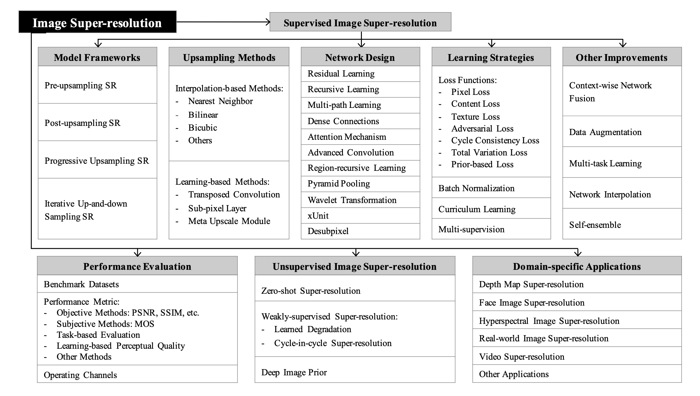
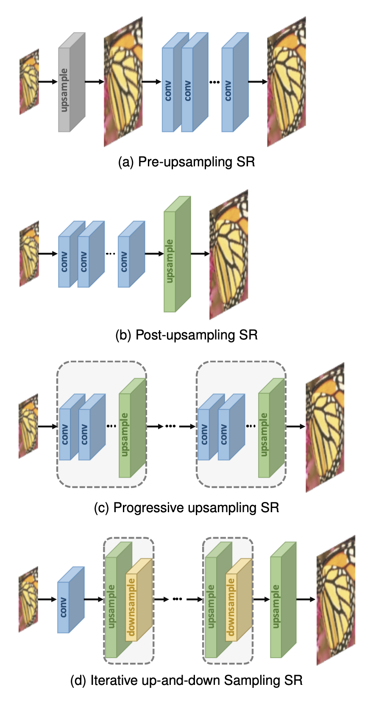
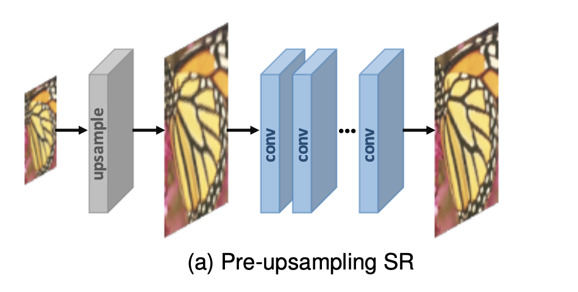

# 图像超分辨率综述

# [TPAMI 2020] Deep Learning for Image Super-resolution: A Survey

## Abstract

全面综述基于深度学习算法的图像超分辨率研究的最新进展，将现有的超分算法大致分为三大类：

1. 有监督SR
2. 无监督SR
3. 特定领域的SR(domain-specific SR)

此外，讨论公开可用的基准数据集和性能评估指标。

最后，总结了几个未来的方向和进一步需要解决的问题。

## 1. Introduction

In general, this problem is very challenging and inherently ill-posed since there are always multiple HR images corresponding to a single LR image.

天生不适定，可以有好多HR图像对应一张LR图像。

目前深度学习SR算法主要不同：

1. 不同的网络架构
2. 不同的Loss Fuction
3. 不同的Learning principles和strategies

不同于以往的超分综述，该篇仅关注深度学习超分方法，以独特的基于深度学习的视角，系统全面地回顾超分算法的最新进展。

### Contributions：

1. 全面回顾了基于深度学习的图像超分算法，包括problem settings, benchmark datasets, 性能度量标准，深度学习超分方法系列，特定领域的超分应用。
2. 以分层和结构化（hierarchical and structural manner）的方式，系统地展示了基于深度学习的超分算法的最新进展，并且总结了每个组件的优势和局限性。
3. 讨论挑战和有待解决的问题，找出新趋势和未来方向，提供有洞察力的指导。

### Taxonomy

Learning-based Methods:

1. Transposed Convolution
2. Sub-pixel Layer
3. Meta Upscale Module

* **Section2: problem definition, mainstream datasets and evaluation metircs**
* **Section3: main components of supervised SR modularly**
* **Section4: unsupervised SR**
* **Section5: popular domain-specific SR applications**
* **Section6: future directions and open issues**

## 2. Problem Setting and Terminology

LR images: $I_x = \mathcal{D}(I_y; \delta)$

$I_y$表示对应的HR图像，$\mathcal{D}$表示degradation退化函数，$\delta$表示退化过程，例如scaling factor或noise。

Blind SR：即只有LR图像，不知道退化过程是怎样的。

预测HR：$\hat{I_y} = \mathcal{F}(I_x; \theta)$，尽可能接近真实HR：$I_y$。

其中$\mathcal{F}$为超分模型，$\theta$为超分模型的参数。

由于退化过程未知，大多数研究直接将退化看作一个单纯的下采样过程：$\mathcal{D}(I_y; \theta) = (I_y), \downarrow_s, {s}\subset\theta$

$\downarrow_s$下采样，scaling factor $s$，大多数数据集使用的是bicubic interpolation下采样方法，另外也有一些其他退化方法：
$\mathcal{D}(I_y,\delta) = (I_y\otimes \kappa)\downarrow_s + \mathcal{n}_\varsigma, \left\{\kappa, s, \varsigma \right\}\subset \delta$

其中$I_y\otimes \kappa$表示blue kernel $\kappa$ 和HR图像 $I_y$ 之间的卷积操作，$\mathcal{n}_\varsigma$ 是附加的高斯白噪声，其标准差为 $\varsigma$。

## 3. Super-resolution Framworks

### Pre-upsampling Super-resolution

### Post-upsampling Super-resolution
