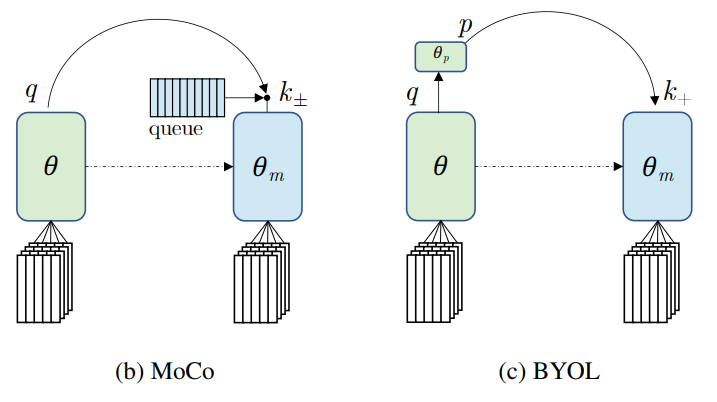
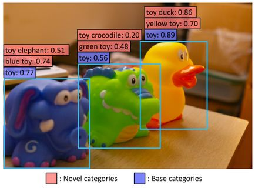
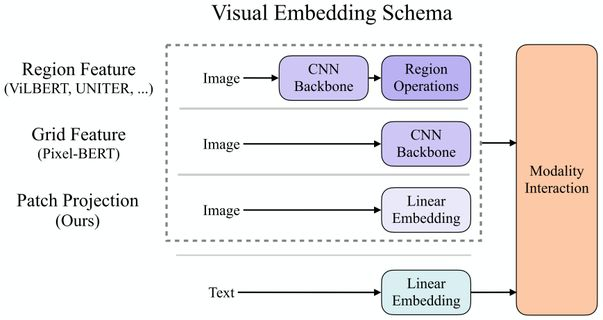

# 2021年深度学习哪些方向比较新颖，处于上升期或者朝阳阶段，比较有研究潜力？

## 一
回答几个我最近在研究的方向～ 我主要在做生成模型，不过乱七八糟的也有涉猎

可解释性：[feature-based](https://www.zhihu.com/search?q=feature-based&search_source=Entity&hybrid_search_source=Entity&hybrid_search_extra=%7B%22sourceType%22%3A%22answer%22%2C%22sourceId%22%3A1902459141%7D)研究的很多了，instance-based个人感觉在上升期，从研究的角度来说缺乏benchmark/axiom/sanity check. 主流方法是influence function, 我觉得这里面self influence的概念非常有趣，应该很值得研究。当然，更意思的方向是跳出influence function本身，比如像relatIF 加一些regularization，也是水文章的一贯套路(relatIF是好文章)。

Influence function for generative models也是很值得做的。Influence function for GAN已经有人做了，虽然文章直接优化FID是有点问题的，但是框架搭好了，换一个evaluation换个setting就可以直接发paper。

我最近写了Influence function for VAE, 有不少比较有意思的observation (paper: https://arxiv.org/pdf/2105.14203.pdf; code repo: VAE-TracIn-pytorch)。

***

无监督生成学习：最近的denoising diffusion probabilistic model(DDPM)绝对是热坑，效果好，但是速度慢没有meaningful latent space限制了很多应用，有待发掘。我去年实习写了一篇DiffWave是这个方法在语音上的应用，效果很好，最近应该能看到这个模型的application井喷，比如3D point cloud生成。

DDPM的加速最近已经有不少paper了，目前来看有几类，有的用conditioned on noise level去重新训练，有的用jumping step缩短Markov Chain，有的在DDPM++里面研究更快的solver. 我最近写了FastDPM, 是一种结合noise level和jumping step的快速生成的框架(无需retrain, original DDPM checkpoint拿来直接用)，统一并推广了目前的好几种方法，给出了不同任务(图像, 语音)的recipe (paper: https//arxiv.org/pdf/2106.00132.pdf; code repo: FastDPM_pytorch)。

生成模型里的Normalizing flow模型，用可逆网络转化数据分布，很fancy 能提供likelihood和比较好的解释性但是效果偏偏做不上去，一方面需要在理论上有补充，因为可逆或者Lipschitz网络的capacity确实有限。另一方面，实际应用中，training不稳定可能是效果上不去的原因，其中initialization 和training landscape都是有待研究的问题。潜在的突破口：augmented dimension或者类似surVAE那种generalized mapping. 除此之外，normalizing flow on discrete domain也是很重要的问题，潜在突破口是用OT里面的sinkhorn network。

我对residual flow这个模型有执念，很喜欢这个框架，虽然它不火。今年早些时候我写了residual flow的universal approximation in MMD的证明，很难做，需要比较特殊的假设 (paper: https://arxiv.org/pdf/2103.05793.pdf)。之后可能继续钻研它的capacity和learnability。

再补充一个：
生成模型的overfitting是一个长久的问题，但是本身很难定义，很大一个原因是mode collapse和copy training data耦合在一起。我们组去年发表了data-copying test用于检测相关性质，不过这个idea还停留在比较初级的阶段，我觉得这一块需要更多high level的框架。

***

Meta learning + generative model方向个人十分看好，meta learning 框架可以直接套，loss改成生成模型的loss就可以了。Again, GAN已经被做了，不过GAN的paper那么多，随便找上一个加上meta learning还是很容易的。类似可以做multitask + GAN。

## 二

### 1. 不适合的研究方向
首先我要反对两个方向：对比学习为代表的自监督学习算法（包括BYOL等）和Transformer。它们的上限几乎是肉眼可见的，在没有非平凡的改进之前，很难有本质上的突破。在大量研究者投入精力的情况下，只要没有持续的产出，就必然会导致其加速衰落。前些年盛极一时的网络架构搜索（NAS）就是一个非常典型的例子。

我们首先分析NAS、对比学习、Transformer的局限性：

1. 原本以NAS为代表的AutoML技术受到了广泛的期待，我还主张“自动机器学习之于深度学习，就好比深度学习之于传统方法”，不过后来发现它的缺陷是明显的。在搜索空间指数级扩大之后，算法就必须在精度和速度之间做出选择。后来盛行的权重共享类搜索方法，相当于追求搜索空间中的平摊精度，而平摊精度与最佳个体的精度往往并不吻合。
2. 对比学习被广泛引入图像领域作为自监督任务以后，前世代的自监督算法（如预测旋转、拼图、上色等）纷纷被吊打，甚至开始在下游任务中超越有监督训练的模型。然而，当前的对比学习类方法（包括BYOL）对于数据扩增（data augmentation）的依赖过重，因而不可避免地陷入了invariance和consistency之间的矛盾：强力的augmentation能够促进学习效果，但是如果augmentation过强，不同view之间的可预测性又无法保证。
3. 至于Transformer，虽然目前还处在比较兴盛的状态，然而它的上限也是明显的。除了更快的信息交换，似乎这种模型并没有体现出显著的优势。问题是：CV任务真的需要频繁而快速的视觉信息交换吗？遗憾的是，学界依然沉浸在“先将所有任务用Transformer刷一遍”的廉价快乐中，鲜有人愿意思考一些更深入的问题。

因此，我特别希望初学者不要看到一个热门方向就一拥而上，而要冷静地思考这个问题：**如果全世界都知道这个方向火热，那么你的研究要想脱颖而出，就必然有某些过人之处**——比如你有特别多的卡，或者你有丰富的PR资源。否则，很可能还是捧红了别人的文章，浪费了自己的时间。

### 2. 应该关注的方向（但未必能够保证产出）

我认为CV领域还是存在很多本质问题没有解决的。但是这些问题往往非常困难，投入长期研究的风险也比较大，因而大部分研究者会回避这些问题。然而要从根源上推进CV的发展，这些问题就不得不去面对、解决：

1. 是否存在神经网络之外的推理方式？当前，神经网络成为训练以后的唯一产物，而几乎所有算法均假设将输入送给神经网络以后，一次性地得到输出结果。然而，是否能够设计直接向前传递以外的其他推理方式？例如，当一个物体处于罕见的视角或者被严重遮挡时，能否通过多次迭代式的处理，逐渐恢复其缺失的特征，最终完成识别任务？这就涉及到将强化学习引入训练，或者通过类似于image warping的方式找到一条困难样例和简单样例之间的路径。后者可以导向一个非常本质的问题：**如何以尽可能低的维度刻画语义空间？**GAN以及相关的方法或许能够提供一些思路，但是目前还没有通用的、能够轻易跨越不同domain的方法。
2. 是否存在更精细的标注方式，能够推进视觉的理解？我最近提出了一个假想：[当前所有的视觉识别算法都远远没有达到完整](https://zhuanlan.zhihu.com/p/376145664)，而这很可能是当前不够精细的标注所导致的。那么，是否能够在可行的范围内，定义一种超越instance segmentation的标注方式，进一步推进视觉识别？这就涉及到一系列根本问题：**什么是一个物体？如何定义一个物体？物体和部件之间有什么联系？**这些问题不得到解决，物体检测和分割将步图像分类的后尘，迅速陷入过拟合的困境。
3. 如何解决大模型和小样本之间的矛盾？当前，大模型成为AI领域颇有前景的规模化解决方案。然而，大模型的本质在于，通过预训练阶段大量吸收数据（有标签或者无标签均可），缓解下游小样本学习的压力。这就带来了一个新的矛盾：**大模型看到的数据越多，模型就越需要适应一个广泛而分散的数据分布，因而通过小样本进行局部拟合的难度就越大**。这很可能是制约大模型思路落地的一个瓶颈。
4. 能否通过各种方式生成接近真实的数据？生成数据（包括虚拟场景或者GAN生成的数据）很可能会带来新的学习范式，然而这些数据和真实数据之间存在一种难以逾越的domain gap，制约了其在识别任务中发挥作用。我们提出问题：**这种domain gap，本质上是不是特定的识别任务带来的learning bias？**我们希望通过改变学习目标，使得这种domain gap得到缓解甚至消失，从而能够在有朝一日消灭人工标注，真正开启新的学习范式。
5. 是否存在更高效的人机交互模式？目前，人机之间的交互效率还很低，我就经常因为为做PPT而头疼不已。我认为AI算法或许会深刻地改变人机交互的模式，使得以下场景变得更容易：**多媒体内容设计和排版、跨模态信息检索、游戏微操作**，等等。多模态算法很可能会在这波“人机交互革命”中发挥重要作用。

在我看来，上述任何一个问题，相比于无止境的烧卡刷点，都要有趣且接近本质，但是风险也要更大一些。因此，大部分研究人员迫于现实压力而选择跟风，是再正常不过的事情。只要有人在认真思考这些问题并且稳步推进它们，AI就不是一个遥不可及的梦。

限于时间，无法将上述每个点写得太仔细；同时限于水平和视野，我也无法囊括所有重要的问题（如可解释性——虽然我对深度学习的可解释性感到悲观，不过看到有学者在这个领域深耕，还是能够感觉到勇气和希望）。

非常欢迎针对各种问题的讨论，也希望这些观点能够引发更多的思考吧。

## 三

<<<<<<< HEAD
先写两个最近火热我比较看好的方向**Transformer**和**Self-Supervised**，我这里举的例子倾向于计算机视觉方向。最后再补充Zero-Shot和多模态两个方向。

### 1.Transformer

自从去年DETR和ViT出来之后，计算机视觉领域掀起了Transformer狂潮。目前可以做的主要有两个路径，**一个是魔改DETR和ViT，另一个是不同task迁移算法。**
=======
先写两个最近火热我比较看好的方向**Transformer**和**Self-Supervised**，我这里举的例子倾向于计算机视觉方向。最后再补充**Zero-Shot**和**多模态**两个方向。

## **1.Transformer**

自从去年DETR和ViT出来之后，计算机视觉领域掀起了Transformer狂潮。目前可以做的主要有两个路径，一个是**魔改DETR和ViT**，另一个是**不同task迁移算法**。
>>>>>>> 0e3eb5a (2021.11)

魔改DETR和ViT的方法，无非是引入local和hierarchical，或者魔改算子。

不同task迁移算法主要是探究如何针对不同的task做适配设计。

<<<<<<< HEAD
其中魔改DETR的可以参考以下工作：
[Deformable DETR] [TSP-FCOS/TSP-RCNN] [UP-DETR] [SMCA] [Meta-DETR] [DA-DETR]

其中魔改ViT的可以参考以下工作：

魔改算子：
[LambdaResNets] [DeiT] [VTs] [So-ViT] [LeViT] [CrossViT] [DeepViT] [TNT] [T2T-ViT] [BoTNet] [Visformer]

引入local或者hierarchical：
[PVT] [FPT] [PiT] [LocalViT] [SwinT] [MViT] [Twins]

Swin Transformer对CNN的降维打击

引入卷积:
[CPVT] [CvT] [ConViT] [CeiT] [CoaT] [ConTNet]

不同task迁移算法的可以参考以下工作：
ViT+Seg [SETR] [TransUNet] [DPT] [U-Transformer]   
ViT+Det [ViT-FRCNN] [ACT]  
ViT+SOT [TransT] [TMT]  
ViT+MOT [TransTrack] [TrackFormer] [TransCenter]  
ViT+Video [STTN] [VisTR] [VidTr] [ViViT] [TimeSformer] [VTN]  
ViT+GAN [TransGAN] [AOT-GAN] [GANsformer]  
ViT+3D [Group-Free] [Pointformer] [PCT] [PointTransformer] [DTNet] [MLMSPT]  

以上几个task是重灾区（重灾区的意思是听我一句劝，你把握不住）

ViT+Multimodal [Fast and Slow] [VATT]  
ViT+Pose [TransPose] [TFPose]  
ViT+SR [TTSR]   
ViT+Crowd [TransCrowd]  
ViT+NAS [BossNAS]  
ViT+ReID [TransReID]  
ViT+Face [FaceT]  

想一想算子怎么魔改，或者还有什么task没有做的

### 2.Self-Supervised

Self-Supervised自从何恺明做出MoCo以来再度火热，目前仍然是最为火热的方向之一。目前可以做的主要有三个路径，**一个是探索退化解的充要条件，一个是Self-Supervised+Transformer探索上限，还有一个是探索非对比学习的方法。**

探索退化解的充要条件主要是探索无negative pair的时候，避免退化解的最优方案是什么。

[SimCLR] [BYOL] [SwAV] [SimSiam] [Twins]

Self-Supervised+Transformer是MoCov3首次提出的，NLP领域强大的预训练模型(BERT和GPT-3)都是Transformer架构的，CV可以尝试去复制NLP的路径，探究Self-Supervised+Transformer的上限。

[MoCov1] [MoCov2] [MoCov3] [SiT]

探索非对比学习的方法就是要设计合适的proxy task。

基于上下文 
[Unsupervised Visual Representation Learning by Context Prediction]  
[Unsupervised Representation Learning by Predicting Image Rotations]   
[Self-supervised Label Augmentation via Input Transformations]

基于时序 
[Time-Contrastive Networks: Self-Supervised Learning from Video]  
[Unsupervised Learning of Visual Representations using Videos]

刚写了基于时序，何恺明和Ross Girshick就搞了个时序的  
A Large-Scale Study on Unsupervised Spatiotemporal Representation Learning

### 3. Zero-Shot

最近因为CLIP的出现，Zero-Shot可能会引起一波热潮，ViLD将CLIP成功应用于目标检测领域，相信未来会有越来越多的基于CLIP的Zero-Shot方法。https://zhuanlan.zhihu.com/p/369464298

### 4. 多模态

最近的ViLT结合了BERT和ViT来做多模态，并且通过增加标志位来巧妙的区分不同模态，感觉是一个非常好的做多模态的思路，相信未来会有更强大的多模态出现。https://zhuanlan.zhihu.com/p/369733979

至于最近火热的MLP架构，极其不推荐，很沙雕

最后，适当灌水，有能力还是要做有影响力的工作。
=======
**其中魔改DETR的可以参考以下工作：**

[[Deformable DETR](https://link.zhihu.com/?target=https%3A//arxiv.org/abs/2010.04159)] [[TSP-FCOS/TSP-RCNN](https://link.zhihu.com/?target=https%3A//arxiv.org/abs/2011.10881)] [[UP-DETR](https://link.zhihu.com/?target=https%3A//arxiv.org/abs/2011.09094)] [[SMCA](https://link.zhihu.com/?target=https%3A//arxiv.org/abs/2101.07448)] [[Meta-DETR](https://link.zhihu.com/?target=https%3A//arxiv.org/abs/2103.11731)] [[DA-DETR](https://link.zhihu.com/?target=https%3A//arxiv.org/abs/2103.17084)]

**其中魔改ViT的可以参考以下工作：**

**魔改算子：**

[[LambdaResNets](https://link.zhihu.com/?target=https%3A//openreview.net/pdf%3Fid%3DxTJEN-ggl1b)] [[DeiT](https://link.zhihu.com/?target=https%3A//arxiv.org/abs/2012.12877)] [[VTs](https://link.zhihu.com/?target=https%3A//arxiv.org/abs/2006.03677)] [[So-ViT](https://link.zhihu.com/?target=https%3A//arxiv.org/abs/2104.10935)] [[LeViT](https://link.zhihu.com/?target=https%3A//arxiv.org/abs/2104.01136)] [[CrossViT](https://link.zhihu.com/?target=https%3A//arxiv.org/abs/2103.14899)] [[DeepViT](https://link.zhihu.com/?target=https%3A//arxiv.org/abs/2103.11886)] [[TNT](https://link.zhihu.com/?target=https%3A//arxiv.org/abs/2103.00112)] [[T2T-ViT](https://link.zhihu.com/?target=https%3A//arxiv.org/abs/2101.11986)]

[[BoTNet](https://link.zhihu.com/?target=https%3A//arxiv.org/abs/2101.11605)] [[Visformer](https://link.zhihu.com/?target=https%3A//arxiv.org/abs/2104.12533)]

**引入local或者hierarchical：**

[[PVT](https://link.zhihu.com/?target=https%3A//arxiv.org/abs/2102.12122v1)] [[FPT](https://link.zhihu.com/?target=https%3A//arxiv.org/abs/2102.12122)] [[PiT](https://link.zhihu.com/?target=https%3A//arxiv.org/abs/2103.16302)] [[LocalViT](https://link.zhihu.com/?target=https%3A//arxiv.org/abs/2104.05707)] [[SwinT](https://link.zhihu.com/?target=https%3A//arxiv.org/abs/2103.14030)] [[MViT](https://link.zhihu.com/?target=https%3A//arxiv.org/abs/2104.11227)] [[Twins](https://link.zhihu.com/?target=https%3A//arxiv.org/abs/2104.13840)]

**引入卷积:**

[[CPVT](https://link.zhihu.com/?target=https%3A//arxiv.org/pdf/2102.10882.pdf)] [[CvT](https://link.zhihu.com/?target=https%3A//arxiv.org/abs/2103.15808)] [[ConViT](https://link.zhihu.com/?target=https%3A//arxiv.org/abs/2103.10697)] [[CeiT](https://link.zhihu.com/?target=https%3A//arxiv.org/abs/2103.11816)] [[CoaT](https://link.zhihu.com/?target=https%3A//arxiv.org/abs/2104.06399)] [[ConTNet](https://link.zhihu.com/?target=https%3A//arxiv.org/abs/2104.13497)]

**不同task迁移算法的可以参考以下工作：**

**ViT+Seg** [[SETR](https://link.zhihu.com/?target=https%3A//arxiv.org/abs/2012.15840)] [[TransUNet](https://link.zhihu.com/?target=https%3A//arxiv.org/abs/2102.04306)] [[DPT](https://link.zhihu.com/?target=https%3A//arxiv.org/abs/2103.13413)] [[U-Transformer](https://link.zhihu.com/?target=https%3A//arxiv.org/abs/2103.06104)]

**ViT+Det** [[ViT-FRCNN](https://link.zhihu.com/?target=https%3A//arxiv.org/abs/2012.09958)] [[ACT](https://link.zhihu.com/?target=https%3A//arxiv.org/abs/2011.09315)]

**ViT+SOT** [[TransT](https://link.zhihu.com/?target=https%3A//arxiv.org/abs/2103.15436)] [[TMT](https://link.zhihu.com/?target=https%3A//arxiv.org/abs/2103.11681)]

**ViT+MOT** [[TransTrack](https://link.zhihu.com/?target=https%3A//arxiv.org/abs/2012.15460)] [[TrackFormer](https://link.zhihu.com/?target=https%3A//arxiv.org/abs/2101.02702)] [[TransCenter](https://link.zhihu.com/?target=https%3A//arxiv.org/abs/2103.15145)]

**ViT+Video** [[STTN](https://link.zhihu.com/?target=https%3A//arxiv.org/abs/2007.10247)] [[VisTR](https://link.zhihu.com/?target=https%3A//arxiv.org/abs/2011.14503)] [[VidTr](https://link.zhihu.com/?target=https%3A//arxiv.org/abs/2104.11746)] [[ViViT](https://link.zhihu.com/?target=https%3A//arxiv.org/pdf/2103.15691.pdf)] [[TimeSformer](https://link.zhihu.com/?target=https%3A//arxiv.org/abs/2102.05095)] [[VTN](https://link.zhihu.com/?target=https%3A//arxiv.org/abs/2102.00719)]

**ViT+GAN** [[TransGAN](https://link.zhihu.com/?target=https%3A//arxiv.org/abs/2102.07074)] [[AOT-GAN](https://link.zhihu.com/?target=https%3A//arxiv.org/abs/2104.01431)] [[GANsformer](https://link.zhihu.com/?target=https%3A//arxiv.org/abs/2103.01209)]

**ViT+3D** [[Group-Free](https://link.zhihu.com/?target=https%3A//arxiv.org/abs/2104.00678)] [[Pointformer](https://link.zhihu.com/?target=https%3A//arxiv.org/abs/2012.11409)] [[PCT](https://link.zhihu.com/?target=https%3A//arxiv.org/abs/2012.09688)] [[PointTransformer](https://link.zhihu.com/?target=https%3A//arxiv.org/abs/2012.09164)] [[DTNet](https://link.zhihu.com/?target=https%3A//arxiv.org/abs/2104.13044)] [[MLMSPT](https://link.zhihu.com/?target=https%3A//arxiv.org/abs/2104.13636)]

**以上几个task是重灾区（重灾区的意思是听我一句劝，你把握不住）**

**ViT+Multimodal** [[Fast and Slow](https://link.zhihu.com/?target=https%3A//arxiv.org/abs/2103.16553)] [[VATT](https://link.zhihu.com/?target=https%3A//arxiv.org/abs/2104.11178)]

**ViT+Pose** [[TransPose](https://link.zhihu.com/?target=https%3A//arxiv.org/abs/2012.14214)] [[TFPose](https://link.zhihu.com/?target=https%3A//arxiv.org/abs/2103.15320)]

**ViT+SR** [[TTSR](https://link.zhihu.com/?target=https%3A//arxiv.org/abs/2006.04139)]

**ViT+Crowd** [[TransCrowd](https://link.zhihu.com/?target=https%3A//arxiv.org/abs/2104.09116)]

**ViT+NAS** [[BossNAS](https://link.zhihu.com/?target=https%3A//arxiv.org/abs/2103.12424)]

**ViT+ReID** [[TransReID](https://link.zhihu.com/?target=https%3A//arxiv.org/abs/2102.04378)]

**ViT+Face** [[FaceT](https://link.zhihu.com/?target=https%3A//arxiv.org/abs/2104.11502)]

**想一想算子怎么魔改，或者还有什么task没有做的**

## **2.Self-Supervised**

Self-Supervised自从何恺明做出MoCo以来再度火热，目前仍然是最为火热的方向之一。目前可以做的主要有三个路径，一个是**探索退化解的充要条件**，一个是**Self-Supervised+Transformer探索上限，**还有一个是**探索非对比学习的方法。**

探索退化解的充要条件主要是探索无negative pair的时候，避免退化解的最优方案是什么。

[[SimCLR](https://link.zhihu.com/?target=https%3A//arxiv.org/abs/2002.05709v3)] [[BYOL](https://link.zhihu.com/?target=https%3A//arxiv.org/abs/2006.07733)] [[SwAV](https://link.zhihu.com/?target=https%3A//arxiv.org/pdf/2006.09882.pdf)] [[SimSiam](https://link.zhihu.com/?target=https%3A//arxiv.org/abs/2011.10566)] [[Twins](https://link.zhihu.com/?target=https%3A//arxiv.org/abs/2103.03230)]

Self-Supervised+Transformer是MoCov3首次提出的，NLP领域强大的预训练模型(BERT和GPT-3)都是Transformer架构的，CV可以尝试去复制NLP的路径，探究Self-Supervised+Transformer的上限。

[[MoCov1](https://link.zhihu.com/?target=https%3A//arxiv.org/abs/1911.05722)] [[MoCov2](https://link.zhihu.com/?target=https%3A//arxiv.org/abs/2003.04297v1)] [[MoCov3](https://link.zhihu.com/?target=https%3A//arxiv.org/abs/2104.02057)] [[SiT](https://link.zhihu.com/?target=https%3A//arxiv.org/abs/2104.03602)]

探索非对比学习的方法就是要设计合适的proxy task。

**基于上下文** [[Unsupervised Visual Representation Learning by Context Prediction](https://link.zhihu.com/?target=https%3A//www.cv-foundation.org/openaccess/content_iccv_2015/papers/Doersch_Unsupervised_Visual_Representation_ICCV_2015_paper.pdf)] [[Unsupervised Representation Learning by Predicting Image Rotations](https://link.zhihu.com/?target=https%3A//openreview.net/pdf%3Fid%3DS1v4N2l0-)] [[Self-supervised Label Augmentation via Input Transformations](https://link.zhihu.com/?target=https%3A//arxiv.org/pdf/1910.05872.pdf)]

**基于时序** [[Time-Contrastive Networks: Self-Supervised Learning from Video](https://link.zhihu.com/?target=https%3A//arxiv.org/abs/1704.06888)] [[Unsupervised Learning of Visual Representations using Videos](https://link.zhihu.com/?target=http%3A//www.cs.cmu.edu/~xiaolonw/papers/unsupervised_video.pdf)]

刚写了基于时序，何恺明和Ross Girshick就搞了个时序的

[A Large-Scale Study on Unsupervised Spatiotemporal Representation Learning](https://link.zhihu.com/?target=https%3A//arxiv.org/abs/2104.14558)

[陀飞轮：何恺明+Ross Girshick：深入探究无监督时空表征学习193 赞同 · 3 评论文章](https://zhuanlan.zhihu.com/p/369159211)

[

## 3. Zero-Shot

最近因为CLIP的出现，Zero-Shot可能会引起一波热潮**，**ViLD将CLIP成功应用于目标检测领域，相信未来会有越来越多的基于CLIP的Zero-Shot方法**。**

[陀飞轮：ViLD：超越Supervised的Zero-Shot检测器141 赞同 · 5 评论文章](https://zhuanlan.zhihu.com/p/369464298)

## 4. 多模态

最近的ViLT结合了BERT和ViT来做多模态，并且通过增加标志位来巧妙的区分不同模态，感觉是一个非常好的做多模态的思路，相信未来会有更强大的多模态出现。

[陀飞轮：ViLT：最简单的多模态Transformer311 赞同 · 19 评论文章](https://zhuanlan.zhihu.com/p/369733979)

至于最近火热的MLP架构，极其不推荐，很沙雕

[计算机视觉是否已经进入瓶颈期？205 赞同 · 16 评论回答](https://www.zhihu.com/question/51863955/answer/1879155038)

**最后，适当灌水，有能力还是要做有影响力的工作。**
>>>>>>> 0e3eb5a (2021.11)
