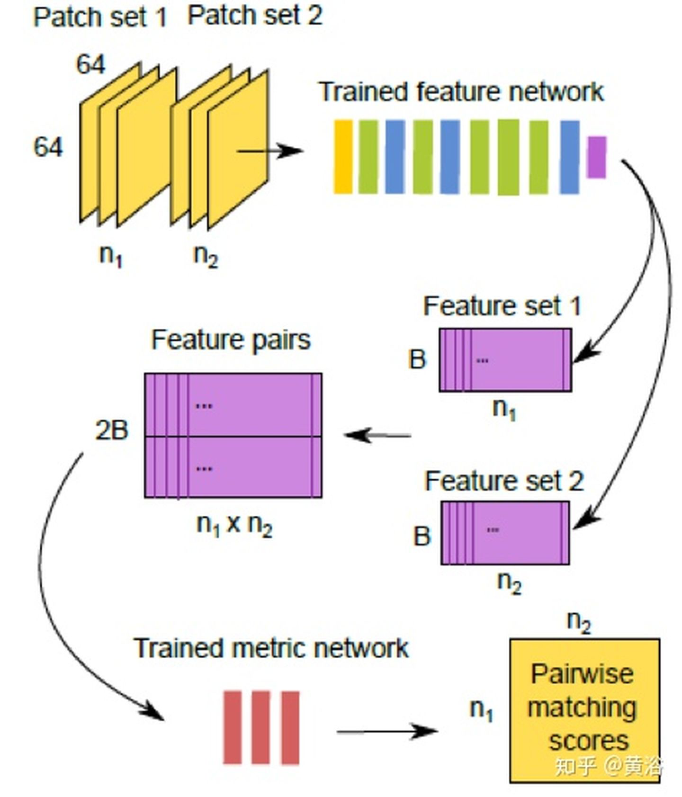
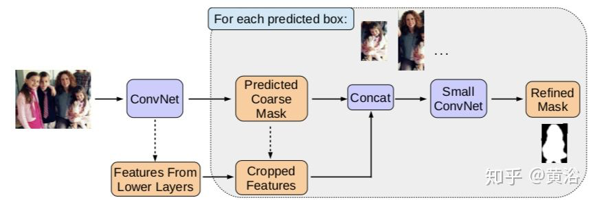
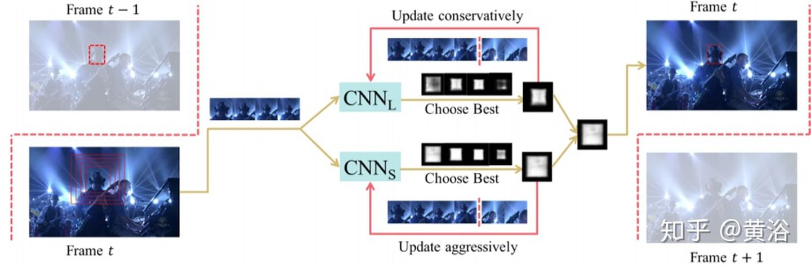

# 深度学习在计算机视觉领域（包括图像，视频，3-D点云，深度图）的应用一览
## [原文](https://zhuanlan.zhihu.com/p/55747295)

计算机视觉不是深度学习最早看到突破的领域，真正让大家大吃一惊的颠覆传统方法的应用领域是语音识别，做出来的公司是微软，而不是当时如日中天的谷歌。计算机视觉应用深度学习堪称突破的成功点是2012年ImageNet比赛，采用的模型是CNN，而不是Hinton搞的RBM和DBN之类，就是Hinton学生做出来以他命名的AlexNet。

（注：顺便提一下，2010年的ImageNet冠军是余凯/林元庆领导的NEC和UIUC Tom Huang组的合作团队，当时采用的方法是基于sparse coding+SVM。）

当然，真正一直在研究CNN的专家是Yann LeCun，小扎后来拉他去FB做AI research的头。第一个CNN模型就是他搞出来的，即LeNet，原来就是做图像数字识别。不得不说，CNN非常适合2-D信号的处理任务，RNN呢，是时域上的拓展。

现在CNN在计算机视觉应用的非常成功，传统机器学习方法基本被弃之不用。其中最大的一个原因就是，图像数据的特征设计，即特征描述，一直是计算机视觉头痛的问题，在深度学习突破之前10多年，最成功的图像特征设计 (hand crafted feature)是SIFT，还有著名的Bag of visual words，一种VQ方法。后来大家把CNN模型和SIFT比较，发现结构还蛮像的：），之后不是也有文章说RNN和CRF很像吗。

CNN从AlexNet之后，新模型如雨后春笋，每半年就有新发现。这里随便列出来就是，ZFNet (也叫MatNet)，VGGNet， NIN， GoogleNet (Inception)， Highway Network， ResNet， DenseNet，SE-Net（Squeeze and Excitation Net），。。。基本上都是在ImageNet先出名的：）。

简单回顾一下：
* AlexNet应该算第一个深度CNN；
* ZFNet采用DeconvNet和visualization技术可以监控学习过程；
* VGGNet采用小滤波器3X3去取代大滤波器5X5和7X7而降低计算复杂度；
* GoogleNet推广NIN的思路定义Inception基本模块（采用多尺度变换和不同大小滤波器组合，即1X1，3X3，5X5）构建模型；
* Highway Networks借鉴了RNN里面LSTM的gaiting单元；
* ResNet是革命性的工作，借鉴了Highway Networks的skip connection想法，可以训练大深度的模型提升性能，计算复杂度变小；
* Inception-V3/4用1X7和1X5取代大滤波器5X5和7X7，1X1滤波器做之前的特征瓶颈，这样卷积操作变成像跨通道（cross channel）的相关操作；
* DenseNet主要通过跨层链接解决vanishing gradient问题；
* SE-Net是针对特征选择的设计，gating机制还是被采用；
* 前段时间流行的Attention机制也是借鉴于LSTM，实现object-aware的context模型。

在具体应用领域也出现了不少成功的模型，比如
* detection问题的R-CNN，fast RCNN，faster RCNN，SSD，YOLO，RetinaNet，CornerNet等，
* 解决segmentation问题的FCN，DeepLab，Parsenet，Segnet，Mask R-CNN，RefineNet，PSPNet，U-Net等，
* 处理激光雷达点云数据的VoxelNet，PointNet，BirdNet，LMNet，RT3D，PIXOR，YOLO3D等，
* 实现激光雷达和图像融合的PointFusion，RoarNet，PointRCNN，AVOD等，
* 做图像处理的DeHazeNet，SRCNN (super-resolution)，DeepContour，DeepEdge等，
* 2.5 D视觉的MatchNet，DeepFlow，FlowNet等，
* 3-D重建的PoseNet，VINet，Perspective Transformer Net，SfMNet，CNN-SLAM，SurfaceNet，3D-R2N2，MVSNet等，
* 以及解决模型压缩精简的MobileNet，ShuffleNet，EffNet，SqueezeNet，

## 一、图像/视频处理
先说图像/视频处理（计算机视觉的底层，不低级）。

图像处理，还有视频处理，曾经是很多工业产品的基础，现在电视，手机还有相机/摄像头等等都离不开，是技术慢慢成熟了（传统方法），经验变得比较重要，而且芯片集成度越来越高，基本上再去研究的人就少了。经典的ISP，A3，都是现成的，当然做不好的也很难和别人竞争，成本都降不下来。

这是一个典型成像处理的流程图：

经典的ISP流程图如下：

图像处理，根本上讲是基于一定假设条件下的信号重建。这个重建不是我们说的3-D重建，是指恢复信号的原始信息，比如去噪声，内插。这本身是一个逆问题，所以没有约束或者假设条件是无解的，比如去噪最常见的假设就是高斯噪声，内插实际是恢复高频信号，可以假设边缘连续性和灰度相关性，著名的TV（total variation）等等。

以前最成功的方法基本是信号处理，机器学习也有过，信号处理的约束条件变成了贝叶斯规则的先验知识，比如sparse coding/dictionary learning，MRF/CRF之类，现在从传统机器学习方法过渡到深度学习也正常吧。

### 1. 去噪/去雾/去模糊/去鬼影
先给出一个encoder-decoder network的AR-CNN模型（AR=Artifact Reduction）：

这是一个图像处理通用型的模型框架：

### 2. 增强/超分辨率（SR）
Bilateral filter是很有名的图像滤波器，这里先给出一个受此启发的CNN模型做图像增强的例子：

前面说过内插的目的是恢复失去的高频信息，这里一个做SR的模型就是在学习图像的高频分量：

### 3. 修补/恢复/着色
用于修补的基于GAN思想的Encoder-Decoder Network模型：

用于灰度图像着色（8比特的灰度空间扩展到24比特的RGB空间）的模型框架：

## 二、计算机视觉的预处理（2-D）
计算机视觉需要图像预处理，比如特征提取，包括特征点，边缘和轮廓之类。以前做跟踪和三维重建，首先就得提取特征。特征点以前成功的就是SIFT/SURF/FAST之类，现在完全可以通过CNN形成的特征图来定义。

边缘和轮廓的提取是一个非常tricky的工作，细节也许就会被过强的图像线条掩盖，纹理（texture）本身就是一种很弱的边缘分布模式，分级（hierarchical）表示是常用的方法，俗称尺度空间（scale space）。以前做移动端的视觉平台，有时候不得不把一些图像处理功能关掉，原因是造成了特征畸变。现在CNN这种天然的特征描述机制，给图像预处理提供了不错的工具，它能将图像处理和视觉预处理合二为一。

### 1.特征提取
LIFT（Learned Invariant Feature Transform）模型，就是在模仿SIFT：

### 2. 边缘/轮廓提取
一个轮廓检测的encoder-decoder network模型：

### 3. 特征匹配
这里给出一个做匹配的模型MatchNet：

## 三、2.5-D计算机视觉部分（不是全3-D）
涉及到视差或者2-D运动的部分一般称为2.5-D空间。这个部分和前面的2-D问题是一样的，作为重建任务它也是逆问题，需要约束条件求解优化解，比如TV，GraphCut。一段时间（特别是Marr时代）计算机视觉的工作，就是解决约束条件下的优化问题。

后来，随机概率和贝叶斯估计大行其事，约束条件变成了先验知识（prior），计算机视觉圈里写文章要是没有 P (Probability) 和 B (Bayes)，都不好意思发。像SVM， Boosting，Graphical Model，Random Forest，BP（Belief Propagation），CRF（Conditional Random Field），Mixture of Gaussians，MCMC，Sparse Coding都曾经是计算机视觉的宠儿，现在轮到CNN出彩：）。

可以说深度学习是相当“暴力”的，以前分析的什么约束呀，先验知识呀在这里统统扔一边，只要有图像数据就可以和传统机器学习方法拼一把。

### 1. 运动/光流估计
传统的方法包括局部法和全局法，这里CNN取代的就是全局法。
这里是一个光流估计的模型：

### 2. 视差/深度图估计
深度图估计和运动估计是类似问题，唯一不同的是单目可以估计深度图，而运动不行。
这里是一个双目估计深度图的模型：

而这个是单目估计深度图的模型：巧妙的是这里利用双目数据做深度图估计的非监督学习

另外一个单目深度估计的模型：也是利用双目的几何约束做非监督的学习

### 3. 视频去隔行/内插帧
Deinterlacing和Framerate upconversion视频处理的经典问题，当年Sony和Samsung这些电视生产商这方面下了很大功夫，著名的NXP（从Philips公司spin-off）当年有个牛逼的算法在这个模块挣了不少钱。
基本传统方法都是采用运动估计和补偿的方法，俗称MEMC，所以我把它归类为2.5-D。前面运动估计已经用深度学习求解了，现在这两个问题自然也是。
首先看一个做MEMC的模型：

这是做Deinterlacing的一个模型：

这是Nvidia的Framerate Upconversion方面模型：

因为它采用optic flow方法做插帧，另外附上它的flow estimation模型：就是一个沙漏（hourglass）模式

### 4. 新视角图像生成
刚才介绍单目估计深度图的时候，其实已经看到采用inverse warping方法做新视角生成的例子，在IBR领域这里有一个分支叫Depth Image-based Rendering （DIBR）。

和上个问题类似，采用深度图学习做合成图像，也属于2.5-D空间。在电视领域，曾经在3-D电视界采用这种方法自动从单镜头视频生成立体镜头节目。以前也用过机器学习，YouTube当年采用image search方法做深度图预测提供2D-3D的内容服务，但性能不好。现在感觉，大家好像不太热衷这个了。

这是一个产生新视角的模型：

而这个是从单镜头视频生成立体视频的模型：

有做编码/解码的，也是采用运动或者相似变换为基础，但性能不如传统方法，这里忽略。

## 四、3-D计算机视觉
下面谈谈3-D，基于多视角（MVS）/运动（SFM）的重建，后者也叫SLAM。

这部分就是经典的计算机视觉问题：3-D重建。

基本上可以分成两种路径：一是多视角重建，二是运动重建。前一个有一个经典的方法MVS（multiple view stereo），就是多帧匹配，是双目匹配的推广，这样采用CNN来解决也合理。当年CMU在Superbowl展示的三维重建和视角转化，轰动一时，就是基于此路径，但最终没有被产品化（技术已经转让了）。

后一个在机器人领域成为SLAM，有滤波法和关键帧法两种，后者精度高，在稀疏特征点的基础上可以采用BA（Bundle Adjustment），著名的方法如PTAM，ORB-SLAM1/2，LSD-SLAM，KinectFusion（RGB-D），LOAM和Velodyne SLAM（LiDAR）等。如今SLAM已经成为AR产业的瓶颈，看看MagicLeap和HoloLens，大家不能总是在平面检测基础上安一个虚拟物体吧，真正的虚实结合是在一个普通的真实环境里才行。

想想像特征点匹配，帧间运动估计，Loop Closure检测这些模块都可以采用CNN模型解决，那么SLAM/SFM/VO就进入CNN的探索区域。

### 1. 标定
Calibration是计算机视觉的经典问题，摄像头作为传感器的视觉系统首要任务就是要确定自己观测数据和3-D世界坐标系的关系，即标定。摄像头标定要确定两部分参数，一是内参数，二是外参数。对于有多个传感器的视觉系统，比如深度测距仪，以前有Kinect RGB-D，现在有Velodyne激光雷达，它们相互之间的坐标系关系是标定的任务。

外参数标定的完成帮助是校准数据，比如激光雷达的点云，RGB-D的深度图，还有摄像头的图像像素集，它们一定存在一个最佳匹配标准，这就可以通过数据训练NN模型来完成。而标定参数就是NN模型回归输出的结果。

这里是一个激光雷达和摄像头标定的系统框图：

它的模型CalibNet结构视图：

### 2. Visual Odometry（VO）
VO属于SLAM的一部分，只是估计自身运动和姿态变化吧。VO是特斯拉的前Autopilot2.0负责人David Nister创立的，他之前以两帧图像计算Essential Matrix的“5点算法”而出名，现在是Nvidia的自动驾驶负责人，公司VP。

这里是一个和惯导数据结合的VIO（Visual-Inertial Odometry）NN模型：

这是著名的AR创业公司MagicLeap提出的VO模型：两部分组成，即特征提取和匹配（Homography）。

顺便加一个，激光雷达数据做Odometry的CNN模型：

### 3. SLAM (Mono, Stereo, RGB-D, LiDAR)/SFM
运动恢复结构是基于背景不动的前提，计算机视觉的同行喜欢SFM这个术语，而机器人的peers称之为SLAM。SLAM比较看重工程化的解决方案，SFM理论上贡献大。

先看一个单摄像头的SFM系统框图：

它的NN模型SFM-Net，包括Motion和Structure两部分：

再附上一个SLAM的模型CNN-SLAM：主要是加上一个单目深度图估计的CNN模块。

这是一个用CNN的基于Lidar的localization方法：不仅需要点云数据，还输入反射值灰度图。

图像像素运动是optic flow，而3-D场景的运动称之为scene flow，如果有激光雷达的点云数据，后者的估计可以通过ICP实现，这里给出一个CNN模型的实现方法FlowNet3D，是PointNet的扩展：

### 4. MVS
MVS的传统方法可以分成两种：region growing和depth-fusion，前者有著名的PMVS，后者有KinectFusion，CNN模型求解MVS的方法就是基于此。

先看看一个做MVS任务的基于RNN中LSTM的3D-R2N2模型：

它的系统框图如下：

UIUC/Facebook合作的DeepMVS模型：

这是他们的系统框图：

现在看到的是Berkeley分校Malik组提出的LSM（Learnt Stereo Machine ）模型：

下面是最近香港权龙教授组提出的MVSNet模型：

## 五、计算机视觉核心：环境理解
核心部分是计算机视觉的高层：环境理解。

这部分是深度学习在计算机视觉最先触及，并展示强大实力的部分。出色的工作太多，是大家关注和追捧的，而且有不少分析和总结文章，所以这里不会重复过多，只简单回顾一下。

### 1. 语义分割/实例分割（Semantic/Instance Segmentation）
语义分割最早成功应用CNN的模型应该是FCN（Fully Convolution Network），由Berkeley分校的研究人员提出。它是一种pixel2pixel的学习方法，之后各种演变模型，现在都可以把它们归类于Encoder-Decoder Network。

这里是去年CVPR的一篇论文在总结自动驾驶的实时语义分割算法时给出的框图：

其中Encoder部分特别采用了MobileNet和ShuffleNet。

实例分割是特殊的语义分割，结合了目标检测，可以说是带有明确轮廓的目标检测，其代表作就是Mask R-CNN，应该是何凯明去FB之后的第一个杰作。

这是一个借鉴目标检测算法SSD的实例分割模型：

而下面这个是从目标检测算法Faster-RCNN演变的实例分割模型MaskLab，论文发表在去年CVPR‘18：

这是它修正Mask的方法示意图：

这是一个基于3-D点云的语义分割NN模型：

### 2. 检测/识别(特别例子：人脸)
目标检测的开拓性工作应该是Berkeley分校Malik组出来的，即两步法的R-CNN（Region-based CNN），借用了传统方法中的Region Proposal。之后不断改进的有fast RCNN和faster RCNN，每次都有新点子，真是“群星闪耀”的感觉。

一步法的工作，有名的就是SSD（Single Shot Detection）和YOLO（You Only Look Once)，期间何凯明针对one-stage和two-stage方法的各自优缺点引进一个Focal Loss，构建的新方法叫RetinaNet，而后来YOLO3基本也解决了精度低的弱点。

这里我画了一个算法发展草图（其实还有一些方法没有包括在里面，比如densebox，deepbox，R-FCN，FPN等等）。

ImageNet本身就是一个1000多种物体识别比赛，一般公布的是top 5的结果（可见最早精度有多低）。CNN在ImageNet的发展史，就是它在图像识别的一段近5年的历史了：）。

激光雷达点云数据的处理，无论识别还是分割，有PointNet以及改进的CNN模型：

基于点云做目标识别的例子有Apple公司研究人员发表的VoxelNet模型：

将点云和RGB图像结合的目标检测CNN模型例子如下：

这里顺便提一下人脸识别，因为是对人脸的个体属性判别，所以这个课题应该算fine grained recognition。就好像对狗或者马这种动物继续判别它的品种，都是细分的。

请注意，人脸识别分人脸验证（face verification）和人脸确认（face identification）；前者是指两个人是不是同一个人，1-to-1 mapping，而后者是确定一个人是一群人中的某个，1-to-many ampping。以前经常有报道机器的人脸识别比人强了，都是指前者，假如后者的话，那谁能像机器一样识别上万人的人脸数据库呢？何况中国公安部的数据高达亿的数量级。

一个完整的人脸识别系统，需要完成人脸检测和人脸校准（face alignment），而后者是需要人脸关键点（facial landmarks）的检测，也是可以基于CNN模型来做。这里以FB的DeepFace模型为例吧，给出一个人脸识别的系统框图：

这是不久前刚刚提出的人脸检测模型：Selective Refinement Network

而这里给出一个基于facial landmarks做校准的模型：

顺便提一下旷世科技的Pyramid CNN模型和商汤科技的DeepID2模型（一共发布过4个DeepID版本）依次如图：

### 3. 跟踪（特别例子：人体姿态/骨架）
目标跟踪是一个递推估计问题，根据以前的图像帧目标的信息推算当前目标的位置甚至大小/姿态。有一阵子，跟踪和检测变得浑为一体，即所谓tracking by detection，跟踪也可以看出一个目标分割（前后景而言）/识别问题。

跟踪是短时（short term）邻域的检测，而一般的检测是长时（long term）大范围的检测。跟踪的困难在于目标的遮挡（分部分还是全部），背景复杂（相似目标存在），快速（fast）以及突变（agile）运动等等。比如，跟踪人脸，当转90度成侧脸时就会有以上这些问题。

跟踪方法有一个需要区分的点，多目标（MOT）还是单目标（SOT）跟踪器。单目标不会考虑目标之间的干扰和耦合，而多目标跟踪会考虑目标的出现，消失以及相互交互和制约，保证跟踪各个目标的唯一性是算法设计的前提。

跟踪目标是多样的，一般是考虑刚体还是柔体，是考虑单刚体还是铰接式（articulated），比如人体或者手指运动，需要确定skeleton模型。跟踪可以是基于图像的，或者激光雷达点云的，前者还要考虑目标在图像中大小的变化，姿态的变化，难度更大。

基于以上特点，跟踪可以用CNN或者RNN模型求解，跟踪目标的描述本身就是NN模型的优势，检测也罢，分割或者识别也罢，都不是问题。运动特性的描述也可以借鉴RNN模型，不过目前看到的结果这部分不比传统方法好多少。

先看一个单目标跟踪的CNN模型：

这个展示的模型是一个基于R-CNN检测模型扩展的单目标跟踪方法：

多目标跟踪模型有这么一个例子：

下面是一个基于RNN的多目标跟踪模型：

补充一个基于RGB图像和3-D点云的目标跟踪NN模型：

顺便谈一下人体姿态和骨架跟踪问题。以前传统方法在人体姿态估计花了很大力气但效果不好，提出了part-based目标模型，比如constellation model, pictorial structure, implicit shape model, deformable model等等。

最近CMU提出一个方法，基于Part Affinity Fields（PAF）来估计人体姿态和骨架，速度非常快。PAF是一个非参数描述模型，用来将图像像素和人体各肢体相关起来，看它的架构如图，采用的是two branch CNN结构，联合学习各肢体的相关性和位置。

下面这个是其中双部图形匹配(Bipartie matching)算法的示意图。

这种多目标快速姿态跟踪的实现对人体行为的理解是非常重要的工具。

## 六、计算机视觉的推广
最后讲一下计算机视觉的推广领域，这里我选了4个计算机视觉的应用谈谈深度学习对这些领域的推动，在CNN或者RNN“火”之前，这些应用已经存在，但在识别分类任务上性能有限罢了。自动驾驶的应用在另外文章已经提过了，在此忽略。

### 1. 内容检索
CBIR（Content-based Image Retrieval）有两波人搞，一波是计算机科学的，把这个问题当数据库看待；另一波人是电子过程的，认为是图像匹配问题。刚开始大家也是对这个问题的semantic gap比较头疼，用了一些feature，比如颜色，纹理，轮廓，甚至layout，效果真不咋样。

后来有了SIFT，用了Information Retrieval的概念Bag of Words，加上inverted Indexing，TF-IDF（term frequency–inverse document frequency），hashing之类的技术变得好多了，每年ACM MM会议上一堆的paper。深度学习进来，主要就是扮演特征描述的角色。

这是一个CBIR采用CNN的框架：

这个展示的是image matching用于CBIR的CNN模型：

### 2. 增强现实
AR一开始就不好做，不说VR那部分的问题，主要是实时性要求高，无论识别还是运动/姿态估计，精度都不好。现在计算机硬件发展了，计算速度提高了，加上深度学习让识别变得落地容易了，最近越来越热，无论是姿态估计还是特征匹配（定位），都变得容易些了。希望这次能真正对社会带来冲击，把那些AR的梦想都实现。

这个框架是Google Glass的AR应用平台，其中几个模块都可以基于CNN实现：

下面给出的是camera motion 的encoder-decoder network框架：三个模型串联，其中一个有迭代。

下面的模型展示了特征提取和描述的作用，AR中直接可以用做re-localization。

### 3. 内容加注/描述
Captioning是计算机视觉和NLP的结合。你可以把它当成一个“检索”任务，也可以说是一个“翻译”工作。深度学习，就是来帮助建立一个语言模型并取样产生描述。

### 4. 内容问答（Q&A）
Q&A 也是计算机视觉和NLP的结合，其实质是在图像描述和语言描述之间建立一个桥梁。有人说，Q&A是一个Turing Test的好问题，这里深度学习就是在帮助理解图像的描述，问题的组成，以及它们模式之间的交互。

有些CNN的应用还是需要进一步改进模型，性能并没有达到满意。不过，大家高兴地看到深度学习已经进来了，以后随着研究的深入性能会越来越好。

