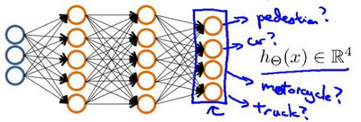
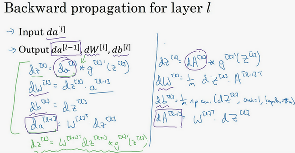

# 神经网络

无论是线性回归还是逻辑回归都有这样一个缺点，即：当特征太多时，计算的负荷会非常大。

<<<<<<< HEAD
=======
结构化数据即数据的基本数据库。例如在房价预测中，有一个数据库，专门的几列数据展示卧室的大小和数量；或者在预测用户是否会点击广告时，会有关于用户的信息，比如年龄以及关于广告的一些信息，然后对预测分类标注，这就是结构化数据，每个特征（比如房屋大小卧室数量，或者是一个用户的年龄）都有一个很好的定义。

相反非结构化数据是指比如音频，原始音频或者你想要识别的图像或文本中的内容。这里的特征可能是图像中的像素值或文本中的单个单词。

随着数据量的加大，深度模型的效果更好。

Scale drives deep learning progress: Data, Computation, Algorithms.

>>>>>>> 0e3eb5a (2021.11)
## 模型表示Model Representation

大脑中的神经网络：每一个神经元都可以被认为是一个处理单元/神经核（**processing unit**/**Nucleus**），它含有许多输入/树突（**input**/**Dendrite**），并且有一个输出/轴突（**output**/**Axon**）。神经网络是大量神经元相互链接并通过电脉冲来交流的一个网络。

其中$x_1$, $x_2$, $x_3$是输入单元（**input units**），我们将原始数据输入给它们。$a_1$, $a_2$, $a_3$是中间单元，它们负责将数据进行处理，然后呈递到下一层。最后是输出单元，它负责计算${h_\theta}\left( x \right)$。

神经网络模型是许多逻辑单元按照不同层级组织起来的网络，每一层的输出变量都是下一层的输入变量。下图为一个3层的神经网络，第一层成为输入层（**Input Layer**），最后一层称为输出层（**Output Layer**），中间一层成为隐藏层（**Hidden Layers**）。我们为每一层都增加一个偏差单位（**bias unit**）：$x_0$, $a_0$

$a_{i}^{\left( j \right)}$ 代表第$j$ 层的第 $i$ 个激活单元。${{\Theta }^{\left( j \right)}}$代表从第 $j$ 层映射到第$ j+1$ 层时的权重的矩阵，例如${{\Theta }^{\left( 1 \right)}}$代表从第一层映射到第二层的权重的矩阵。其尺寸为：以第 $j+1$层的激活单元数量为行数，以第 $j$ 层的激活单元数加一为列数的矩阵（加一个偏置项）。例如：上图所示的神经网络中${{\Theta }^{\left( 1 \right)}}$的尺寸为 3*4。

对于上图所示的模型，激活单元和输出分别表达为：

$a_{1}^{(2)}=g(\Theta _{10}^{(1)}{{x}_{0}}+\Theta _{11}^{(1)}{{x}_{1}}+\Theta _{12}^{(1)}{{x}_{2}}+\Theta _{13}^{(1)}{{x}_{3}})$

$a_{2}^{(2)}=g(\Theta _{20}^{(1)}{{x}_{0}}+\Theta _{21}^{(1)}{{x}_{1}}+\Theta _{22}^{(1)}{{x}_{2}}+\Theta _{23}^{(1)}{{x}_{3}})$

$a_{3}^{(2)}=g(\Theta _{30}^{(1)}{{x}_{0}}+\Theta _{31}^{(1)}{{x}_{1}}+\Theta _{32}^{(1)}{{x}_{2}}+\Theta _{33}^{(1)}{{x}_{3}})$

${{h}_{\Theta }}(x)=g(\Theta _{10}^{(2)}a_{0}^{(2)}+\Theta _{11}^{(2)}a_{1}^{(2)}+\Theta _{12}^{(2)}a_{2}^{(2)}+\Theta _{13}^{(2)}a_{3}^{(2)})$

上面进行的讨论中只是将特征矩阵中的一行（一个训练实例）喂给了神经网络，我们需要将整个训练集都喂给我们的神经网络算法来学习模型。可以知道：每一个$a$都是由上一层所有的$x$和每一个$x$所对应$\theta$的决定的，把这样从左到右的算法称为前向传播算法forward propagation。

<<<<<<< HEAD
向量化表示
=======
### 向量化表示

>>>>>>> 0e3eb5a (2021.11)

$x=\left[ \begin{matrix} x_0 \\ x_1 \\ x_2 \\ x_3 \end{matrix} \right]$ $z^{(2)} = \left[ \begin{matrix} z_1^{(2)} \\ z_2^{(2)} \\ z_3^{(2)} \end{matrix} \right]$

$z^{(2)} =\Theta^{(1)} x$
$a^{(2)} = g(z^{(2)})$

$a^{(2)} = \left[ \begin{matrix} a_1^{(2)} \\ a_2^{(2)} \\ a_3^{(2)} \end{matrix} \right] = g \left(\left[ \begin{matrix} \Theta_{10}^{(1)}&\Theta_{11}^{(1)}&\Theta_{12}^{(1)}&\Theta_{13}^{(1)} \\ \Theta_{20}^{(1)}&\Theta_{21}^{(1)}&\Theta_{22}^{(1)}&\Theta_{23}^{(1)} \\ \Theta_{30}^{(1)}&\Theta_{31}^{(1)}&\Theta_{32}^{(1)}&\Theta_{33}^{(1)} \\ \end{matrix} \right] \times\left[ \begin{matrix} x_0 \\ x_1 \\ x_2 \\ x_3 \end{matrix} \right] \right) = g \left(\left[ \begin{matrix} \Theta_{10}^{(1)}x_0&\Theta_{11}^{(1)}x_1&\Theta_{12}^{(1)}x_2&\Theta_{13}^{(1)}x_3 \\ \Theta_{20}^{(1)}x_0&\Theta_{21}^{(1)}x_1&\Theta_{22}^{(1)}x_2&\Theta_{23}^{(1)} x_3\\ \Theta_{30}^{(1)}x_0&\Theta_{31}^{(1)}x_1&\Theta_{32}^{(1)}x_2&\Theta_{33}^{(1)}x_3 \\ \end{matrix} \right]  \right)$

令 ${{z}^{\left( 2 \right)}}={{\Theta }^{\left( 1 \right)}}x$，则 ${{a}^{\left( 2 \right)}}=g({{z}^{\left( 2 \right)}})$ ，计算后添加 $a_{0}^{\left( 2 \right)}=1$。 计算输出的值为：

<<<<<<< HEAD
$h_\Theta(x) = a^{(3)} = g(z^{(3)} = g \left(\left[ \begin{matrix} \Theta_{10}^{(2)}&\Theta_{11}^{(2)}&\Theta_{12}^{(2)}&\Theta_{13}^{(2)} \end{matrix} \right] \times \left[ \begin{matrix} a_0^{(2)} \\ a_1^{(2)} \\ a_2^{(2)} \\ a_3^{(2)} \end{matrix} \right] \right) = g (\left[ \begin{matrix} \Theta_{10}^{(2)}a_0^{(2)}&\Theta_{11}^{(2)}a_1^{(2)}&\Theta_{12}^{(2)}a_2^{(2)}&\Theta_{13}^{(2)}a_3^{(2)} \end{matrix} \right] )$
=======
$h_\Theta(x) = a^{(3)} = g(z^{(3)}) = g \left(\left[ \begin{matrix} \Theta_{10}^{(2)}&\Theta_{11}^{(2)}&\Theta_{12}^{(2)}&\Theta_{13}^{(2)} \end{matrix} \right] \times \left[ \begin{matrix} a_0^{(2)} \\ a_1^{(2)} \\ a_2^{(2)} \\ a_3^{(2)} \end{matrix} \right] \right) = g (\left[ \begin{matrix} \Theta_{10}^{(2)}a_0^{(2)}&\Theta_{11}^{(2)}a_1^{(2)}&\Theta_{12}^{(2)}a_2^{(2)}&\Theta_{13}^{(2)}a_3^{(2)} \end{matrix} \right] )$

这个过程就是前向传播forward propagation，从输入单元的激活项开始，前向传播给隐藏层，计算隐藏层的激活项，然后继续前向传播，计算输出层的激活项。

这只是针对训练集中一个训练实例所进行的计算。如果我们要对整个训练集进行计算，需要让同一个实例的特征都在同一列里。即：

${{Z}^{\left( 2 \right)}}={{\Theta }^{\left( 1 \right)}}\times {X} $

${{A}^{\left( 2 \right)}}=g({{Z}^{\left( 2 \right)}})$

其实神经网络就像是**logistic regression**，只不过我们把**logistic regression**中的输入向量$\left[ x_1\sim {x_3} \right]$ 变成了中间层的$\left[ a_1^{(2)}\sim a_3^{(2)} \right]$，即:

$h_\Theta(x)=g\left( \Theta_0^{\left( 2 \right)}a_0^{\left( 2 \right)}+\Theta_1^{\left( 2 \right)}a_1^{\left( 2 \right)}+\Theta_{2}^{\left( 2 \right)}a_{2}^{\left( 2 \right)}+\Theta_{3}^{\left( 2 \right)}a_{3}^{\left( 2 \right)} \right)$

我们可以把 $a_0, a_1, a_2, a_3$ 看成更为高级的特征值，也就是$x_0, x_1, x_2, x_3$的进化体，并且它们是由 $x$ 与 $\Theta$ 决定的，因为是梯度下降的，所以 $a$ 是变化的，并且变得越来越厉害，所以这些更高级的特征值远比仅仅将 $x$ 次方厉害，也能更好的预测新数据。这就是神经网络相比于逻辑回归和线性回归的优势。

### 神经网络多分类  

输入向量 $x$ 有三个维度，两个中间层，输出层4个神经元分别用来表示4类，也就是每一个数据在输出层都会出现${{\left[ a\text{ }b\text{ }c\text{ }d \right]}^{T}}$，且$a,b,c,d$中仅有一个为1，表示当前类。下面是该神经网络的可能结构示例：

 Training set: $(x^{(1)},y^{(1)}),(x^{(2)},y^{(2)}),\cdots,(x^{(m)},y^{(m)})$

$y^{(i)}$ one of $\left[ \begin{matrix}1\\0\\0\\0 \end{matrix} \right],\left[ \begin{matrix}0\\1\\0\\0 \end{matrix} \right],\left[ \begin{matrix}0\\0\\1\\0 \end{matrix} \right],\left[ \begin{matrix}0\\0\\0\\1 \end{matrix} \right]$

## 神经网络的学习

回顾逻辑回归问题中代价函数为：

$J\left(\theta \right)=-\frac{1}{m}\left[\sum_\limits{i=1}^{m}{y}^{(i)}\log{h_\theta({x}^{(i)})}+\left(1-{y}^{(i)}\right)log\left(1-h_\theta\left({x}^{(i)}\right)\right)\right]+\frac{\lambda}{2m}\sum_\limits{j=1}^{n}{\theta_j}^{2}$

在逻辑回归中，只有一个输出变量，又称标量（**scalar**），也只有一个因变量$y$，但是在神经网络中，可以有很多输出变量，$h_\theta(x)$是一个维度为$K$的向量，并且训练集中的因变量也是同样维度的一个向量，因此代价函数会比逻辑回归更加复杂一些，为：$\newcommand{\subk}[1]{ #1_k }$

$h_\theta\left(x\right)\in \mathbb{R}^{K}$

${\left({h_\theta}\left(x\right)\right)}_{i}={i}^{th} \text{output}$

$J(\Theta) = -\frac{1}{m} \left[ \sum\limits_{i=1}^{m} \sum\limits_{k=1}^{K} {y_k}^{(i)} \log \subk{(h_\Theta(x^{(i)}))} + \left( 1 - y_k^{(i)} \right) \log \left( 1- \subk{\left( h_\Theta \left( x^{(i)} \right) \right)} \right) \right] + \frac{\lambda}{2m} \sum\limits_{l=1}^{L-1} \sum\limits_{i=1}^{s_l} \sum\limits_{j=1}^{s_{l+1}} \left( \Theta_{ji}^{(l)} \right)^2$

这个看起来复杂很多的代价函数背后的思想还是一样的，我们希望通过代价函数来观察算法预测的结果与真实情况的误差有多大，唯一不同的是，对于每一行特征，我们都会给出$K$个预测，利用循环对每一行特征都预测$K$个不同结果，然后再利用循环在$K$个预测中选择可能性最高的一个，将其与$y$中的实际数据进行比较。

正则化的那一项只是排除了每一层$\theta_0$后，每一层的 $\theta$ 矩阵的和。最里层的循环$j$循环所有的行（由 $s_{l+1}$  层的激活单元数决定），循环$i$则循环所有的列，由该层（$s_l$层）的激活单元数所决定。即：$h_\theta(x)$与真实值之间的距离为每个样本-每个类输出的加和，对参数进行**regularization**的**bias**项处理所有参数的平方和。

### 反向传播算法

**Cost function**:

$J(W^{[1]},b^{[1]},W^{[2]},b^{[2]}) = {\frac{1}{m}}\sum\limits_{i=1}^mL(\hat{y}, y)$

**loss function**和之前做**logistic**回归完全一样。

训练参数需要做梯度下降，在训练神经网络的时候，随机初始化参数很重要，而不是初始化成全零。当你参数初始化成某些值后，每次梯度下降都会循环计算以下预测值：

$\hat{y}^{(i)},(i=1,2,…,m)$

定义 $dW^{[1]} = \frac{\partial J}{\partial W^{[1]}},db^{[1]} = \frac{\partial J}{\partial b^{[1]}}，dW^{[2]} = \frac{\partial J}{\partial W^{[2]}},db^{[2]} = \frac{\partial J}{\partial b^{[2]}}$

梯度下降：

$W^{[1]}\implies{W^{[1]} - adW^{[1]}},b^{[1]}\implies{b^{[1]} -adb^{[1]}}$

$W^{[2]}\implies{W^{[2]} - \alpha{\rm d}W^{[2]}},b^{[2]}\implies{b^{[2]} - \alpha{\rm d}b^{[2]}}$

正向传播方程如下 **forward propagation**：

$Z^{[1]} = W^{[1]}x + b^{[1]}$

$A^{[1]} = \sigma(Z^{[1]})$

$Z^{[2]} = W^{[2]}A^{[1]} + b^{[2]}$

$A^{[2]} = g^{[2]}(Z^{[2]}) = \sigma(Z^{[2]})$

对于Logistic回归，有：

$\frac{dL(a,y)}{da}=\frac{y}{a}+\frac{1-y}{1-a}$ 

$\frac{\partial L}{\partial z}=\frac{dL}{da}\frac{da}{dz}=(\frac{y}{a}+\frac{1-y}{1-a})(a(1-a)) =a-y$ 

反向传播方程如下**back propagation**：

向量化实现（$Y$是$1×m$的矩阵）：

$ dZ^{[2]} = A^{[2]} - Y , Y = \begin{bmatrix}y^{[1]} & y^{[2]} & \cdots & y^{[m]}\\ \end{bmatrix} $

$ dW^{[2]} = {\frac{1}{m}}dZ^{[2]}A^{[1]T} $

$ {\rm d}b^{[2]} = {\frac{1}{m}}np.sum({d}Z^{[2]},axis=1,keepdims=True)$

$ dZ^{[1]} = \underbrace{W^{[2]T}{dZ^{[2]}}}_{(n^{[1]},m)}\quad*\underbrace{{g^{[1]}}^{'}{(Z^{[1]})}}_{(n^{[1]},m)} $

$dW^{[1]} = {\frac{1}{m}}dZ^{[1]}X^{T}$

${\underbrace{db^{[1]}}_{(n^{[1]},1)}} = {\frac{1}{m}}np.sum(dZ^{[1]},axis=1,keepdims=True)$

由于 $J=\sum\limits_{i=1}^mL()$，因此$\frac{\partial J}{\partial Z}={\frac{1}{m}}dZ^{[2]}$

这里`np.sum`是python的numpy命令，`axis=1`表示水平相加求和，`keepdims`是防止python输出那些错误的秩数$(n,)$，加上这个确保阵矩阵$db^{[2]}$这个向量输出的维度为$(n^{[1]},1)$这样标准的形式。 还有一种防止**python**输出奇怪的秩数，需要显式地调用`reshape`把`np.sum`输出结果写成矩阵形式。

因为$W^{[2]T}dZ^{[2]}$和${g^{[1]}}^{'}(Z^{[1]})$这两个都为$(n^{[1]},m)$矩阵，所以这里是进行逐个元素乘积。

#### 总结

反向传播：

（1）$d{{z}^{[l]}}=d{{a}^{[l]}}*{{g}^{[l]}}'( {{z}^{[l]}})$

（2）$d{{w}^{[l]}}=d{{z}^{[l]}}\cdot{{a}^{[l-1]}}$

（3）$d{{b}^{[l]}}=d{{z}^{[l]}}~~$

（4）$d{{a}^{[l-1]}}={{w}^{\left[ l \right]T}}\cdot {{dz}^{[l]}}$

（5）$d{{z}^{[l]}}={{w}^{[l+1]T}}d{{z}^{[l+1]}}* \text{ }{{g}^{[l]}}'( {{z}^{[l]}})~$

式子（5）由式子（4）带入式子（1）得到，前四个式子就可实现反向函数。

向量化实现：

（6）$d{{Z}^{[l]}}=d{{A}^{[l]}}*{{g}^{\left[ l \right]}}'\left({{Z}^{[l]}} \right)~~$

（7）$d{{W}^{[l]}}=\frac{1}{m}\text{}d{{Z}^{[l]}}\cdot {{A}^{\left[ l-1 \right]T}}$

（8）$d{{b}^{[l]}}=\frac{1}{m}\text{ }np.sum(d{{z}^{[l]}},axis=1,keepdims=True)$

（9）$d{{A}^{[l-1]}}={{W}^{\left[ l \right]T}}.d{{Z}^{[l]}}$

### 机器学习反向传播：

为了计算代价函数的偏导数$\frac{\partial}{\partial\Theta^{(l)}_{ij}}J\left(\Theta\right)$，采用反向传播算法，也就是首先计算最后一层的误差，然后再一层一层反向求出各层的误差，直到倒数第二层。

从最后一层的误差开始计算，定义激活单元的预测（${a^{(4)}}$）与实际值（$y^k$）之间的误差 $\delta^{(4)}=a^{(4)}-y$。

利用这个误差值来计算前一层的误差：$\delta^{(3)}=\left({\Theta^{(3)}}\right)^{T}\delta^{(4)}\ast g'\left(z^{(3)}\right)$

其中 $g'(z^{(3)})$是 $S$ 形函数的导数，$g'(z^{(3)})=a^{(3)}\ast(1-a^{(3)})$。而$(\Theta^{(3)})^{T}\delta^{(4)}$则是权重导致的误差的和。

下一步是继续计算第二层的误差：$ \delta^{(2)}=(\Theta^{(2)})^{T}\delta^{(3)}\ast g'(z^{(2)})$

因为第一层是输入变量，不存在误差。有了所有的误差的表达式后，便可以计算代价函数的偏导数了，假设$λ=0$，即我们不做任何正则化处理时有：$\frac{\partial}{\partial\Theta_{ij}^{(l)}}J(\Theta)=a_{j}^{(l)} \delta_{i}^{l+1}$

式子中上下标的含义：

$l$ 代表目前所计算的是第几层。

$j$ 代表目前计算层中的激活单元的下标，也将是下一层的第$j$个输入变量的下标。

$i$ 代表下一层中误差单元的下标，是受到权重矩阵中第$i$行影响的下一层中的误差单元的下标。

**这里的 $\delta^{(l)}$ 相当于是第 $l$ 层的第 $j$ 单元中得到的激活项的“误差”，即”正确“的 $a^{(l)}_{j}$ 与计算得到的 $a^{(l)}_{j}$ 的差。而 $a^{(l)}_{j}=g(z^{(l)})$ ，在逻辑回归的情况下 $dZ^{(l)}=\delta^{(l)}_{j}=\frac{\partial}{\partial z^{(l)}_{j}}cost()$**

$dW^{(l)}=d{{z}^{[l]}}\cdot{{a}^{[l-1]}}$

$\frac{\partial}{\partial\Theta_{ij}^{(l)}}J(\Theta)=a_{j}^{(l)} \delta_{i}^{l+1}$

### 梯度检验

当我们对一个较为复杂的模型（例如神经网络）使用梯度下降算法时，可能会存在一些不容易察觉的错误。虽然代价看上去在不断减小，但最终的结果可能并不是最优解。

为了避免这样的问题，我们采取一种叫做梯度的数值检验（**Numerical Gradient Checking**）方法。这种方法的思想是通过估计梯度值来检验正在计算的导数值是否真的是我们要求的。

对梯度的估计采用的方法是在代价函数上沿着切线的方向选择离两个非常近的点然后计算两个点的平均值用以估计梯度。即对于某个特定的 $\theta$，我们计算出在 $\theta$-$\varepsilon $ 处和 $\theta$+$\varepsilon $ 的代价值（$\varepsilon $是一个非常小的值，通常选取 $10^{-4}$），然后求两个代价的平均，用以估计在 $\theta$ 处的代价值。

$\frac{\partial}{\partial \theta}J(\theta)= \frac{J(\theta+\epsilon)+J(\theta-\epsilon)}{2\epsilon}$

### 随机初始化

任何优化算法都需要一些初始的参数。到目前为止我们都是初始所有参数为0，这样的初始方法对于逻辑回归来说是可行的，但是对于神经网络来说是不可行的。如果我们令所有的初始参数都为0，这将意味着我们第二层的所有激活单元都会有相同的值。同理，如果我们初始所有的参数都为一个非0的数，结果也是一样的。

**打破对称性**

通常初始参数为 $[-\epsilon,+\epsilon]$ 之间的随机值。

### 训练神经网络

1. 随机初始化参数

2. 利用正向传播方法计算所有的$h_{\theta}(x)$

3. 编写计算代价函数 $J$ 的代码

4. 利用反向传播方法计算所有偏导数

5. 利用数值检验方法检验这些偏导数

6. 使用优化算法来最小化代价函数

 
>>>>>>> 0e3eb5a (2021.11)
