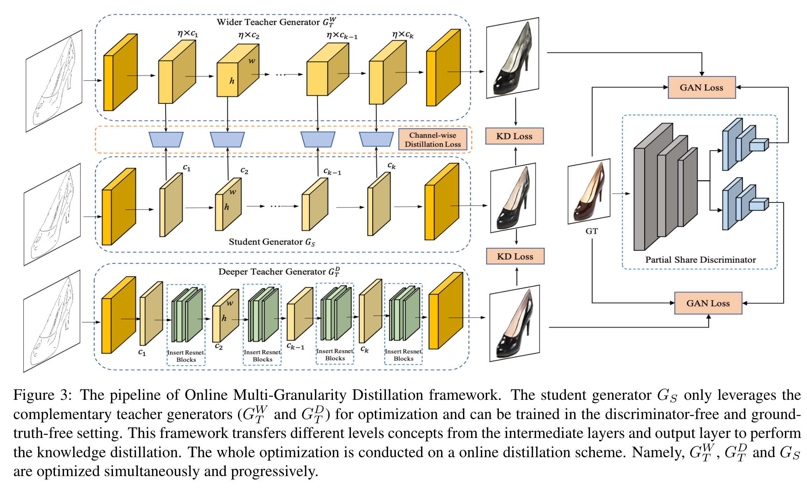
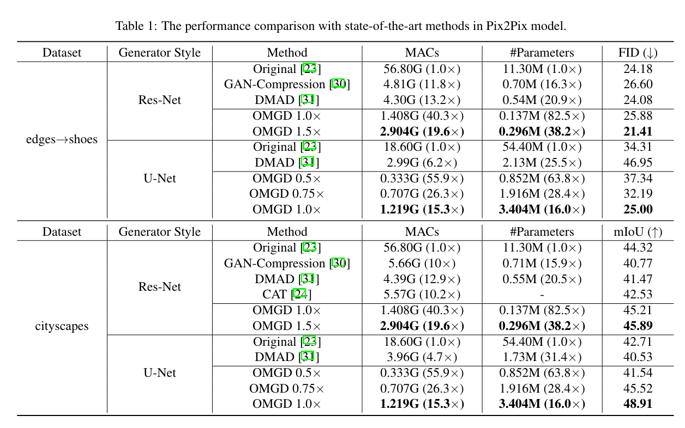
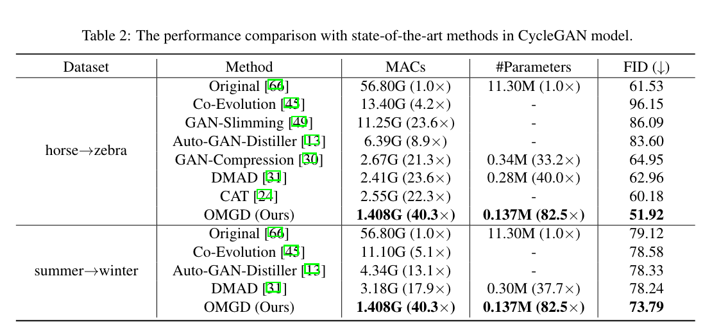

# OMGD Online Multi-Granularity Distillation for GAN Compression

[ICCV 2021] OMGD

## Abstract

生成对抗网络（GAN）在生成逼真的图像方面取得了巨大的成功，但是由于计算成本高和内存使用量大，在资源受限的设备上部署GAN非常麻烦。尽管最近在压缩GAN方面的努力取得了显著的成果，但它们仍然存在潜在的模型冗余，可以进一步压缩。

为了解决这个问题，提出了一种新的在线多粒度蒸馏（OMGD）方案来获得轻量级的GAN，以较低的算力生成high-fidelity图像。

首次尝试将single-stage单步在线蒸馏推广到GAN模型压缩，逐步提升的教师网络生成器有助于改进无判别器的学生网络的生成器。互补的教师网络生成器提供了多层次、多粒度的信息，从不同维度增强视觉质量。

在四个基准数据集上的实验结果表明，OMGD成功地在Pix2Pix和CycleGAN上压缩了40倍MACs和82.5倍参数，并且没有图像质量损失。

结果表明，OMGD为在资源受限的设备上部署实时图像翻译提供了一种可行的解决方案。

## Introduction

GAN最近非常流行，在图像生成、图像翻译等任务上取得了不错的成果。然而GAN这种需要巨大计算成本的模型很难推广，难以部署在资源受限的手机或其他轻量级物联网设备上。

为了减轻如此昂贵的计算成本，GAN压缩成为一项新提出的关键任务。大量模型压缩技术[29, 28, 56, 38, 57, 33]被用来训练高效的GAN，包括知识蒸馏[30, 1, 49, 8, 13, 15, 31, 20, 9, 24]，通道修剪[30, 31, 49]和nerual architecture search神经结构搜索[15, 30, 31]]。

上述压缩算法主要存在三方面的问题：

1. 直接使用现有的模型压缩技术[7,63,19]，这些技术不是针对GAN定制的，没有深入探索对GAN复杂特性和结构；
2. 其次，将GAN压缩定义为一个多阶段的任务。例如[30]需要按顺序进行预训练、蒸馏、进化和微调；基于蒸馏的方法[30, 31, 13, 9, 8, 49, 24]要先预训练教师网络生成器，然后蒸馏学生网络生成器。在多阶段训练中，端到端方法对于减少时间和计算资源至关重要。
3. 目前最先进的方法仍有高算力需求。例如SoTA模型[31]需要3G MACs，这对于部署在轻量级边缘设备上来说仍然较高。

为了解决上述问题，提出了一种新的在线多粒度蒸馏（OMGD）框架，不使用复杂的多阶段压缩过程，而是采用GAN的在线蒸馏策略，一步就可以获得压缩模型，从多个层次和粒度挖掘潜在的互补信息，帮助压缩模型。

#### Contributions

1. 首次尝试将在线蒸馏方法应用到GAN压缩领域，并在无判别器和无GT的情况下优化学生生成器。该方法对教师和学生进行交替训练，以迭代和渐进的方式提升这两个生成器。逐步优化的教师生成器有助于 warm up 学生，逐步引导优化方向。
2. 进一步从两个角度将在线蒸馏策略扩展为多粒度蒸馏。一方面，采用不同结构的教师生成器传递更多互补信息，并从更多样化的维度提高视觉质量。另一方面，除了输出层的知识外，我们还从中间层传递通道粒度信息作为辅助监督信号。
3. 实验证明，OMGD可以将两个基本条件GAN模型（包括pix2pix[23]和CycleGAN[66]）的计算量减少40倍，而不损失生成图像的视觉质量。证明OMGD对于各种基准数据集、不同的conditional GAN、网络架构以及问题设置（成对或不成对）是高效和鲁棒的。与现有方法相比，OMGD有助于以更少的计算成本获得更好的图像质量。此外，0.5倍OMGD（仅需要0.333G MAC）效果令人印象深刻，为在资源受限的设备上部署提供了可行的解决方案，甚至打破了移动设备上实时图像翻译的瓶颈。

## Related Work

### GANs and GAN Compression

Pix2Pix在生成器和鉴别器之间进行min-max博弈，以使用成对的训练数据进行图像到图像的转换。CycleGAN[66]进一步扩展了GANs在弱监督环境下（在训练阶段没有利用成对数据）进行图像翻译的能力，但是GAN内存和计算需求越来越高，这与在资源受限设备上的部署相冲突。

近年来，为了在轻量级设备部署，面向GAN的压缩成为一项重要任务。

- Shu等人[45]初步探索，提出了co-evolutionary algorithm协同进化算法去除冗余卷积核以压缩CycleGAN。
- Fu等人[13]采用AutoML方法，在计算资源约束下设计一个有效的生成器。
- Wang等人[49]提出了一个统一的GAN压缩优化框架，包括模型提取、通道修剪和量化。
- Li等人[30]设计了一个“once-for-all”的生成器，通过权重共享将模型训练和结构搜索分解。
- Li等人[31]提出了一种可微differentiable mask和共同注意力蒸馏算法。
- Jin等人[24]提出了一种一步剪枝算法，用于从教师模型中训练学生模型。

## Methodology

### 1. 在线蒸馏

方法中的“在线”，指的是网络不是预训练后固定的网络，而是教师网络在指导学生的同时，也根据与GT的差异更新自身参数。

离线蒸馏中的三个关键问题：

1. 传统离线蒸馏方法中的学生生成器应保持一定的容量，以保持与判别器的动态平衡，避免模型崩溃和消失梯度。然而，OMGD 的学生生成器仅利用教师网络的输出信息来进行优化，并且在无判别器的设定中进行训练。学生生成器依赖判别器，可以更灵活地训练并获得进一步的压缩。

   在每个迭代步骤中反向传播教师生成器和学生生成器之间的蒸馏损失。这样学生生成器可以模仿教师生成器的训练过程以逐步学习。其中蒸馏的损失函数由结构相似化损失函数和感知损失函数构成。

$$
\mathcal L_{KD}(p_t,p_s)=\lambda_{SSIM}\mathcal L_{SSIM}+\lambda_{feature}\mathcal L_{feature}+\lambda_{style}\mathcal L_{style}+\lambda_{TV}\mathcal L_{TV}
$$

其中$\lambda_{TV}\mathcal L_{TV}$是total variation loss。

2. 预先训练的教师生成器无法引导学生逐步学习信息，只能传递最后一层的知识，并且容易导致在训练阶段过度拟合。而 OMGD 的教师生成器有助于渐进地引导学生生成器的优化方向。
3. 对于 GAN 任务来说，评估指标是主观的，因此选择合适的预训练的教师生成器并非易事。而在线策略不需要一个预先训练好的教师生成器，可以避免这个问题；同时 OMGD 的学生生成器在优化过程中不需要使用真实标签，而仅学习教师生成器的输出，这大大降低了直接拟合真实标签的难度。

### 2. 多粒度蒸馏

将在线知识蒸馏扩展为多粒度，主要考虑两个方面：

1. 教师生成器的互补结构
2. 传递来自不同层的知识

#### 教师生成器的互补结构

从深度和宽度两个互补维度将学生模型扩展为教师模型。给定一个学生生成器，通过扩展学生生成器的通道来获得更宽的教师生成器 $G^W_T$ 。接着在学生生成器每个下采样层和上采样层之后插入几个 Resnet block 构建一个更深的教师生成器  $G^D_T$ 。直接将互补教师生成器的两个蒸馏损失合并为多教师设置中的知识蒸馏损失。
$$
\mathcal L_{KD_{multi}} (p^w_t,p^d_t,p_s) = \mathcal L_{KD} (p^w_t,p_s) + \mathcal L_{KD} (p^d_t,p_s)
$$

### 中间层蒸馏

除了输出层的知识外，OMGD 还将中间通道的粒度信息作为辅助的监督信号进行蒸馏优化。

OMGD 计算在通道维度上的注意力权重来衡量特征图中每个通道的重要性，并将注意力信息迁移到学生模型中。通道蒸馏损失channel distillation loss的定义如下所示：
$$
\mathcal L_{CD}(G^W_T,G_S)=\frac{1}{n}\sum\limits_{i=1}^n(\frac{\sum^c_{j=1}(w^{i,j}_{t_w}-w^{i,j}_{s})^2}{c})
$$
其中n是要采样的特征图数，c是特征图的通道数。$wij$ 是第i个特征图的第j个通道的注意力权重。

综上所述，整个在线多粒度蒸馏的损失函数定义：
$$
\mathcal L(G^W_T , G^D_T , G_S ) = \lambda_{CD}\mathcal L_{CD}(G^W_T,G_S) + \mathcal LKD_{multi}(p^w_t , p^d_t , p_s)
$$

## Experiments

在Pix2Pix 的实验结果表明，OMGD 对 U-Net 和 Resnet 两种类型的 GAN 都显著优于当前最先进的方法，且计算成本减少许多。

在 CycleGAN 实验结果表明，OMGD 以更小的计算成本获得了更好的性能表现。

在手机上测试（华为P20和小米10），极大加速推理，OMGD（U）1.0×将延迟从140.8ms减少到14.01ms，延迟下降90%。

## 结论

OMGD 能够把 GAN 模型的计算量减少到最低 1/46、参数量减少到最低 1/82 的程度，并保持原来的图像生成质量。

