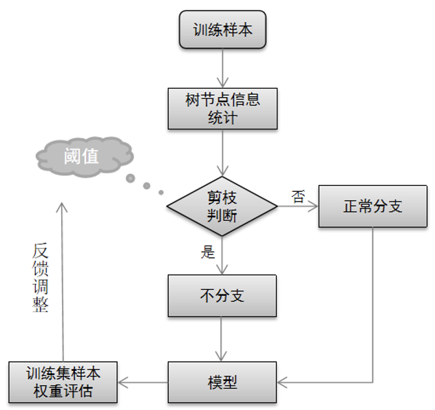
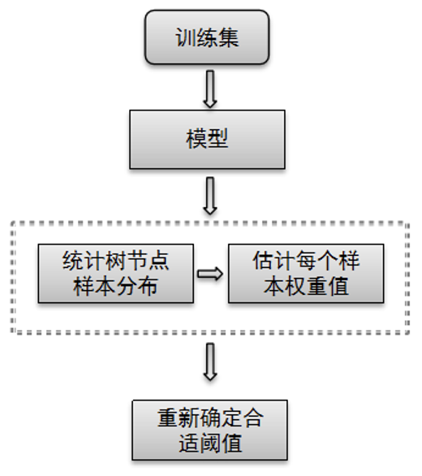

# XGBoost模型压缩

本发明阐述了XGBoost的模型减少内存消耗的一种方法。由于模型在实际使用中可能受到内存大小的限制，导致原有模型不能加载至内存使用。因此为了降低模型的内存消耗，本发明提出了一种基于叶子节点信息减少XGBoost模型大小的方法，可对训练过程中模型进行剪枝操作，使得最终树模型的节点更少，达到模型压缩的目的，并且在检出率变化控制在1%以内。

## 专业术语介绍以及相关名词解释

- 剪枝：通过树模型结构进行分析，减掉对分类结果呈现副作用、或意义不大的节点/叶子。
- 模型压缩：泛指机器学习中，通过特定的方式减少模型最后的复杂度、大小，本发明讨论XGBoost算法下的树模型压缩。
- 节点样本数量：树结构中训练集样本，使用树进行预测是，样本在各个节点分布数量。
- 白误报率：模型在正样本的误报个数/正样本数量
- 黑检出率：模型对负样本的检出个数/负样本数量

### 介绍技术背景，并描述与本发明相关的现有技术，说明现有技术的缺点与不足

在实际使用中，由于在特定环境下设备内存限制严格，直接只用训练后的集成树模型结构，会照成内存不足的情况。并且若在想要在有限的内存之中放入多个模型，使得设备可适应更多的环境，实现多种不同类别的检测功能，则必须减少模型的内存消耗。

现有的模型压缩技术主要有模型蒸馏、权重剪枝、模型量化、调整树分支时的信息增益阈值等。其中模型蒸馏、权重剪枝主要适用于深度模型，不适合本文讨论的树模型结构。模型量化是指使用低精度的数值，代替模型中高精度的值，从而减少内存所占空间，但该种方式模型精度下降较多。最后是树分叉阈值的调整，提高树分叉的阈值使树模型产生更少的分支，但这种经过试验发现模型压缩效果并不理想。

### 本发明摘要

（针对现有技术存在的缺点和不足，提出本发明的基本方案或基本思路，以及本发明针对现有技术所具备的整体技术效果）

针对现有模型压缩方法在XGBoost上表现出的不足，提出一种通过减少模型叶子节点来进行模型压缩的方法。本方法在模型训练集上，统计不同叶子节点样本的数量、权重信息，并根据预先设定相关阈值，当模型中的叶子节点样本总数量、权重小于该阈值时，则该树模型中的节点不进行分裂，达到模型压缩的目的。

本发明能够有效压缩树模型节点数量，降低模型内存消耗，在控制精度变化1%以内的情况下，模型压缩20%以上。

### 本专利相关技术方案的流程图及详细阐述

本发明方法的整体流程如下图一所示，主要有树节点信息统计、剪枝判断、模型分支、样本权重估、反馈再调节等几个部分。通过通过事先设定的阈值来判断是否对节点进行分裂，并且当模型训练出后，若模型压缩效果不好，则可对训练集在模型节点上的样本分布数量、权重进行预估，然后根据评估结果对阈值再调节，寻找更优阈值。

1. 树节点信息统计
   XGBoost模型包含多颗决策树，在训练过程中需要对每一颗决策树进行树节点的信息统计，包括样本在节点数量、样本训练过程中的权重。要保证模型的效果，我们需要剪枝掉对模型影响最小的节点。这里选取样本数量小、样本权重小的节点进行剪枝处理。
2. 剪枝判断根据前面统计的节点样本数量n、节点样本权重，然后对每一个节点中的样本权重进行求和，统计一个总权重信息w，以n和w判断是否分支。设节点样本数量阈值为N，节点样本权重阈值为W。
   1. 当n < N或者 w< W时模型节点不进行分裂
   2. 当n > N并且 w> W时模型正常进行分支。
3. 模型节点样本数量、权重评估
   由于对于新的样本集，无法确定阈值选取的范围，造成模型压缩效果不好，这里我们设计了反馈调整机制，当训练出第一版模型之后。可对模型整体进行评估，确定模型的阈值情况。评估流程如下：

使用训练的模型在训练集进行预测，统计各个树模型样本在各个叶子节点的分布数量，由于事先设定了阈值W，可借此对该训练集样本平均权重进行预估。设第i棵树中样本最少的节点上样本数量为ni，树的颗数为tree_num则样本平均权重avg_w预估为：

$avg_w = W/[sum(ni)/tree_num]$

若发现模型压缩效果不足，则根据统计的叶子节点上的样本数量，以及求出的样本平均权重，适当将阈值调大。

若发现模型压缩过多照成模型效果如在确定白误报率（如千分之一）的情况下，黑检出率效果不好，则适当减小阈值，提高树分枝数量。

### 请与现有技术方案对比，阐明本发明创新的关键点和希望保护的技术方案
现有的模型压缩方式有部分不适用与树模型的压缩，模型量化方式则模型精度下降较多，模型分支信息增益的调整试验发现模型压缩效果不理想。为了解决以上压缩方式在XGBoost模型表现不好的情况，本发明通过减少树模型叶子数量，从而降低模型内存占用。

本发明结合树模型结构，通过分析叶子样本数量以及权重，提出一种减少树模型叶子节点数量的方法，达到降低模型内存消耗的目的。
