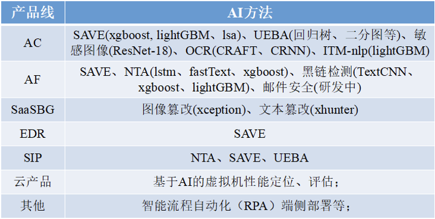
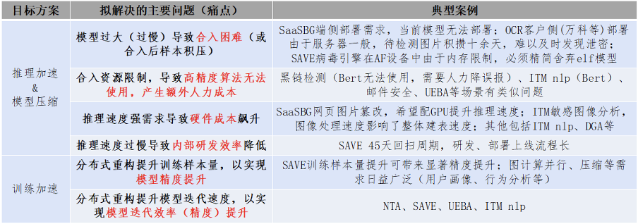

## 合作任务概述

随着公司内AI算法效果的体现，AI模型日益广泛的部署应用在了AF、AC、EDR、SIP、SaaSBG等诸多产品线，并为公司带来了显著价值。与此同时，为控制AI模型的部署成本（内存，CPU等资源占用），模型推理加速与压缩重要性日益凸显（详见1.2）。

在推理加速工作层面，公司当前主要重点在结合业务场景，使用成熟技术做定点、高效推进。然而，随着AI在公司不同产品线的结合，使用一种或少量技术无法满足所有的应用需求。为提高AI在真实场景中的工作效率，需要对现有的相关技术进行梳理。

另一方面， 随着数据量的爆炸性增长，存储空间和传输容量的需求也与日俱增，然而技术的增长率远远跟不上数据的增长率。传统编解码算法日渐接近信息熵极限，几乎达到了性能极致。而基于深度学习的方法因为能够更深层次的挖掘图像深层信息，因此有望突破已有的性能瓶颈。针对存储中的图像和视频数据（存储时未进行压缩或者压缩率不高），致力于构建数据压缩算法框架， 实现图像与视频高效有损压缩，降低数据存储、后期数据维护、数据备份成本，并且借鉴目前业界、学界数据压缩最新方式，构建出率数据压缩质量、数据压缩率处于领先地位的压缩算法框架。

在AI领域，每年会发表数千篇顶会论文，并且会提出海量方法，这些方法可能会帮助公司在一些特定业务场景中提高效率，但学术界的最新方案公司暂无人力跟踪。我们希望通过校企合作的方式，能够对学术界提出的最新技术进行汇总与分析，并探索这些技术在实际应用中的最优实现方式，从而解决业务场景中遇到的问题，同时形成公司系统化工具与技术壁垒。

## 项目来源和背景

近年来，AI效果彰显，各个产品线不断对接相应需求并与公司主流场景结合（安全，云计算）启动算法预研项，场景化落地趋势日益广泛（内部+外部）。当前各类AI模型已经广泛的部署在了AF、AC、EDR、SIP、SaaSBG等诸多场景，并为公司带来了显著价值。

高精度模型需要更大的训练数据、更复杂的模型结构。然而硬件发展无法跟上AI模型网络复杂度的提升（模型复杂度增速 >> 摩尔定律 > 硬件处理能力增长）。根据Intel全球副总裁，AI产品事业部负责人Naveen Rao所述，“神经网络模型中的参数数量实际上正以每年10倍的速度增长。这是我以前从未见过的指数，它的速度之快令人难以置信，基本上超过了我见过的每一次技术转型……而当前，参数数量已经逼近硬件可以处理的极限”。

在公司实际产品线中，部分较为严格的部署要求（训练速度、模型内存、推理速度）限制了复杂算法的使用，导致模型合入困难、产生额外人力成本、或模型效果无法达到最优；具体案例如下图所示：

另外，数据量的指数级增长对存储空间和传输容量提出了新的需求，在一些专业场景中，如卫星图像，地理信息系统等，高质量的图片需要更大的存储空间，如微观组织4096*4096像素的阵列图像需要占用48 MB的存储空间。若没有数据压缩，则很难甚至有时无法存储或传递大量数据文件。传统的编解码技术达到瓶颈，而基于深度学习的方法具有天然的优势，使用AI技术实现、辅助数据压缩是当前热点。工业界与学术界不仅有领先的研究成果，相关的标准也在制定中。

为解决上述实际需求，部分外部公司组建了大型团队持续投入以解决相关问题，例如图鸭、商汤等公司，在图像压缩、视频压缩等多个领域，已经形成了成熟的方法与方案，业界也有成熟论文进行相关领域最新进展的发表。当前公司人力主要精力在按需响应业务线需求定点完成任务，暂无专门人力进行相关领域最新进展，尤其是学术界进展的跟踪。为确保对公司业务的迅速、高效支撑，需要对相关领域最新进展进行把握，构建可用的框架。与此同时，项目将落地至少两个应用场景，以期对业务取得真实的效果提升。

### 2.1.1 功能目标
1. 调研学术界关于图像有损压缩、视频深度学习算法压缩研究的相关论文及workshop，梳理出技术发展方向及当前在业界广泛应用的主流的技术、算法，产出系统化报告，详细阐述图像、视频压缩的主流方案；
2. 项目在深度模型NTA-DGA落地，并取得实际效果；
3. 进行一次口头技术报告分享，负责的学生进行检测算法设计思路分享和测试演示，在部门层面或以上进行相关技术内容的分享。

### 2.1.2 性能目标
1. 结合 JPG、 WebP以及BPG 编解码方法，研究基于生成网络模型的有损图像压缩方法，以传统编解码算法为baseline，同当前SoTA深度学习压缩算法对比，在压缩率，或质量评价指标如PSNR、MS-SSIM等上取得优势；
2. 结合 H.264、H.265等压缩算法，实现端到端基于学习的视频压缩框架，按需实现有损视频压缩在业务场景中落地，进而综合利用基于生成对抗网络的图像重构算法、超分算法、新型编解码算法等，实现视频图像高效压缩， 形成算法壁垒；
3. 针对上述覆盖场景内的深度学习模型（eg：NTA-DGA），取得至少100%的压缩效果，尽可能同时取得较好的加速效果。

### 2.1.3 约束条件
运行平台：linux
开发语言：python & C++
产出要求：发展趋势及主流方法调研报告；不少于两个应用的代码demo
人员基础要求：需要深度学习背景与基础，当前主要在结合业务场景，使用成熟技术做定点推进，学术界最新方案暂无人力跟踪。希望能够结合学术界最新技术，探索最优实现方式并在应用中取得效果，同时形成公司系统化工具与技术壁垒。

### 2.1.4 技术难点

当前，伴随着AI算法的迅猛发展，为获取更强表征能力、更高精度的模型，模型训练参数与复杂度增加速度远远超过硬件自身计算能力的发展（GPT为例，自2018年6月至2020年5月，模型参数量增加超过1500倍，与此同时硬件处理器计算能力增加在4倍以内）。与此同时，随着IoT、物联网等领域的迅猛发展，AI模型在端侧（计算资源、内存均极为有限）部署的需求也日益强烈，公司内部（AF、EDR、AC、SaaSBG…）也诞生了诸多模型推理加速需求。

为解决模型压缩推理的相关问题，部分外部公司组建了大型团队持续投入以解决相关问题，例如商汤、依图等公司，在模型蒸馏、量化、剪枝、训练分布式等多个领域，已经形成了成熟的方法与方案，业界也有成熟论文进行相关领域最新进展的发表。针对这一领域，公司自2020年开始投入以来已经完成了部分场景的加速优化，但受限于人力背景与相关领域方法的迅猛发展与已有方案的海量膨胀，无法对最新相关方案逐一尝试。当前主要推进方案为结合业务场景，使用成熟技术做定点推进，已经成功完成部分场景的优化任务。但是，学术界最新方案暂无人力跟踪。希望能够结合学术界最新技术，探索最优实现方式并在应用中取得效果，同时形成公司系统化工具与技术壁垒。

在 AI+数据压缩领域，对 AI 模型应用在图像、视频等格式的压缩场景方面进行了系统的调研和研究，方法包括多篇顶会顶刊文章、国内外厂商产品、专利书等探讨和涉及的 AI技术。在图像和视频压缩方面，在各公司普遍使用的神经网络结构基础上， 针对特定场景优化网络结构，包括判别器优化以适应多尺寸图像、生成器判别器网络训练同步设计、模型场景判别等，通过结合 AI 模型实现各场景下的压缩构建技术壁垒。 主要涉及以下几个挑战：
1. AI 模型结构选型
目前研究涉及的网络结构很多，主要包括 RNN、 CNN、 Transform、 GAN 等几种方式，如何选择网络结构，甚至需要选取多种网络结构进行组合，在结合调研各大厂商以及学界研究的基础上，需要结合具体的场景去进行选择。
2. 神经网络模型初始结构只能对特定尺寸进行压缩
在实际场景应用中，单一的神经网络结构往往只能适应单一的数据尺寸，综合考虑采用数据预处理对图片进行裁剪或拉伸，或者修改网络结构以适应处理任意尺寸的图片。
3. 生成图像可能存在欺诈性的清晰与高分辨率
在生成图像时有可能生成的图像具有清晰的纹理，很好的视觉效果，很高的分辨率和清晰度，但与原图对比却可能存在明显差异。主要是因为，实现图像的有损压缩使用的 AI 技术，除起到预测作用、与传统编解码结合的模型外，大部分网络结构采取重建图像来实现压缩效果，因此学习到的图像信息可能与原图像有差异。因此需要通过衡量与原图像的差异来评估生成图像的正确性，同时引入场景分类等方案，进一步提升图片质量（质量指标如：PSNR、MS-SSIM等），解决上述问题。
