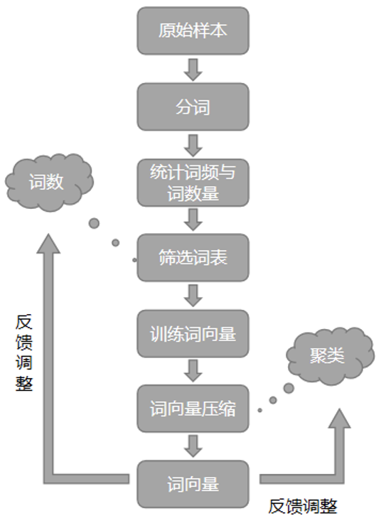
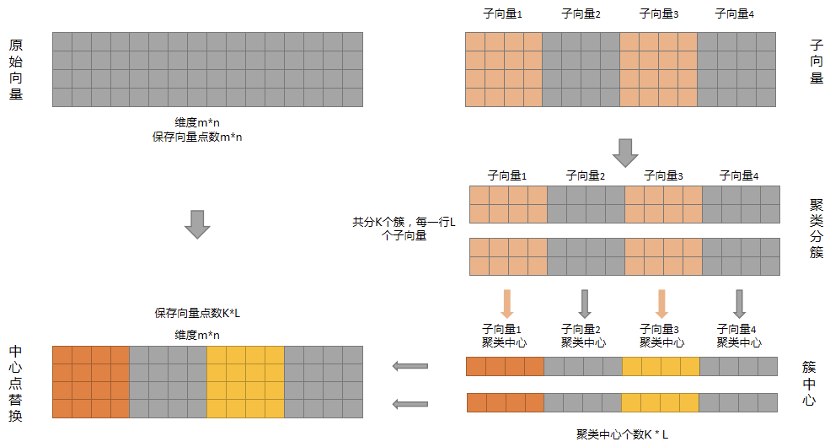

# 词向量模型压缩方法

本发明阐述了一种基于词向量模型的压缩方法。在机器学习的自然语言处理领域，词向量是常用的词义表征方式，但是词向量过长则会造成模型加载过程中，词表占用内存过大的情况。为此，本法明提出了一种词向量压缩方式，基于聚类减少词向量所占内存空间，进而减少模型整体大小，达到模型压缩的目的。

## 专业术语介绍以及相关名词解释

- 词向量：将一个词转换一个向量表示的方式，用于机器学习的数据输入。
- 模型压缩：通过一定方法减少模型加载到内存的大小，进而减少模型的内存消耗
- 词向量维度：一个词转换为向量时的表示长度，其中相似词义的词向量距离相近。
- 聚类：基于向量之间的距离，将相近的向量聚成一类的方法。
- 簇：聚类结果中表示同一类的数据集合，其中集合元素之间具有一定的相似性。

## 介绍技术背景，并描述与本发明相关的现有技术，说明现有技术的缺点与不足

在基于词向量的机器学习中，由于词向量维度一般很高，导致模型加载内存过大。现有词向量降低存储一般是采用降维方法，主要有PCA（主成分分析）、TSNE、LDA以及基于深度网络的Embedding等方式。现有的方式主要是数学方法，中间需要计算大量的矩阵运算，耗费时间久，Embedding方式则需要与神经网络结合，花费时间也比较长。

## 本发明摘要

（针对现有技术存在的缺点和不足，提出本发明的基本方案或基本思路，以及本发明针对现有技术所具备的整体技术效果）

为了解决词向量模型内存消耗大，传统降维方式所需计算量大的问题，本文发明，对训练词个数进行评估，减少一定的词个数降低模型的词向量所占资源消耗，同时提出了基于聚类的词向量降维方法。通过对词向量不同维度进行拆分，获取多个不同的子向量，然后不同对拆分出的子向量采用聚类的方式，将子向量的相似向量聚为一簇。最后针对同一簇的向量，则使用相同的簇中心向量表示，减少词向量所需内存需求，并加快了词向量降维速度。

## 本专利相关技术方案的流程图及详细阐述

数据整体处理流程主要有以下几步：

1. 原始样本分词  
按照一定规则将原始文本数据进行拆分，常用的分词方法有空格拆分、n_gram、正则规则拆分等。拆分完后一个sequence将表示为多个word的形式。
2. 统计词频与词数量  
根据每一个sequence拆分出的多个word信息，统计权训练集中每一个word的数量，以及全体样本词的总数，服务后续词表选择、词数量确认等步骤。
3. 筛选词表  
统计的词频信息筛选出出现频次较多的词作为词表。这里也可以结合逆词频等其他可以统计词重要性的方法，筛选重要性较高的词。
4. 训练词向量  
该步骤主要是采用CBOW或者Skip_Gram方式，根据上述步骤筛选出的词表代表的文本信息，进行词向量训练，获取词表中词对应的向量信息
5. 词向量压缩  
根据获取到的词向量信息，结合聚类的方式如k-means聚类方法，对词向量进行聚类，降低词向量内存空间消耗，达到模型压缩的目的。
6. 反馈调整  
根据词向量在模型上的表现效果、模型压缩大小，调整词表大小、向量压缩阶段子向量维度、聚类簇数量等信息。

在词向量聚类压缩阶段，处理步骤主要为三步，子向量划分、聚类以及中心点替换。将原始向量分块、聚类，寻找各向量块的簇中心点，使用中心点表示同一向量簇的对应子向量。

1. 原始向量：表示m*n的二维词向量，每一行为一个词的向量表示；
2. 子向量划分：将高向量维度，按照行拆分为多个子向量块；
3. 聚类：分别对每块中的每个子向量部分进行聚类，找到每块子向量的簇中心；
4. 中心点替换：最后在每块中使用簇中心代表其中的其他部分子向量信息，可大幅减少词向量存储占用、内存消耗。最终的簇中心数量为 K * L，相比于原有m*n的数据量大幅减少。

## 请与现有技术方案对比，阐明本发明创新的关键点和希望保护的技术方案
现有的词向量模型压缩方法，一般是直接采用数学方式或者结合深度学习方式，进行词向量降维，从而减少词向量占用空间，这种方式由于需要大量的数学计算，导致降维速度较慢。本发明则结合了聚类的方式，降低词向量所占空间，并较降维方式速度有所提升。

本发明提出了一种基于聚类的词向量模型压缩方法，通过使用聚类中心点表示同一簇的其他词向量，达到压缩词向量空间的目的。
