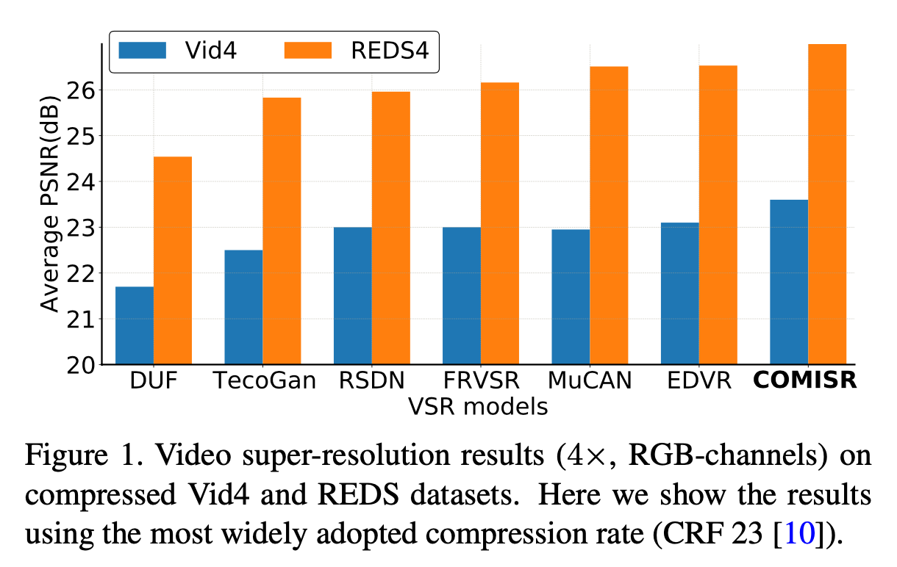
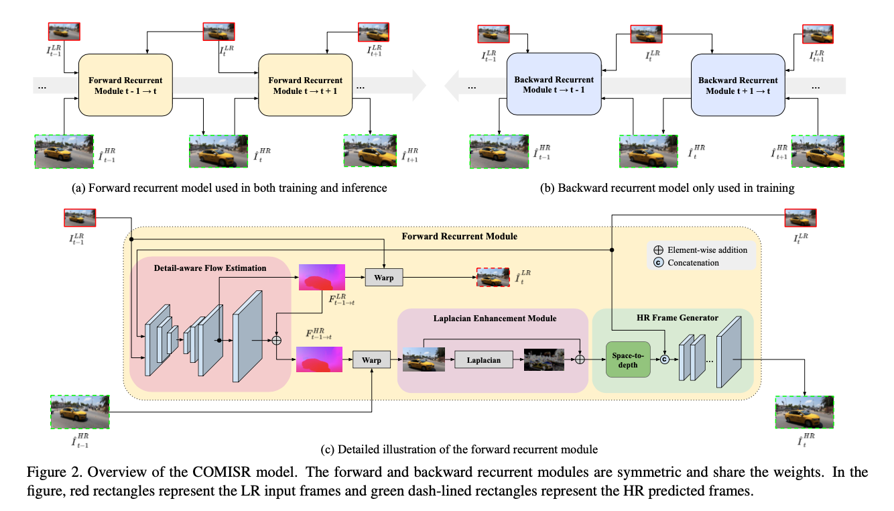

# 压缩视频超分COMISR

COMISR: Compression-Informed Video Super-Resolution

Google

## 摘要

大多数视频超分辨率方法侧重于从低分辨率视频恢复高分辨率视频帧，而不考虑压缩视频。但是，网络或移动设备上的大多数视频都是压缩的，当带宽有限时，压缩可能会很严重。

提出了一种新的压缩感知视频超分辨率模型来恢复高分辨率内容，而不引入压缩引起的伪影。该模型由三个视频超分辨率模块组成：bi-directional recurrent warping双向循环扭曲、detail-preserving flow estimation保持细节的流估计和拉普拉斯增强。

这三个模块都用于处理压缩特性，例如输入帧中帧内的位置和输出帧中的平滑度。

为了进行全面的性能评估，我们在具有各种压缩率的标准数据集上进行了各种的实验，涵盖了许多真实的视频用例。COMISR不仅可以从广泛使用的标准数据集中恢复未压缩帧上的高分辨率内容，而且还可以在基于众多量化指标的超分辨率压缩视频中实现SoTA的性能。通过模拟YouTube上的流媒体评估，以证明其有效性和鲁棒性。

## 一、简介

SISR: use learned image priors to recover high-resolution details of the given image,

VSR: use both image priors and inter-frame information to generate temporally smooth high-resolution results

先前工作中使用的未压缩视频实际上是低压缩率的高质量图像序列。因此这类方法在高压缩率的视频和图像上时，可能会造成伪影。

H.264编码中广泛使用的压缩率（恒定速率因子（CRF））为23，这是视觉质量和文件大小之间的折衷。当输入视频被压缩时，最先进的VSR算法效果不好。

一个可行的解决方案是在应用最先进的VSR模型之前，首先对图像进行去噪并去除图像中的压缩伪影。然而，在第4.3节中的实验表明，这种方法不会改善SR结果，反而会对视觉质量产生负面影响。通过预处理，第一步中的去噪模型可能与VSR训练过程中隐式使用的退化核有很大不同。经过去噪处理后，VSR模型需要有效地处理更具挑战性的图像。

另一个可行的解决方案是在压缩图像上训练现有的最先进的VSR模型。这将强制VSR模型考虑训练过程中的压缩伪影。然而，在第4.5节中描述的实验表明，在模型训练中简单地使用压缩帧只能带来适度的改进。事实上，如果不对网络模块的设计进行具体更改，此类训练数据甚至可能对整体性能产生负面影响。

为了解决上述问题，提出了一种压缩感知compression-informed (即compression-aware) 超分辨率模型，该模型可以在具有不同压缩级别的真实视频上运行良好。设计了三个模块来有效地恢复由于视频压缩而丢失的信息。

- 首先，提出了一个双向循环模块，以减少压缩视频帧中帧内随机位置的累积扭曲误差[46]。
- 其次，引入细节感知流估计模块，从压缩的LR帧中恢复HR流。
- 最后，采用拉普拉斯增强模块将高频信息添加到通过视频编码去除的扭曲HR帧中。

将此模型称为压缩信息视频超分辨率（COMISR）。

通过消融研究证明了这些模块的有效性，在几个VSR基准数据集上进行了广泛的实验，包括Vid4[32]和REDS4[41]，使用不同CRF值压缩的视频。实验表明，COMISR模型在压缩视频（如CRF23）上获得了显著的性能增益，同时在未压缩视频上效果也不错。

此外，还提供了基于最先进的VSR模型和现成视频去噪器的不同组合的评估结果。最后在使用专有编码器压缩的YouTube视频上验证了COMISR模型的健壮性。

### Contributions

- 提出一个用于超分辨率真实压缩视频的压缩感知的模型，实现了最先进的性能；
- 结合三个视频超分中新颖的模块，以有效提高压缩帧上视频超分辨率的关键组件；
- 在压缩基准数据集上对最先进的VSR模型进行了广泛的实验。我们还提出了一个新的设定，以评估针对YouTube转码视频的VSR模型，这是一个现有的评估方法不考虑的现实世界的应用场景。

## 二、相关工作

### 2.1 SISR

GAN：SRGAN [28], EnhanceNet [44], ESRGAN [55], SPSR [39] and SRFlow [37]

## 三、方法

COMISR模型基于递归公式设计，与现有的SoTA VSR模型类似，利用前一帧的视觉信息来超分当前帧。递归模型仅需要很少的内存，所以适用于视频中的大量推理任务。

给定LR GT帧，使用前向和后向递归模块，生成HR帧，并计算两个方向上HR GT帧的内容损失。在递归模块中，在LR和HR同时预测光流、生成扭曲帧，使用LR和HR GT帧端到端训练网络。

### 3.1 Bi-directional Recurrent Module

常见的视频压缩方法是采用不同的算法对视频流中不同位置的帧进行压缩和编码，分为帧内预测和帧间预测。

I帧压缩率低，但是伪影更少；由于I帧位置未知，为了有效减少视频超分过程中，I帧未知位置导致的累积误差，提出一种双向递归网络来增强LR扭曲输入和HR预测帧的前向和后向一致性。

双向递归网络由前向和后向的对称模块组成。

前向过程中，同时估计LR光流 $F^{LR}_{t-1\rightarrow t}$ 和HR光流 $F^{HR}_{t-1\rightarrow t}$，然后LR和HR流采取不同的操作。

LR流：

### 3.2 Detail-aware Flow Estimation

在递归模块中，显式地估计相邻帧之间的LR和HR流，并在前向和后向方向传递。

首先连接相邻的LR帧 $I^{LR}_{t-1}$ 和 $I^{LR}_{t}$，然后利用LR光流估计网络估计LR光流 $F^{LR}_{t-1\rightarrow t}$。不直接对 $F^{LR}_{t-1\rightarrow t}$ 上采样，而是在bilinear上采样的前面增加了几个额外的反卷积层。因此在端到端的训练过程中可以更好的预测HR流中的高频细节。

### 3.3 Laplacian Enhancement Module

拉普拉斯残差，在从视频帧中找到细节时特别有用，在视频压缩过程中可以平滑这些细节。

扭曲的预测HR帧保留了从先前帧中学习到的详细纹理信息，这种细节很容易在放大网络中丢失。因此将拉普拉斯残差添加到预测的HR帧以增强细节。

## 四、实验

### 4.1 数据集

REDS和Vimeo作为训练集。

这两个数据集之间的主要区别是REDS数据集包含手持设备捕获运动更剧烈的图像。

### 4.2 压缩方法

使用H.264最常见的设置在不同的压缩率（即不同的CRF值）下编码视频。CRF推荐值在18和28之间，默认值为23。实验中使用CRF为15、25和35来评估不同压缩率的视频超分。为了公平比较，在评估其他方法时，使用相同的退化方法在压缩前生成LR序列。最后这些压缩的LR序列被送入VSR模型进行推理。

### Youtube实验

首先从原始帧生成未压缩的视频，然后将它们上传到YouTube。这些视频以不同的分辨率进行编码和压缩以供下载。上传的视频是1280×720，youtube将其压缩为480p, 360p, 240p, 和 144p。下载其中的360p，比较三种算法MuCAN、RSDN和TecoGan。

### 4.3 实验结果

### 4.4 消融实验

## 五、总结

## 六、思考

