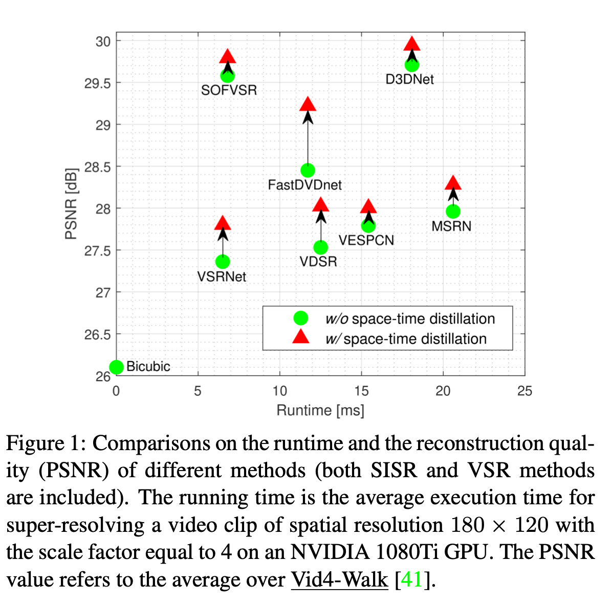
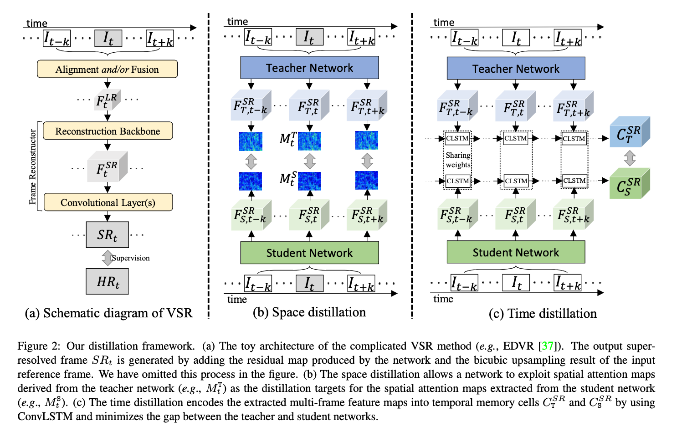

# Space-Time Distillation for Video Super-Resolution

[CVPR 2021]视频超分时空蒸馏

## Abstract

紧凑型视频超分辨率网络可以很容易地部署在资源受限的设备上，例如智能手机和可穿戴设备，但与需要大量计算资源的复杂VSR网络相比，其性能存在相当大的差距。

我们的目标是在不改变原始结构的情况下，通过一种知识蒸馏方法来提高紧凑型VSR网络的性能，该方法将信息从复杂的VSR网络传递到紧凑型VSR网络。具体地说，我们提出了一种时空蒸馏（STD）方案来利用VSR任务中的时空信息。

对于空间蒸馏，我们从两个网络中提取表示高频视频内容的空间注意力图，进一步用于传输空间建模能力。

对于时间蒸馏，我们通过提取时间记忆单元temporal memory cells的特征相似性来缩小紧凑模型和复杂模型之间的性能差距，时间记忆单元是使用ConvLSTM从训练片段中生成的特征图序列编码而来的。

在训练过程中，STD可以轻松地合入任何网络，而无需改变原始网络架构。在标准数据集上的实验结果表明，在资源受限的情况下，该方法在不增加参考时间的情况下显著改善了现有VSR网络的性能。

## Introduction

复杂模型性能好，紧凑模型易部署，然而由于结构简单，他们对时空相关性的建模能力受限，进一步影响了其超分性能。

和单张图像超分不同的是，视频超分关键一步是对齐不同帧，不管是显式地还是隐式地。

光流估计十分耗时，同时光流估计错误会导致伪影。为了避免显式计算光流，最近的一些方法隐式地利用运动信息。如DUF和 progressive fusion residual blocks，不计算光流，进行运动补偿。

EDVR使用了pyramid, cascading, and deformable structures金字塔、级联、可变形结构，用于多帧对齐。

虽然隐式地方法在一定程度上能节省一部分计算，但是依然有相当大的计算需求，不能部署在计算受限的场景中。

[6] [14] [28]通过simply用一个递归单元传播前一步的输出和隐藏状态，这些方法重建性能相当不错，并大大减少了推断时间。虽然可以在有效性和效率之间取得很好的折衷，但设计这样的循环网络需要付出巨大的努力。

1. [6] DarioFuoli,ShuhangGu,andRaduTimofte.Efficientvideo super-resolution through recurrent latent space propagation. In *ICCV Workshops*, 2019.
2. [14] Takashi Isobe, Xu Jia, Shuhang Gu, Songjiang Li, Shengjin Wang, and Qi Tian. Video super-resolution with recurrent structure-detail network. In *ECCV*, 2020
3. [28] Mehdi SM Sajjadi, Raviteja Vemulapalli, and Matthew Brown. Frame-recurrent video super-resolution. In *CVPR*, 2018.

本文中，我们不追求更先进的网络结构，而是引入知识蒸馏，利用教师网络原有的信息训练学生网络。在不改变网络架构和增加推理时间的前提下，提升学生网络的性能。Once a more powerful teacher network is available, we only need to retrain the student network instead of deploying a new one.

- 空间蒸馏SD：使用来自教师网络的spatial attention maps作为学生网络的训练目标，使学生网络模仿强大的教师网络捕获和建模空间相关性的能力。
- 时间蒸馏TD：获取教师网络捕获时间相关性并保持时间一致性的能力，缩小教师和学生网络的时间记忆单元之间的差距。时间记忆单元通过滑动窗口机制从特征图序列中使用ConvLSTM编码的。时间蒸馏不仅提高了时间一致性，而且提高了重建精度。

仅需在训练期间使用蒸馏，并且网络结构在推理期间保持不变。与仅使用重建损失（即Charbonnier损失[14,15,37]）进行训练相比，提出的STD方案可以从教师网络中获得额外的性能增益。

使用VESPCN [1], VSRNet [17] and FastDVDnet [34] 

## Related Work

### Video Super-Resolution

- [22] 提出时域自适应神经网络用于自适应选择最佳时间相关性范围的，提出改进的光流对准方法用于更好运动补偿。
- [32] 提出用于帧间运动对齐的亚像素运动补偿层，可同时实现运动补偿和上采样。
- [41] 通过提出的task-oriented flow面向任务流，以端到端的方式联合训练运动估计和VSR。
- TDAN [35] 和 EDVR [37] 不在图像层面运动对齐，而是在特征层面对齐。TDAN使用时域可变形卷积，在特征域对齐不同的帧。EDVR通过由粗到细的方式使用可变形卷积，使用心得时空注意力融合模块，代替简单地串联对齐的LR帧。
- [14] 提出了一种基于递归的网络，该网络利用two-stream structure-detail blocks两流结构细节块，重构从LR输入中提取的结构和细节分量，以实现高效的VSR。

### Knowledge Distillation (KD)

KD refers the technique that leverages intrinsic information of a large teacher network to train a small student one.

单张图像超分中的知识蒸馏：

- [7] 尝试从教师模型传传递一阶统计信息（例如，通道上的平均池化），学生模型经过训练，具有与教师相似的特征分布。
- [19] 将GT HR图像作为输入，提取强大的特权privileged信息用于图像重建。

## Space-Time Distillation

- (a): EDVR SRt是通过将网络产生的残差图与输入参考帧的双三次上采样结果相加而生成的。
- (b) 空间蒸馏：将从教师网络得到的空间注意图$M_t^T$作为从学生网络提取的空间注意图$M_t^S$的蒸馏目标
- (c) 时间蒸馏：利用ConvLSTM将提取的多帧特征图编码到时间存储单元$C_T^{SR}$和$C_S^{SR}$中，并最小化教师和学生网络之间的差距。

$F_t^{LR}$表示对齐的 和/或 融合帧，接下来给重建backbone中，得倒$F_t^{SR}$，他的空间分辨率与$HR_t$相同。通过卷积$F_t^{SR}$减少通道数，最终得到恢复后的$SR_t$。

蒸馏过程，选择蒸馏$F_t^{SR}$而不是$F_t^{LR}$，重建精度更好。

### Space Distillation

高频细节对参考帧的重建至关重要。受activation-based attention distillation 启发，设计的SD方案，通过从T中提取空间注意图来模拟T的空间表示能力，并利用它来训练紧凑的S。

feature maps: $F_{T,t}^{SR}\in \mathbb R^{C \times W \times H}, F_{S,t}^{SR}\in \mathbb R^{C \times W \times H}$

空间注意图的生成相当于找到一个映射函数：

$\mathcal M: \mathbb R^{C \times W \times H}\rightarrow \mathbb R^{W \times H}$

空间注意力图包含丰富多样的上下文信息，展示高频视频内容。映射函数可以定义为以下三种操作之一：
$$
\mathcal M_{sum(F_t^{SR})}= \sum\limits_{i=1}^{C}|F_{t,i}^{SR}|,(1)\\
\mathcal M_{sum(F_t^{SR})}^2= \sum\limits_{i=1}^{C}|F_{t,i}^{SR}|^2,(2)\\
\mathcal M_{max(F_t^{SR})}^2= \max_{i=1}^{C}|F_{t,i}^{SR}|^2,(3)
$$
空间

