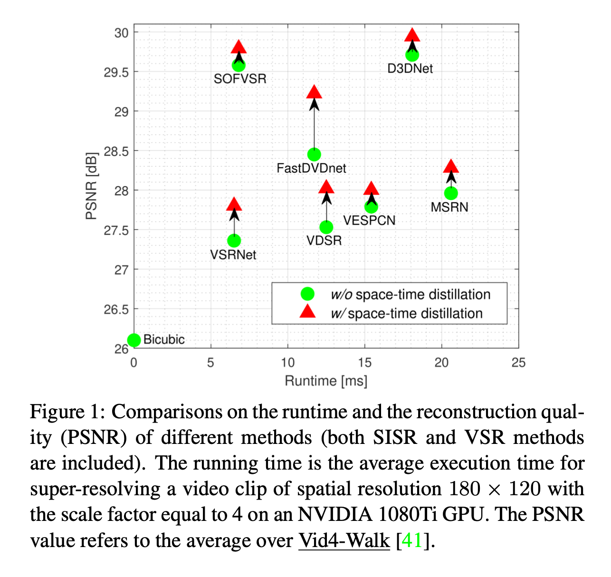
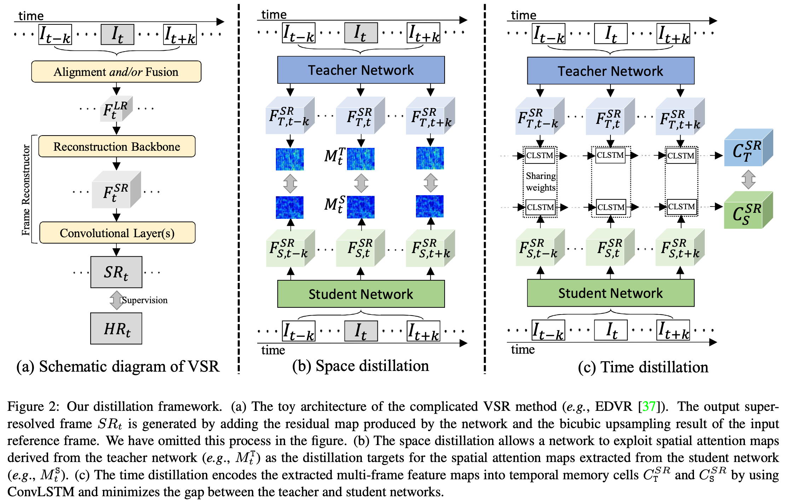

# 时空蒸馏STD

[CVPR 2021] Space-Time Distillation for Video Super-Resolution

中科大

## 摘要

紧凑的模型虽然容易部署在移动设备上，但是性能和复杂模型之间有较大差距，提出时空蒸馏STD，在不改变紧凑模型原来架构的前提下，将复杂模型的知识传到紧凑模型上，同时利用时间和空间的知识。

1. 空间蒸馏。从两个网络中同时提取表示高频视频内容的空间注意图，用于传输空间建模功能。
2. 时间蒸馏。提取时间记忆单元的特征相似性来缩小两个模型之间的性能差距。ConvLSTM对训练片段中生成的特征图序列编码得到时间记忆单元。

STD可以和其他的网络兼容，而不改变原有网络的架构。

重点：**方向是在不增加推理时间的前提下，缩小了紧凑模型和复杂模型的差距，而不是减少推理时间**。

GPU 1080 Ti，超分180×120视频，4倍超分。PSNR是在Vid4—Walk数据集上测试的均值。

## 一、简介
### 1.1 Motivation

与单张图像超分不同，a key step in VSR is to align different frames, either explicitly or implicitly，显式地或隐式地对齐帧。

Although a good tradeoff between effectiveness and efficiency can be obtained, designing such recurrent networks requires tremendous efforts.虽然也可以设计网络在性能和效率之间做好trade-off，但是设计这样的网络需要很大的精力。

光流估计十分耗时，同时光流估计错误会导致伪影。为了避免显式计算光流，最近的一些方法隐式地利用运动信息。如DUF和 progressive fusion residual blocks，不计算光流，进行运动补偿。

EDVR使用了pyramid, cascading, and deformable structures金字塔、级联、可变形结构，用于多帧对齐。

虽然隐式地方法在一定程度上能节省一部分计算，但是依然有相当大的计算需求，不能部署在计算受限的场景中。

新方向：做知识蒸馏，而不设计新的网络。这个方法尤其适合于资源受限的设备。一旦有更强大的教师网络，只需要训练学生网络就可以，而不需要部署新的网络。

分为两部分：空间蒸馏和时间蒸馏。

1. 空间蒸馏 SD

提取教师网络中的空间注意图作为学生网络的训练目标，使得学生网络可以学习到教室网络建模空间correlation的能力。

2. 时间蒸馏 TD

让学生网络学习到教师网络的捕获时间相关性和保持时间一致性的能力。使用ConvLSTM编码滑动窗口机制的特征图序列，来缩小教师网络和学生网络的时间记忆单元之间差距。

时间蒸馏不仅改善了时间一致性，而且提高了重建精度。操作只在训练时使用，推理时网络结构不变。

使用EDVR作为教师网络，在不增加推理时间的情况下，可以极大的提高紧凑VSR网络的性能。

使用VESPCN, VSRNet和FastDVDnet。

### 1.2 效果

### 1.3 Contributions

## 二、相关工作

### 2.1 视频超分

- [22] 提出时域自适应神经网络用于自适应选择最佳时间相关性范围的，提出改进的光流对准方法用于更好运动补偿。
- [32] 提出用于帧间运动对齐的亚像素运动补偿层，可同时实现运动补偿和上采样。
- [41] 通过提出的task-oriented flow面向任务流，以端到端的方式联合训练运动估计和VSR。
- TDAN [35] 和 EDVR [37] 不在图像层面运动对齐，而是在特征层面对齐。TDAN使用时域可变形卷积，在特征域对齐不同的帧。EDVR通过由粗到细的方式使用可变形卷积，使用心得时空注意力融合模块，代替简单地串联对齐的LR帧。
- [14] 提出了一种基于递归的网络，该网络利用two-stream structure-detail blocks两流结构细节块，重构从LR输入中提取的结构和细节分量，以实现高效的VSR。

### 2.2 知识蒸馏

单张图像超分中的知识蒸馏：

- [7] 尝试从教师模型传传递一阶统计信息（例如，通道上的平均池化），学生模型经过训练，具有与教师相似的特征分布。
- [19] 将GT HR图像作为输入，提取强大的特权privileged信息用于图像重建。

### 2.3

## 三、方法

- (a): EDVR SRt是通过将网络产生的残差图与输入参考帧的双三次上采样结果相加而生成的。
- (b) 空间蒸馏：将从教师网络得到的空间注意力图 $M_t^T$ 作为从学生网络提取的空间注意力图 $M_t^S$ 的蒸馏目标
- (c) 时间蒸馏：利用ConvLSTM将提取的多帧特征图编码到时间记忆单元 $C_T^{SR}$ 和 $C_S^{SR}$ 中，最小化教师和学生网络之间的差距。

$F_t^{LR}$ 表示对齐的 和/或 融合帧，接下来经过pixel-shuffle operation后，送入用于重建的backbone中，得到 $F_t^{SR}$，其空间分辨率与 $HR_t$ 相同。通过卷积减少 $F_t^{SR}$ 通道数，最终得到恢复后的 $SR_t$。

蒸馏过程，选择蒸馏 $F_t^{SR}$ 而不是 $F_t^{LR}$，重建精度更好。

### 3.1 空间蒸馏

高频细节对参考帧的重建至关重要。受activation-based attention distillation 启发，SD通过从教师T中提取空间注意图来模拟T的空间表示能力，并利用它来训练紧凑的学生S。

feature maps: $F_{T,t}^{SR}\in \mathbb R^{C \times W \times H}, F_{S,t}^{SR}\in \mathbb R^{C \times W \times H}$

空间注意图的生成相当于找到一个映射函数：

$$
\mathcal M: \mathbb R^{C \times W \times H}\rightarrow \mathbb R^{W \times H}
$$

空间注意力图包含丰富多样的上下文信息，展示高频视频内容。映射函数可以定义为以下三种操作之一：

$$
\mathcal M_{sum(F_t^{SR})}= \sum\limits_{i=1}^{C}|F_{t,i}^{SR}|,(1)\\
\mathcal M_{sum(F_t^{SR})}^2= \sum\limits_{i=1}^{C}|F_{t,i}^{SR}|^2,(2)\\
\mathcal M_{max(F_t^{SR})}^2= \max_{i=1}^{C}|F_{t,i}^{SR}|^2,(3)
$$

## 四、实验

### 4.1 数据集

### 4.2 模型设置

### 4.3 实验结果

### 4.4 消融实验

## 五、总结

## 六、思考