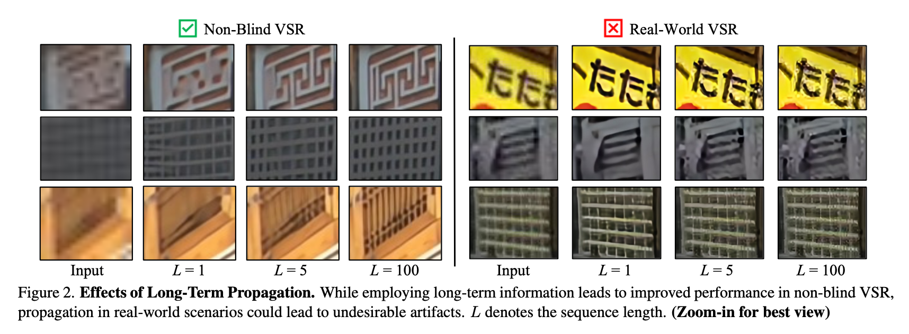

# 真实世界超分RealBasicVSR

Investigating Tradeoffs in Real-World Video Super-Resolution

NTU S-Lab

## 摘要

退化过程的diversity and complexity是一个non-trivial挑战。

一、虽然在退化不严重的情况下，long-term 传播可以提高性能。但是在真实环境中，退化严重，会随着长期传播导致严重的质量下降。

为了细节生成和控制伪影之间的平衡，在传播之前，必须要做图像预清洁，这样可以减少噪声和伪影。

RealBasicVSR，用一个精心设计的clean模块，超分质量和效率都更好。

二、现实世界的VSR模型通常使用不同的退化进行训练，以提高通用性，所以需要增加batch size以提供稳定的梯度。这样不可避免增加了计算量，导致两个问题：

1. 速度和性能之间trade-off
2. batch和length之间trade-off

针对速度和性能trade-off，提出随机退化方法，在不损失性能的前提下，可减少40%的训练时间。

针对batch和length之间trade-off，尝试并分析了不同的训练设置，发现更长的序列比更大的batch可以更有效地利用时间信息，从而使推理过程中性能更稳定。

为了便于公平比较，提出了VideoLQ数据集，由大量真实世界的低质量视频序列组成，其中包含丰富的纹理和图案。

## 一、简介
### 1.1 Motivation

假设退化过程已知，虽然限定条件下效果不错，over-simplified scenarios cannot generalize well to the complex degradations in the wild。泛化性不好。
此外，退化的多样性和复杂性会导致推理和训练时的困难，像是伪影放大，增加计算负担。

BasicVSR中已经证明long-term信息有助于恢复，然而在现实中也会导致更严重的伪影，由于传播过程中的错误累积。
所以就有了enhancing details和suppressing artifacts之间的trade-off，因为网络的合成能力是以放大噪声和伪影为代价的。

RealBasicVSR提出预先图像清洗模块，去除输入图像中的退化。在保持模型简单的基础上，避免了伪影，提升了质量。

### 1.2 效果

### 1.3 Contributions

## 二、相关工作

### 2.1

### 2.2 Real-World Super-Resolution

盲超分假设输入经过了未知参数的退化过程。过去的方法训练网络时用一组预定义的退化，随机选择参数。虽然经过训练的网络能够恢复有一系列退化的图像/视频，但这些退化通常是有限的，无法满足真实世界退化的多样性。

最近的两项研究[37,45]提出在训练期间使用数据增广来实现更为多样化的退化。使用ESRGAN而不改变其网络结构，这两种方法在真实图像中表现出了良好的性能。然而在实际的VSR中，这种数据增广级别的直接扩展是不可行的，因为网络往往会放大噪声和伪影。

RealBasicVSR用一个简单有效的图像清洗模块来解决噪声和伪影的问题。

### 2.3 Input Pre-Processing

一个看似微不足道的图像清洗模块，对于在传播之前消除退化和抑制输出伪影至关重要。在长期传播中更是如此。

在图像超分中，已经有相关工作在无监督学习中做突袭那个预处理。尽管已经取得了不错的成果，但是有监督学习中和 VSR 中输入预处理还没有有效的工作。与上述工作相反，本文将重点放在完全不同的有监督VSR上，以消除在长期传播过程中放大的退化。

此外，还设计了一个动态优化方法，通过在推理过程中反复应用清洗模块来消除过度降解。最后对图像清洗模块和优化方案进行了系统分析，以验证其有效性，并为未来的研究提供一定的指导。

## 三、方法

BasicVSR在非盲视频超分领域取得了非常好的效果，但是在真实场景的表现仍差强人意，见下图对比。

可以看到：在非盲场景，BasicVSR具有非常好的结果，同时伴随帧数增加，性能可以大幅改善；而在真实场景中，轻度退化时的性能尚可，重度退化时则会引入新问题：增强噪声、产生伪影。而如果仅处理一帧的话，BasicVSR可以移除噪声，产生平滑的结果。因此，在增强细节与伪影抑制方面需要进行均衡。

### 3.1 输入预清洗

提出了一种简单的“即插”模块用于时序传播中抑制退化先验，总结来说就是“清理”输入序列，使输入中的退化对VSR网络中的子序列影响最小。

输入图像首先经过该块进行退化移除操作：$\widetilde{x}_i=C(x_i$);

经上述模块清洗后的图像将送入到VSR模型中进行处理：$y_i=S(\widetilde{x}_i)$，使用BasicVSR进行超分，结构简单，且长期传播在非盲超分中表现非常好。

为更好的引导预清洗模块，添加了损失约束：$\mathcal L_{clean}=\sum_i \rho(\widetilde{x}_i-d(z_i))$，其中 $z_i$ 是GT，d表示下采样操作，$\rho$ 表示Charbonnier损失。

除了清洗损失，还使用输出保真度损失来指导清洗模块：$\mathcal L_{out}=\sum_i \rho(y_i-z_i)$。

当使用这两种损失对网络进行微调时，清洗模块与感知损失[20]和对抗损失[11]分离。

需要精心设计清洗模块，使用循环结构的替代模型无法有效移除伪影。

### 3.2 动态微调

简单的进行上述预清洗可能无法有效的移除过度退化问题，所以提出一种动态微调机制(测试时使用)：

$$
\begin{cases}
\widetilde x_i^{j+1}=C(\widetilde x_i^j) & \text{if} \quad mean (|\widetilde x_i^j-\widetilde x_i^{j-1}|)\geq \theta \\ \widetilde x_i=\widetilde x_i^j & \text{otherwise,}
\end{cases}
$$
注：对于非GAN模型，$\theta=1.5$；对于GAN模型，$\theta=5$。

动态微调会自动停止清洗过程，以避免过度平滑和不自然的平坦区域。

在预清洗模块的架构方面，采用了简单的残差模块堆叠方式；在VSR方面，对BasicVSR简化，将残差模块数从60降低到40，以保持相当的复杂度。

## 四、实验 Tradeoff in Training

在真实场景中，视频超分模型需要通过多样性的退化数据进行训练，这导致需要采用更大的batch稳定梯度、更长的序列长度提升重建质量，以及更多的计算资源。

但计算资源往往是有限的，所以将其拆分为两个子问题：(1) 速度-性能均衡；(2) batch-length均衡。

### 4.1  Speed vs. Performance

提出随机退化机制，可以大幅提升训练速度且不会牺牲性能，见

### 4.2 模型设置

### 4.3 实验结果

### 4.4 消融实验

## 五、总结

## 六、思考