# 视频超分综述

Video Super Resolution Based on Deep Learning: A comprehensive survey

## Abstract

研究了28种基于深度学习的SoTA超分算法。

众所周知，视频帧内信息的利用对视频超分很重要。因此将帧间信息的利用方式分为六类。

详细描述了所有算法架构和实现细节（包括输入输出、损失函数和学习率）。在标准数据集上总结和比较了他们在不同的magnification factor放大因子下的性能。

下一步的挑战，alliviate **understandability and transferability**减轻现有技术和未来技术在实践中的可理解性和可移植性。

## Introduction

从广义上讲，视频超分辨率可以看作是图像的超分辨率，可以用图像超分辨率算法逐帧进行处理。然而这样做会带来artifacts和jam，导致帧内的时间一致性不能得到保证。

- Liu和Sun[1]提出了一种贝叶斯方法来同时估计潜在运动、模糊核和噪声水平，并重建高分辨率帧。
- [2]采用期望最大化(EM)方法估计模糊核，指导高分辨率帧的重建。

然而，这些高分辨率视频的显式模型由于其固定的解决方式，仍然不足以适应视频中的各种场景。随着深度学习在各个领域取得的巨大成功，基于深度学习的超分辨率算法得到了广泛的研究。研究人员提出了许多基于深层神经网络(如卷积神经网络(CNN)、生成对抗网络(GAN)和递归神经网络(RNN))的视频超分辨率方法，它们使用大量的低分辨率和高分辨率视频序列来输入神经网络进行**帧间对准、特征提取/融合和训练网络**，然后为相应的低分辨率(LR)视频序列生成高分辨率(HR)序列。大多数视频超分辨率方法的处理流程主要包括一个对准模块、一个特征提取与融合模块和一个重构模块，如图1所示。得益于深度神经网络的非线性学习能力，基于深度学习的方法在许多公共基准数据集上取得不错的性能。

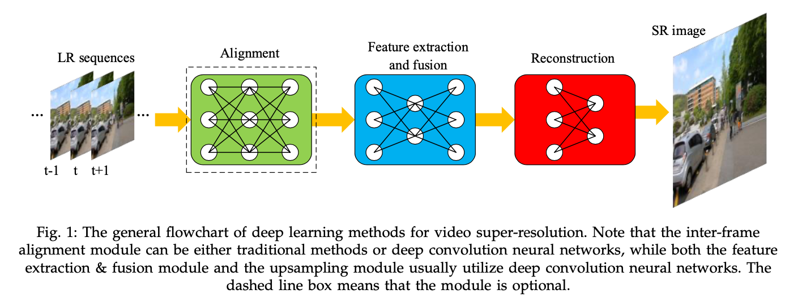

虽然关于单图像超分辨率研究的文献[3，4，5]已经发表了很多，但关于视频超分辨率任务的综述工作很少。Daithan kar和Ruikar在文献[6]中对多种频域-空域方法进行了简要的评述，但对深度学习方法却鲜有提及。不同于以往的工作，我们对近年来视频超分辨率深度学习技术进行了较为全面的研究。众所周知，视频超分辨率和图像超分辨率的主要区别在于帧内信息的处理，而能否有效利用附近帧的信息对于超分辨率结果至关重要。我们专注于在各种基于深度学习的方法中利用帧内信息的方法。

### Contributions

1. 回顾了近年来在基于深度学习的视频超分辨率技术的工作和进展
2. 根据帧间信息利用方式，提出了一种基于深度学习的视频超分辨率方法分类方法，并举例说明了如何使用该分类方法对现有方法进行分类
3. 总结了这些state-of-the-art 方法在标准数据集上的性能
4. 分析了视频超分辨率任务面临的挑战和前景。

## Background

视频超分辨率源于图像超分辨率，其目标是从一个或多个低分辨率(LR)图像/视频中恢复高分辨率(HR)图像/视频。然而，视频超分辨率技术和图像超分辨率技术的区别也很明显，即视频超分通常利用帧间信息。

退化过程

$\hat{I}=\phi(I;\theta_\alpha)$

其中$\phi(\cdot;\cdot)$表示退化函数， $\theta_\alpha$是退化函数中的参数，可以表示各种退化因子，如噪声、运动模糊、下采样因子等。

获得$\hat{I}$很容易，但退化因子可能相当复杂，也可能是目前尚不清楚几个因素的组合。视频超分辨率目标是从退化的视频序列中恢复出相应的HR视频序列，并使其尽可能接近真实(GT)视频。

超分辨过程，即函数的逆过程：

$\widetilde{I}=\phi^{-1}(\hat{I};\theta_\beta)$

在大多数现有方法中，退化过程被建模为：

$\hat{I}=(I\otimes k)\downarrow_s+n$

k表示模糊核，n表示高斯噪声，$\downarrow_s$表示下采样scale为s，$\otimes$卷积。

与图像超分辨率一样，视频质量主要通过计算峰值信噪比(PSNR)和结构相似指数(SSIM)来评价。PSNR衡量两图像之间像素的差异，SSIM衡量两图像的结构相似性。

$PSNR=10\log(\frac{L^2}{MSE})$

L表示颜色值的最大范围，通常为255

$SSIM(I,\widetilde{I})=\frac{2\mu_I \mu_{\widetilde{I}}+k_1}{\mu_I^2+\mu_{\widetilde{I}}^2+k1}\cdot\frac{2\sigma_{I \widetilde{I}}+k_2}{\sigma_I^2+\sigma_{\widetilde{I}}^2+k2}$

k1,k2用于稳定计算，通常设置为0.01和0.03。

此外，针对视频序列的特点，有研究人员另外提出了几种测量方法，用于评估恢复的视频质量，包括MOVIE[7,8]、学习感知图像块相似性（LPIPS）[9]以及[10]中提出的两种测量方法：tOF和tLP。

## Video Super-resolution Method

由于视频是运动视觉图像和声音的记录，视频超分辨率方法借鉴了现有的单图像超分辨率方法。

基于深度学习的图像超分辨率方法，如SRCNN[37]，及其改进的变体：FSRCNN[38]、VDSR[39]、ESPCN[40]、RDN [41]、RCAN [42]、ZSSR [43] 和SRGAN [44]。

2016年，Kappeler[12]在SRCNN的基础上提出了一种基于卷积神经网络(VSRnet)的视频超分辨率方法，这是一种将深度学习应用于视频超分辨率任务的著名方法。到目前为止，已经出现了许多视频超分辨率算法。接下来，我们总结了近年来基于深度学习的视频超分辨率方法的特点。

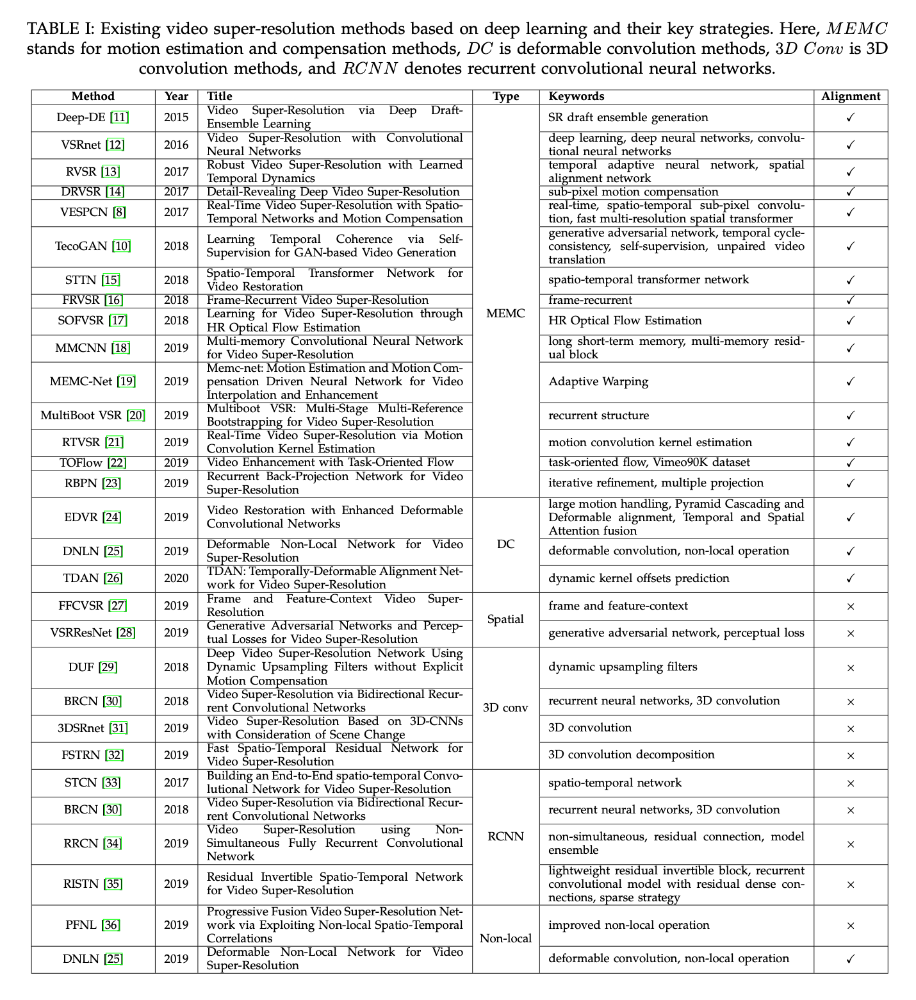

几篇关于视频超分辨率的文献[24,29,26]表明，帧间信息的利用对视频超分性能有很大影响。能够适当和充分地利用这些信息可以提高超分辨率的效果。因此，我们根据帧间信息的利用方式为现有的视频超分辨率方法建立分类。

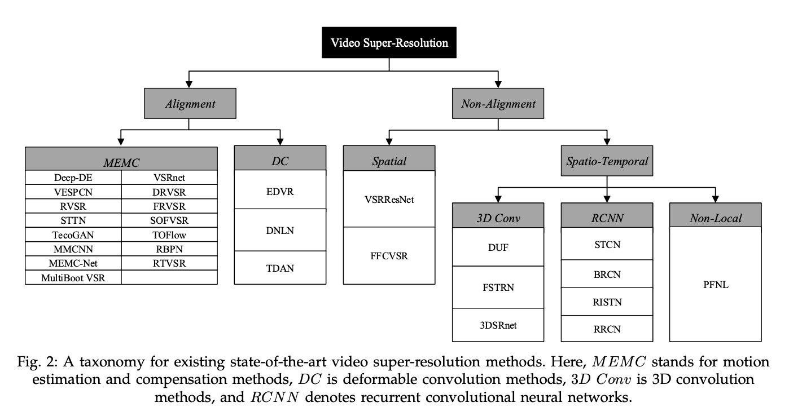

根据视频帧是否对齐，我们将现有的方法分为两大类：对齐方法和非对齐方法。

## Aligned Methods

对齐方法通过网络提取运动信息，使相邻帧与目标帧对齐，然后进行后续重建。这些方法主要采用**运动补偿和可变形卷积**这两种常用的帧对齐技术。

### Motion Estimation and Compensation Methods

在视频超分辨率的对齐方法中，大多数方法都采用了运动补偿和运动估计技术。运动估计的目的是提取帧间运动信息，而运动补偿则是根据帧间运动信息进行帧间的warp扭曲操作，使帧与帧对齐。大多数运动估计技术由光流法[45]执行，光流法试图通过两个相邻帧在时域上的相同和变化来计算运动。运动补偿方法可分为传统方法(如LucasKanade[46]和Druleas[47]算法)和深度学习方法(如FlowNet[45]、FlowNet 2.0[48]和SpyNet[49])。

optical flow矢量场$F_{i\rightarrow j}$：

$F_{i\rightarrow j} = (h_{i\rightarrow j},v_{i\rightarrow j}) = ME(I_i,I_j;\theta_{ME})$

h,v分别为F的水平和垂直分量。ME()是计算光流的函数。

运动补偿根据运动信息在图像之间进行图像变换，使相邻帧与目标帧空间对齐。方法通常有bilinear interpolation和spatial transformer network(STN)

$J=MC(I,F;\theta_{ME})$

MC()是运动补偿函数。

#### 1. Deep_DE

deep draft-ensemble learning method

首先通过调整TV-$\ell_1$损失和motion detail preserving(MDP)生成一系列SR drafts草图。然后SR草图和经过双三次插值的LR目标帧被引入CNN用于特征提取，融合和超分辨率。CNN有四个卷积层，和一个反卷积层。kernel size分别是11×11，1×1，3×3，25×25，对应的通道数是256，512，1，1。

使用$\ell _1$范数损失和total variation正则化作为损失函数。

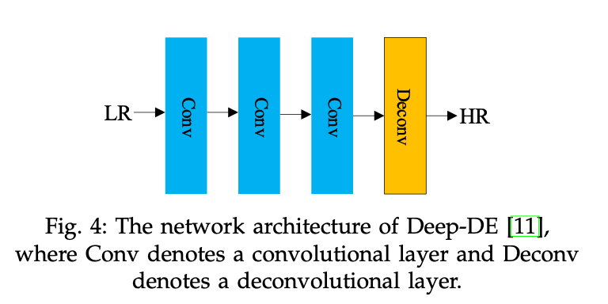

#### 2. VSRnet

基于图像超分SRCNN。3层卷积，除最后一个以外的其他每个卷积层后面是ReLU。VSRnet和SRCNN之间的主要区别在于输入帧的数量，SRCNN将单个帧作为输入，而VSRnet使用多个连续帧，这些帧是补偿帧。 帧之间的运动信息由`Druleas`算法计算得出[63]。 此外，VSRnet提出了一种filter symmetry renforcement（FSE）机制和**自适应运动补偿机制**，它们分别用于加速训练并减少不可靠的补偿帧的影响，从而可以提高视频超分辨率性能。

VSRnet采用Myanmar视频作为训练数据集，分辨率为3840×2160。在实验中，将原始视频下采样到960×540的分辨率作为GT。LR视频通过bicubic插值生成。

输入帧在引入网络之前先上采样，每次5帧输入网络，然后将帧转化为YCbCr颜色空间，Y通道用于训练网络和性能评估。

testing set: Vid4 dataset，由四种常用的视频组成（城市、日历、散步和落叶），四种食品的数量分别是34，41，47，49，分辨率704×576、720×576、720×480、720×480。

训练策略：预训练好的SRCNN初始化网络权重，以减少对大规模视频数据集的依赖。然后使用小型视频数据集进行训练，损失函数MSE。

#### 3. VESPCN

video efficient sub-pixel convolutional network

提出spatial motion compensation transformer (MCT)空间运动补偿转换模块用于运动估计和补偿。然后，将补偿后的帧放到一系列卷积层中，以进行特征提取和融合。最后，通过亚像素卷积层进行上采样以获得超分辨率结果。

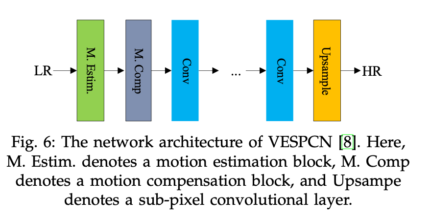

MCT模块采用CNN提取运动信息并进行运动补偿。 MCT使用coarse-to-fine**从粗到精**的方法来计算视频图像序列的光流。

首先，在粗略估计阶段，网络将两个连续的帧（即目标帧和相邻帧）作为输入。粗略估计网络由5个卷积层和一个子像素卷积层组成。它首先执行×2下采样操作两次，然后通过亚像素卷积层执行×4上采样操作，以获得粗略的光流估计结果。接下来，根据光流使相邻帧扭曲。

在精细估计阶段，目标帧，邻近帧，在粗糙阶段计算出的光流和扭曲的相邻帧作为精确估计网络的输入，精确细网络的结构类似于粗略网络。它首先进行×2下采样，然后在网络末端进行×2上采样以获得精确的光流，精确的光流与粗略的光流一起，获得最终的运动估计结果。

最终，相邻帧通过最终的光流估计再次扭曲，以使扭曲的帧与目标框帧对齐。

VESPCN使用从CDVL数据库收集的视频作为训练数据集，包括115个大小为1920×1080的视频，使用Vid4作为测试数据集。LR视频是通过对HR视频进行下采样得到的。输入帧数设置为3。损失函数由MSE损失和运动补偿损失组成，其中运动补偿损失在warped帧和目标帧上形式不同。网络使用Adam优化器训练，batch size是16，学习率$10^{-4}$。

#### 4. DRVSR

detail-revealing deep video super-resolution

亚像素运动补偿层（SPMC）可以根据估计的光流信息同时对相邻输入帧执行上采样和运动补偿操作。

DRVSR由三个主要模块组成：运动估计模块、运动补偿模块和融合模块。运动估计模块采用运动补偿变换器（MCT）用于运动估计，采用SPMC层进行运动补偿。SPMC 层由两个子模块组成，即坐标网络生成器和采样器。坐标网络生成器首先根据光流将LR空间中的坐标转换为HR空间中的坐标，然后采样器在HR空间中执行插值操作。融合模块主要包括编码器和解码器，在编码器中采用步长为2的卷积进行下采样，然后进行反卷积进行上采样，此外，融合模块还采用ConvLSTM模块处理时空信息。

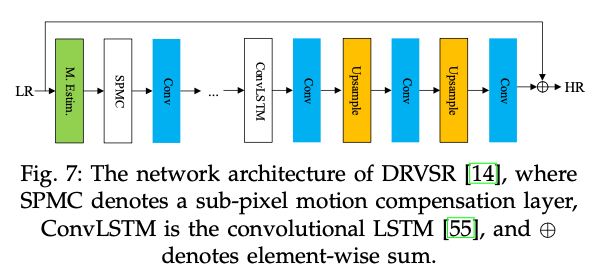

DRVSR的训练分为三个阶段。首先，利用运动补偿损失对运动估计模块进行训练。然后固定训练好的运动估计模块的参数，使用MSE损失训练融合模块。最后整个网络使用运动补偿损失和MSE损失进行微调。为了使训练过程稳定，DRVSR采用梯度裁剪策略来约束ConvLSTM的权重。优化器Adam，网络权重由Xavier初始化。

#### 5. RVSR

robust video super-resolution

空间对准模块和时间自适应模块。

- 空间对齐模块负责多帧对齐，使相邻帧与目标帧对齐。首先通过局部化网络估计相邻帧和目标帧之间的变换参数，然后基于获得的参数通过**空间变换层**[50]使相邻帧与目标帧对齐。局部化网络由两个卷积层和两个全连接层组成，每个卷积层后面紧跟着一个最大池化层。
- 时间自适应模块的特点是由超分辨率子网络的多个分支组成，每个网络负责处理时间尺度（即输入帧的数量），并输出相应的超分辨率结果。然后通过temporal modulation module时间调制模块为每个分支网络的超分辨率结果分配权重。最终的超分辨率结果是每个分支的超分辨率结果与相应权重的权重和。时间调制模块的输入帧数与超分辨率网络中的最大输入帧数相同，时间调制模块的网络结构与超分辨率网络相同，均采用ESPCN的网络结构

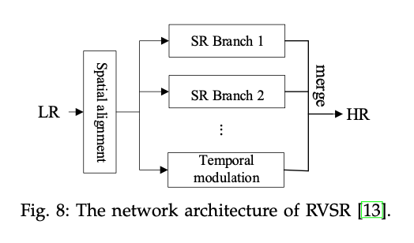

RVSR使用来自LIVE video quality assessment database、MCL-V数据库和TUM 1080p数据集的视频作为训练集，同时采用数据增广技术。Vid4、penguin（Pg）、temple（tp）和Ultra Video Group数据库作为测试集。输入帧数为5，patch size大小设置为30x30。

RVSR结合空间对齐模块和时空自适应模块的损失作为最终损失函数，其中时空自适应模块的损失是GT和网络输出之间的差值，而空间对齐模块的损失是GT变换参数和localization net估计出的变换参数之间的差值，其中GT变换参数通过校正光流对准获得。

#### 6. FRVSR

frame recurrent video super-resolution

主要特点是帧之间的对齐方法。不直接扭曲目标帧的前一帧，而是扭曲前一帧的HR版本。

详细的实现方法：光流估计网络计算从前一帧到目标帧的光流，然后通过双线性插值将LR光流上采样到与HR视频相同的大小。接下来，上一帧的HR版本通过上采样LR光流进行扭曲，然后通过空间到深度变换对扭曲的HR帧进行下采样以获得LR版本。最后，将扭曲HR帧和目标帧的LR版本送入后续的超分辨率网络中，得到目标帧的超分辨率结果。

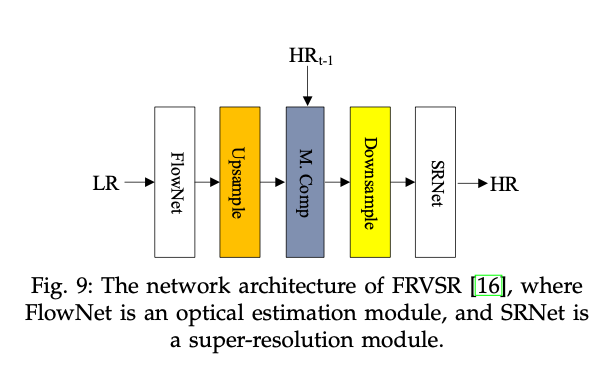

光流网络由14个卷积层、3个池化层和3个双线性上采样层组成。除了最后一个卷积层，每个卷积层后面跟着LeakyReLU激活函数，超分辨率网络由2个卷积层、2个x2的反卷积层和10个残差块组成，其中每个残差块由2个卷积层和一个ReLU激活函数组成。损失函数是MSE和运动补偿损失的组合，Adam作为网络的优化器，Vid4作为测试集。

#### 7. STTN

spatio-temporal transformer network

时空转换模块，用于解决以往光流方法只处理一对视频帧，当视频中存在遮挡和亮度变化时，可能导致估计不准确的问题。STTN可以同时处理多帧，克服了这个缺点。

STTN由三个主要模块组成：时空流估计模块、时空采样模块和超分辨率模块。

- 时空流估计模块是一个U型网络，类似于U-Net[57]，由12个卷积层和两个上采样层组成。首先4倍下采样，然后4倍上采样以恢复输入帧的大小。该模块负责连续输入帧（包括目标帧和多个相邻帧）的光流估计，最终输出是表示帧之间空间和时间变化的三通道时空流。
- 时空采样器模块实际上是一种三线性插值方法，负责对当前多个相邻帧执行扭曲操作，并根据时空流模块获得的时空流获得对齐的视频帧。
- 对于视频超分辨率模块，对齐的帧可以被送入超分辨率网络，用于特征融合和目标帧的超分辨率处理。

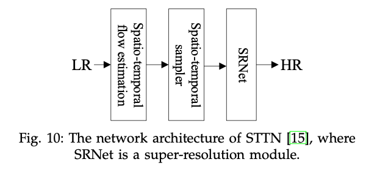

STTN采用MSE和运动补偿损失的组合作为其损失函数。

#### 8. SOFVSR

super-resolution optical flow for video super-resolution

用于视频超分的光流架构。使用OFNet由粗到细地估计帧之间的光流，最终产生高分辨率光流。然后通过空间-深度转换将HR光流转换为LR光流。相邻帧通过LR光流扭曲，与目标帧对齐。SRNet输入目标帧和扭曲帧，生成最终的超分结果，SRNet由2个卷积层，5个dense残差块和一个亚像素卷积层组成。

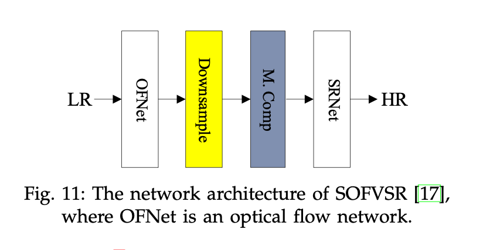

训练集：来自CDVL数据集的145个视频，验证集：Ultra Video Group数据集的7个视频，测试集：Vid4和10个来自DAVIS数据集的视频。

将RGB空间转为YCbCR空间，仅使用Y通道训练网络。输入3帧，patch size 32×32，使用了数据增广技术。损失函数为MSE和运动补偿损失函数，运动补偿损失函数包括三部分，分别对应OFNet的三个阶段，每个阶段使用当前的光流计算运动补偿损失。优化器Adam，初始学习率 $10^{-4}$ ，每50000次迭代后减少一半。

#### 9. TecoGAN

temporally coherent GAN

TecoGAN包括生成器和判别器，生成器将目标帧、前一帧和前一估计HR帧作为输入。

首先，输入帧被送入和FRVSR一样的CNN光流估计模块，该模块估计出目标帧和相邻帧之间的LR光流，并通过双三次插值放大LR光流以获得相应的HR光流。

然后，使用HR光流来扭曲前一帧，被扭曲的前一HR帧和目标帧被送入后续卷积层以产生恢复的目标帧。

此外，判别器评估超分辨率结果的质量。判别器将生成的结果和GT作为输入，其中生成的结果和GT具有三个分量，即三个连续HR帧、三个对应的上采样LR帧和三个扭曲HR帧。使用这种输入格式，可以缓解最终结果中的空间过度平滑和时间不一致。另外，TecoGAN提出了“ping-pong”损失函数，以减少长期时间细节偏差，使超分辨率结果更自然。

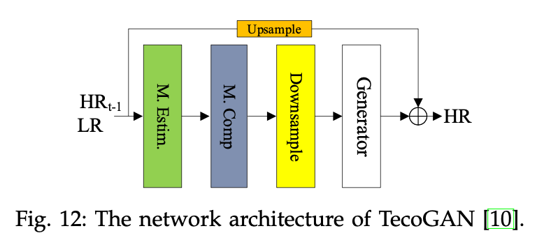

TecoGAN的损失函数包括6部分，MSE、对抗性损失、鉴别器的特征空间损失、感知损失、“乒乓”损失和运动补偿损失。优化器用Adam，测试集选用Vid4和Tear of Steel (ToS)。

与其他基于GAN的方法类似，训练使鉴别器无法区分HR图是GT帧还是生成的超分帧。虽然这些方法可以产生具有更好感知质量的HR视频，但PSNR值通常相对较低，突出PSNR在评估图像和视频质量方面的缺陷。

#### 10. TOFlow

task-oriented flow

TOFlow将用于光流估计的网络与重建网络相结合，并联合训练以获得适合于多个任务的光流，例如视频超分辨率、视频插值和视频去模糊。TOFLOW采用Spynet[49]作为光流估计网络，然后采用空间变换网络spatial transformer network根据计算的光流扭曲相邻帧。然后通过图像处理模块得到最终结果。

对于视频超分辨率任务，图像处理模块由4个卷积层组成，核大小分别为9×9、9×9、1×1和1×1，通道数分别为64、64、64和3。

TOFlow提出了一个新的数据集，称为Vimeo-90k（V-90k），用于训练和测试视频序列。V90K包含4278个视频，包括89800个不同的独立场景。TOFlow采用L1范数作为损失函数。对于视频超分辨率，TOFlow将7个上采样的连续帧作为输入。除了V-90K，TOFlow还使用Vid4作为测试数据集。

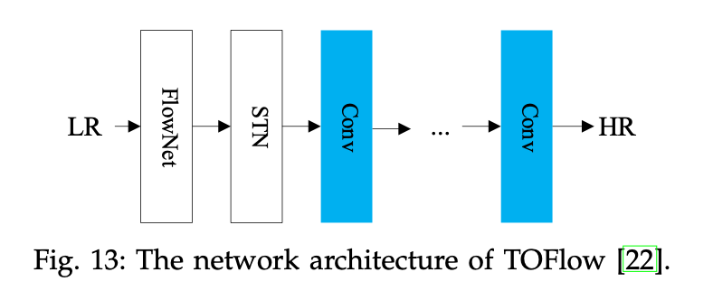

#### 11. MMCNN

multi-memory convolutional neural network

MMCNN包含5个主要的模块：光流估计，特征提取，多记忆细节融合，特征重构和亚像素卷积层。

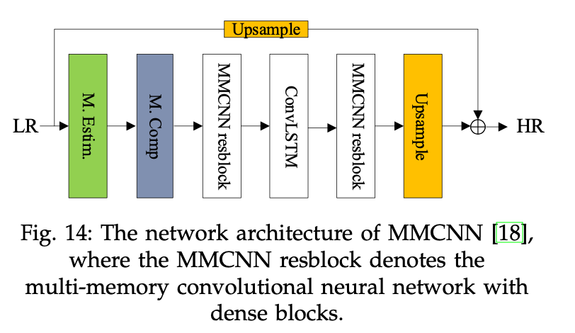

光流估计模块对连续的输入帧进行处理，使相邻帧与目标帧对齐，然后将扭曲帧送入后续网络模块中，以获得目标帧的最终超分辨率结果。

在multi-memory detail fusion module多记忆细节融合模块中，MMCNN采用ConvLSTM[55]模块对时空信息进行融合，而且特征提取、细节融合和特征重构模块都是基于residual dense blocks [41、59]构建的，它们的关键区别仅在于网络层的类型不同。

MMCNN采用VESPCN中的MCT 做运动估计和运动补偿。输入帧数设置为5，损失函数包括MSE和运动补偿损失。Myanmar测试集、YUV21和Vid 4用作测试数据集。

#### 12. RBPN

recurrent back-projection network

受反投影算法的启发，提出了循环反投影网络（RBPN），其结构如下图所示。

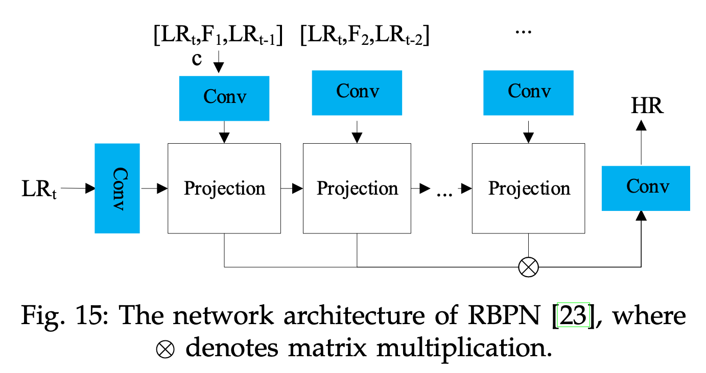

该网络由**特征提取模块、投影模块和重建模块**组成。

特征提取模块包括两个操作，一个是提取目标帧的特征，另一个是从目标帧、相邻帧和相邻帧到目标帧的光流中提取特征，然后隐式地执行对齐。光流由pyflow计算。

投影模块由编码器和解码器组成。在编码器中，将特征提取模块输出的两个特征图分别进行单图超分和多图超分处理。然后将两个结果的差分图输入残差模块，计算残差。最后，将残差结果和单图超分之和作为编码器的输出，输入进解码器。在解码器中，通过残差模块和下采样操作来处理输入，将输出（由目标帧、下一相邻帧和预先计算的光流结合产生）输入进下一个投影模块，将所有投影模块解码器的输出输入进重建模块，得到SR帧。投影是重复使用的，直到处理完所有相邻帧，这是“循环反投影网络”一词的原因。

RBPN采用DBPN[621]作为单图像超分辨率网络，采用ResNet和反卷积作为多图超分网络，使用Vimeo-90k [22]数据集作为训练集和测试集，同时使用数据增强技术。Batch size and patch size大小分别设置为8和64x64。L1范数损失和Adam分别作为损失函数和优化器初始学习率设置为$10^{-4}$，当总迭代执行一半时，学习率将降低到初始的十分之一。

#### 13. MEMC-Net

motion estimation and motion compensation network

运动估计和运动补偿网络，MEMC-Net提出了自适应扭曲层，通过运动估计网络估计出的光流和核估计网络的卷积核来扭曲相邻帧，并将相邻帧与目标帧对齐。

运动估计网络采用FlownNet [45]，kernel estimation network核估计网络采用改进的U-Net[57]，包括五个最大池化层、五个非池化层以及从编码器到解码器的skip connections。

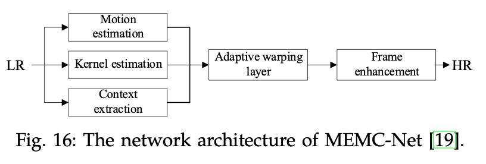

在MEMC-Net中，超分模块的架构类似于EDSR。此外，为了处理遮挡问题，它采用了预训练的ResNet18[63]提取输入帧的特征，同时将ResNet18的第一个卷积层的输出作为上下文信息提供给自适应扭曲层，以执行相同的扭曲操作。

MEMC-Net采用Vimeo-90k作为训练集和测试集，Charbonnier（Cb）函数作为损失函数，Adam[54]作为网络的优化器。Cb函数定义为：

$$
\mathcal L=\frac{1}{N}\sum\limits_{i=1}^{N}\sqrt{\lVert \hat{I}^i_t-I^i_t\rVert ^2_2+\epsilon^2}

$$

N表示batch size，$\epsilon$大小为0.001。

#### 14. RTVSR

real-time video super-resolution

采用运动卷积核估计网络，是一种全卷积编解码器结构，用于估计目标帧和相邻帧之间的运动，并生成与当前目标帧和相邻帧相对应的一对1维卷积核。然后利用估计的卷积核对相邻帧进行扭曲，使其与目标帧对齐。

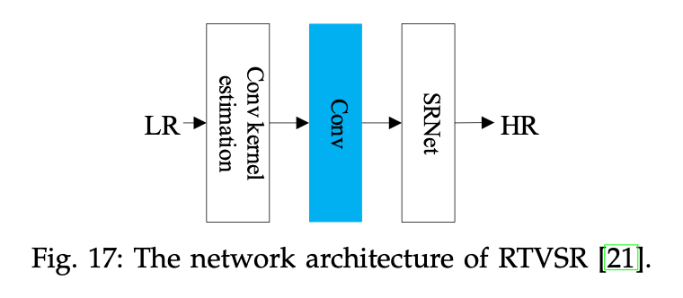

RTVSR首先采用运动卷积核网络对目标帧和相邻帧进行卷积核估计，并产生一对分别代表水平和垂直方向的1维卷积核。然后利用估计的卷积核对相邻帧进行扭曲。然后将扭曲帧和目标帧送入后续的超分辨率网络，得到目标帧的超分辨率结果。

RTVSR设计了一个基于[65]改进的称为门控增强单元（GEU）。它的特点是输出残差块不是输入和输出之间的元素相加，而是具有学习权重的输入和输出的总和。RTVSR使用来自Harmonicinc.com的261个分辨率为3840 × 2160的视频作为训练集，并采用数据增广来扩大训练集。GT视频是通过将原始视频降采样到分辨率960×540，Vid4用作测试集。使用Adam作为优化器，MSE作为损失函数。patch大小和批大小分别设置为96x96和64。

#### 15. MultiBoot

multi-stage multi-reference boot-strapping method，MultiBoot

MultiBoot有两个阶段：第一阶段的输出用作第二阶段的输入，以进一步提高性能。将帧输入到FlowNet 2.0以计算光流并进行运动补偿，然后将处理后的帧送入第一阶段网络，得到目标帧的超分辨率结果。

在第二阶段，前一阶段的输出被降采样，与初始LR帧连接，并输入到网络以获得目标帧的最终超分辨率结果。

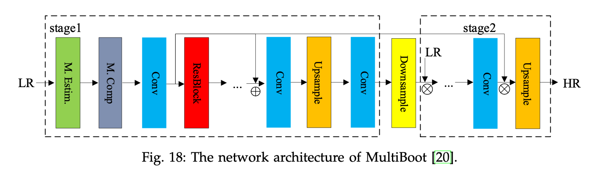

REDS作为训练集和测试集，数据增广。损失函数Huber loss：

$$
\mathcal H(I_t-\widetilde{I}_t) = 
\begin{cases}
\frac{1}{2}\Vert I_t-\widetilde{I}_t \Vert^2_2, & \Vert I_t-\widetilde{I}_t \Vert_1 \leq \delta\\
\delta\Vert I_t-\widetilde{I}_t \Vert_1-\frac{1}{2}, & otherwise
\end{cases}

$$

$I_t$ 表示HR图像，$\widetilde{I}_t$ 表示估计的HR图像，$δ = 1$ 是Huber损失函数从二次函数变为线性函数的点。

运动估计和运动补偿技术用于将相邻帧与目标帧对齐，是解决视频超分辨率问题最常用的方法。然而，他们存在的问题是不能保证运动估计的准确性，而准确的运动估计将直接影响到视频超分辨率的性能。因此，可变形卷积被提出作为深度网络中的一个模块来对齐帧。

### Deformable Convolution Methods

可变形卷积网络最早是由Dai等人于2017年首次提出，而改良版[80]在2019年提出。

在普通的CNN中，通常在每层中使用固定的几何结构，这限制了网络对几何变换进行建模的能力。相比之下，可变形卷积能够克服该限制。

**通过额外的卷积层映射输入特征图以获得offset偏移**。将偏移量添加到常规卷积核中以生成可变形卷积核，然后与输入特征图卷积，得到输出特征图。可变形卷积的图示如图所示。

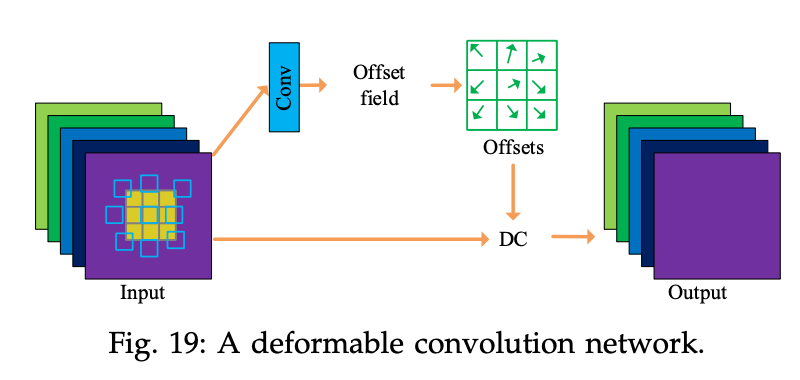

虽然可变形卷积增加了网络对空间变形的适应性，但计算量也增加了。采用可变形卷积的方法主要包括增强可变形视频恢复（EDVR）[24]、可变形非局部网络（DNLN）[25]和时域可变形对准网络（TDAN）[26]。

#### 1. EDVR

enhanced deformable video restoration

EDVR是NTIRE19挑战的冠军模型。它提出了两个关键模块：金字塔、级联和可变形对齐模块pyramid, cascading, deformable（PCD）和时空注意temporal-spatial attention融合模块（TSA），分别用于解决视频中的大运动和有效融合多帧。EDVR由PCD、TSA和重建模块三部分组成。

EDVR由三部分组成，包括PCD对准模块、TSA融合模块和重建模块。

首先，通过PCD对输入帧进行对齐，然后通过TSA对对齐的帧进行融合。然后将融合后的结果输入重建模块进行特征提取，再通过上采样得到残差HR图像，将残差HR图像加到直接上采样的目标帧中得到最终的SR帧，结构如下图所示。为了进一步提高性能，EDVR还采用了两阶段的方法，其第二阶段与第一阶段相似，但网络深度较浅。

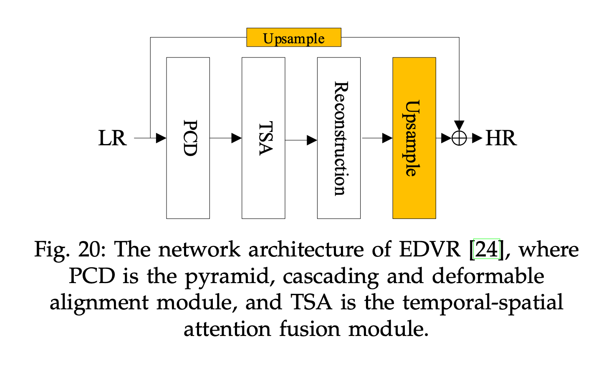

EDVR使用NTIRE19挑战中提出的真实动态场景（REDS）数据集作为训练集。数据集由300个分辨率为720×1280的视频序列组成，每个视频有100帧，其中训练集、验证集和测试集分别有240、30和30个视频。在实验中，由于无法获得测试集的GT，作者对其余视频进行了重新分组。作者选取了4个具有代表性的视频（REDS4）作为测试集，其余视频作为训练集进行数据增广。此外，EDVR采用Charbonnier函数作为损失函数，Adam作为优化器，它以五个连续的帧作为输入。patch size和batch size分别设置为64×64和32。初始学习速率设置为$4\times 10^{-4}$。

#### 2. DNLN

deformable non-local network

基于可变形卷积和非局部网络设计对齐模块和非局部注意模块。

对齐模块使用hierarchical feature fusion module (HFFB)，在原始可变形卷积内生成卷积参数。DNLN通过级联方式利用多个可变形卷积，使得帧间对齐更加精确。非局部注意模块将目标帧和对齐的相邻帧作为输入，通过非局部操作生成注意引导特征。

DNLN的整个网络由一个特征提取模块、一个对齐模块、一个非局部注意模块和一个重建模块组成，其中特征提取模块由一个卷积层和5个残差块组成。对齐模块由5个可变形卷积层组成，重建模块由16个dense残差块（RRDB）组成。特征提取模块首先提取目标帧和相邻帧的特征，然后将特征输入对齐模块，使相邻帧的特征与目标帧的特征对齐。然后将对齐特征和目标特征输入非局部注意模块，提取它们之间的相关性，再由重建模块对提取的相关性进行融合。重建模块的输出被添加到目标帧的特征中，最终由上采样层生成最终超分结果。

VimLReo-90K训练集，数据增广技术。LR通过HR 4倍下采样生成。Patch size 50×50，Adam优化器，L1范数作为损失函数。

#### 3. TDAN

temporally deformable alignment network

TDAN[26]将可变形卷积应用于目标帧和相邻帧，并获得相应的偏移。然后，根据偏移量扭曲相邻帧以与目标帧对齐。

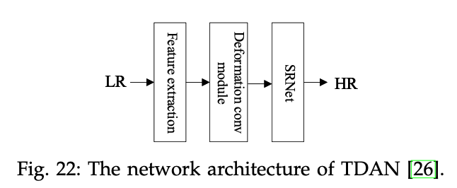

TDAN可分为两部分，对准模块和重构模块。在对齐模块中，目标帧和相邻帧作为输入。然后由卷积层和residual blocks组成的特征提取层分别提取它们的特征，然后将得到的特征拼接。

连接的特征被送入bottleneck层，以融合特征并减少通道数量。

然后将输出送入具有可变形卷积的偏移生成器，以生成相应的偏移。然后利用生成的偏移量对相邻特征映射进行可变形卷积，得到对齐的特征映射。

然后通过卷积层处理对齐的特征映射，以获得对齐的低分辨率帧，同时将低分辨率帧与目标帧连接。最后，将拼接结果输入到重构模块（一个通用的超分辨率网络）中，以输出每个目标帧的超分辨率结果。

TDAN采用Vimeo-90K作为训练集，使用L范数损失和运动补偿损失的组合作为损失函数，Adam作为优化器。初始学习速率设置为$10^{-4}$，将五个连续帧作为输入。patch大小和批大小分别设置为48×48和64。

## Spatial Non-Aligned Methods

与对齐方法不同，非对齐方法在重建前不执行帧对齐。输入帧不通过例如帧间的运动估计和运动补偿进行对齐操作，而是直接输入二维卷积网络，在空间上进行特征提取、融合和超分运算。空间非对齐方法使网络能够自己学习帧内的相关信息，从而进行超分重建。

#### 1. VSRResNet

使用GAN超分，通过对抗性训练获得了不错的效果。

生成器由三个3 × 3卷积核和残差块组成，其中残差块是2个3 × 3卷积层，每个层后面跟着一个ReLU激活函数。

判别器由三组卷积组成，Batch Normalization BN，LeakyReLU，全连接层。

生成器的输入帧不与多个帧完美对齐，而是上采样后直接送入网络。它首先对多个帧中的每一帧执行3×3卷积运算，然后将输出连接并通过卷积层进行特征融合。融合后的特征被送入multiple consecutive residual blocks，最后由3×3卷积层产生超分结果。

判别器用于确定生成器的输出是生成图像还是GT图像。然后，判别器的结果作用于生成器，使其产生更接近GT图像的结果。最后通过迭代优化得到相对满意的结果。

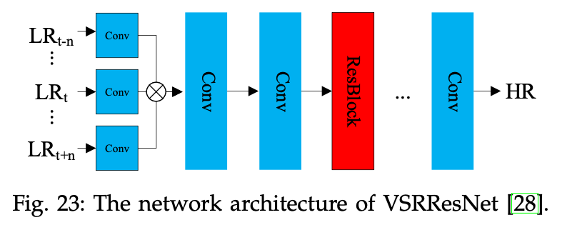

对于网络的训练，首先训练生成器，然后联合训练生成器和判别器。VSRResNet的损失函数由对抗损失、content loss内容损失和感知损失组成，由VGG[75]提取生成图像和对应的GT图像的特征，然后利用提取的特征通过CB损失函数计算损失。内容损失表示在生成结果和GT之间计算的CB损失。

VSRResNet训练集Myanmar，测试集Vid4，优化器Adam，输入帧数量为5，batch size64。

#### 2. FFCVSR

frame and feature-context video super-resolution

FFCVSR利用帧间信息的方式与正常运动估计和运动补偿技术不同，低分辨率的未对齐视频帧和前一帧的高分辨率输出直接作为网络的输入，以恢复高频细节并保持时间一致性。

FFCVSR由局部网络和上下文网络组成，其中局部网络由5个卷积层、1个反卷积层和8个残差块组成，每个残差块由2个卷积层和一个skip connection组成。局部网络负责根据LR输入帧生成相应的特征和HR目标帧。上下文网络由5个卷积层、1个反卷积层、4个剩余块和2个空深转换层组成。

此外，简单地将先前恢复的HR帧输入到下一上下文网络会导致抖动和锯齿伪影，解决方法是对于每个T帧序列，当前局部网络的输出用作前一上下文网络的输出。这种方法称为抑制更新算法。

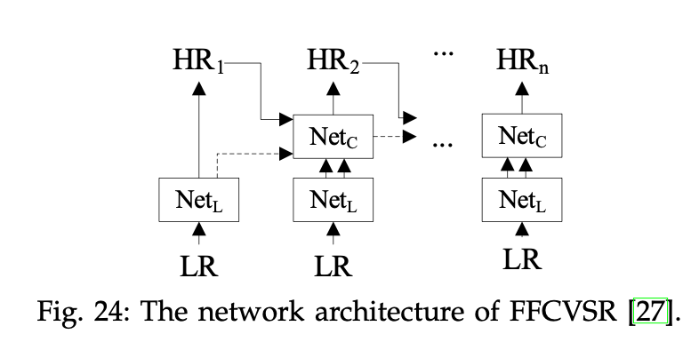

训练集： harmonicinc.com，包括Venice和Myanmar，分辨率4k，测试集Vid4。损失函数MSE，优化器Adam，初始学习率$10^{-4}$。

## Spatio-Temporal Non-Aligned Methods

### 3D Convolution Methods

与2D卷积相比，3D卷积模块[76，77]可以在时空域上操作，2D卷积仅通过输入帧上的滑动卷积核利用空间信息。通过提取时间信息来考虑帧之间的相关性有利于视频序列的处理。3D卷积的流程图如图25所示，具有代表性的3D卷积方法包括DUF [29]、FSTRN [32]和3DSRnet [31]。

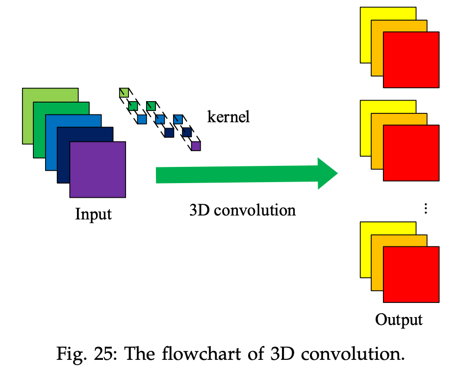

#### 1. DUF

dynamic upsampling filters动态滤波器网络[78]可以为特定的输入生成相应的滤波器，然后应用它们来生成相应的特征图。DUF动态上采样滤波器的结构结合了三维卷积学习的时空信息，避免了运动估计和运动补偿的使用。

DUF不仅执行滤波，还执行上采样操作。为了增强超分辨率结果的高频细节，DUF使用一个单独的网络来估计目标帧的残差图。SR图是残差图和动态上采样滤波器处理后的帧的总和。

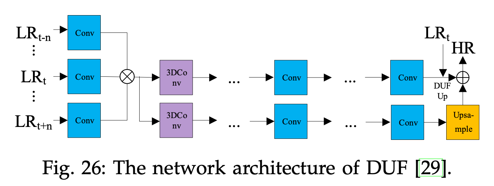

DUF还提出了一种基于时间轴的视频数据增强方法。通过对不同时间间隔的帧进行顺序或相反顺序的采样，可以得到不同运动速度和方向的视频。在实验中，DUF使用Huber函数作为其损失函数，其中δ=0.01。Adam用作优化器，初始学习速率设置为$10^{-3}$。

#### 2. FSTRN

fast spatio-temporal residual network

使用调整后的3D卷积来提取连续帧之间的信息。一个k × k × k的3D卷积核分解为2个大小分别为1×k×k和k×1×1的级联卷积核，以减少使用3D卷积直接导致的计算量。

STRN由以下四部分组成：一个LR视频浅层特征提取网络（LFENET）、快速时空残差块（FRB）、一个LR特征融合和上采样SR网络（LSRNET）和一个全局残差学习（GRL）模块。

- LFENET由C3D层组成[76]，该层对连续LR输入帧特征提取。
- FRB由多个FRB组成，每个FRB由一个PReLU激活函数和2个分解的3D卷积层组成。它负责提取输入帧之间的时空信息。
- LSRNET由个C3D层和一个反卷积层组成，负责融合前几层的信息并进行上采样。
- GRL由LR空间残差学习（LRL）和跨空间残差学习（CRL）组成，其中LRL在FRBS的开始和结束时使用，以提高特征提取的性能，CRL用于将上采样的LR输入帧传送到整个网络的输出，然后两者相加得到最终的SR结果。此外，FSTRN在LRL之后采用了一个dropout层，以增强网络的生成能力

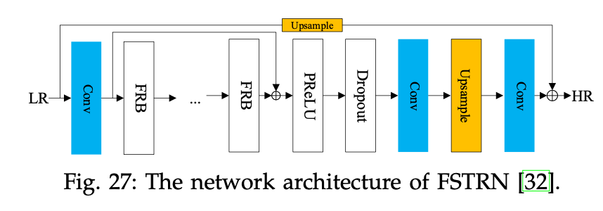

在实验中，FSTRN使用25个YUV格式的视频序列作为训练集，使用[79]中的视频作为测试集（包括舞蹈、旗帜、帆船、跑步机和涡轮机）。输入帧数为5。Cb函数用作损失函数，Adam优化器。初始学习率设置为$10^{-4}$，批量大小设置为144×144。

#### 3. 3DSRnet

3D super-resolution network

3DSRnet使用3D卷积来提取连续视频帧之间的时空信息，用于视频超分辨率任务。

随着网络的深入，三维卷积后的特征图深度也会变浅。为了保持深度和保留时间信息，3DSRnet采用外插extrapolation operation，在连续帧的开始和结束处分别添加一帧。

此外，3DSRnet在实际应用中提出了一种场景变换方法，使用提出的一种分类浅层网络来判断输入的连续帧。如果在当前帧中检测到场景更改，它将被具有相同场景且最接近当前帧的帧替换。被替换过的序列被发送到随后的视频超分辨率网络，该方法有效地解决了场景变化引起的性能下降问题。

在实验环境中，3D卷积函数的核大小为3×3×3。3DSRnet使用MSE作为其损失函数，Adam作为优化器，Xavier作为权重初始化方法，输入帧数为5。

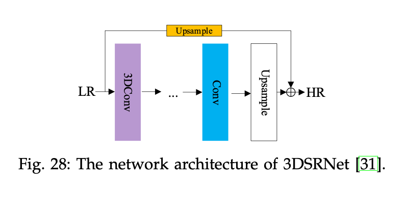

简言之这些3D卷积方法提取连续帧之间的时空相关性，而不是使用运动估计以提取帧之间的运动信息，并进行运动压缩以对齐帧。然而，它们存在计算量相当大的问题。

### Recurrent Convolutional Neural Networks

RCNN在自然语言、视频、音频等序列数据处理的建模中具有很强的时间依赖性。因此可以使用在视频超分领域中。但是本文没有介绍性能很好的RSDN、RRN等网络。

#### 1. STCN

spatio-temporal convolutional network

使用LSTM提取帧内的时间信息。与RISTN[35]类似，该网络由三部分组成：一个空间模块、一个时间模块和一个重建模块。

首先输入多个连续的上采样LR视频帧到空间模块中对每一帧进行卷积以提取特征。然后将输出发送到时间模块中的BMC-LSTM的递归层以提取时间相关性（BMC-LSTM：LSTM的双向多尺度卷积版本）。最后，执行卷积以获得目标帧的HR结果。

空间模块由20层3×3卷积核的卷积组成，卷积核的数量64。时间模块有三层，每层由多个BMC-LSTM子模块组成。

输入帧5帧，在这种情况下，相应的空间模块由5个分支组成，每个分支有20个卷积层。时间模块3层，每层有5个BMC-LSTM子模块。重构模块由1个卷积层组成，STCN采用MSE作为其损耗函数。具体而言，损失函数计算相邻帧的重建结果与其相应HR帧之间，以及目标帧的重建结果与其相应HR帧之间的差异。训练期间，在训练期间，通过将平衡参数从1逐渐衰减到0来控制相邻帧的损失在其总损失中的权重。STCN使用Adam作为优化器，批量大小为64，初始学习率为$10^{-4}$。

#### 2. BRCN

bidirectional recurrent convolutional network

利用RCNN的适合处理序列数据的独特优势，来处理连续帧之间的依赖关系。

BRCN由前向子网和反向子网两个模块组成，结构相似，只是处理顺序不同。首先定义 $X_i，i=1,2,\cdots,T$ 为通过常规双三次方法插值的一组低分辨率视频帧。在前向子网中，隐藏层中每个节点的输入来自三个部分：前一个节点在当前时间i的输出，在时间i-1时的输出，当前层中前一个节点的输出。这3个输出都是由相应的卷积运算得到的，分别为前馈卷积，条件卷积，循环卷积。前馈卷积用于提取空间相关性，而其他两个卷积用于提取连续帧之间的时间相关性。最后，整个网络的输出是两个子网络输出的组合：

- 前向子网：当前时间的前馈卷积输出和时间i−1的条件卷积输出。
- 反向子网：当前时间的前馈卷积输出和时间i+1的条件卷积输出。

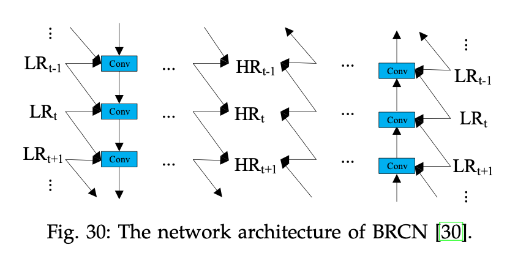

使用25个YUV格式的视频序列作为训练集，[79]中的视频序列作为测试集。patch size大小为32×32，输入帧数为10，损失函数MSE。通过随机梯度下降法（SGD）对网络进行优化。

#### 3. RISTN

residual invertible spatio-temporal network

它受可逆块 [81] 的启发，设计了用于有效提取视频帧空间信息的剩余可逆块（RIB）、用于提取时空特征的具有残差dense卷积的LSTM和用于自适应选择有用特征的稀疏特征融合策略。

网络分为三个部分：一个时间模块、一个空间模块和一个重建模块。

- 空间模块：主要由多条并行RIB组成，其输出作为时间模块的输入。
- 时间模块：在提取时空信息后，采用稀疏融合策略对特征进行选择性融合。
- 重建模块：反卷积重建出目标帧的HR结果。

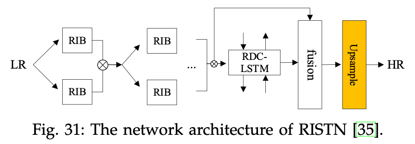

在实验中，RISTN从Imagenet数据集中随机选择50K图像对空间模块进行预训练，然后使用从699pic.com和Vimeo.com收集的192个分辨率为1920 X 1080的视频作为训练集。使用MSE作为其损失函数，稀疏矩阵由L1范数正则化项约束。此外，输入帧的数量设置为5。超分辨率倍数为4，Vid4是测试集。

#### 4. RRCN

residual recurrent convolutional network

本质是双向循环神经网络学习残差图像。RRCN提出了一种非同步全循环卷积网络，其中非同步指的是多个连续视频帧的输入只有中间一个是超分辨率的。

使用组合局部全局和总变量(GLG-TV) 的方法对目标帧及其相邻帧进行运动估计和补偿。补偿帧用作网络的输入，前向网络中使用前向卷积，后向网络中使用循环卷积，将二者输出相加。最后，通过在输入中添加目标帧来获得结果。为了进一步提高性能，RRCN还采用了自集成self-ensemble策略，并将其与单图像超分辨率方法EDSR+[64]的输出相结合，分别获得了名为RRCN+和RRCN++的两个模型。

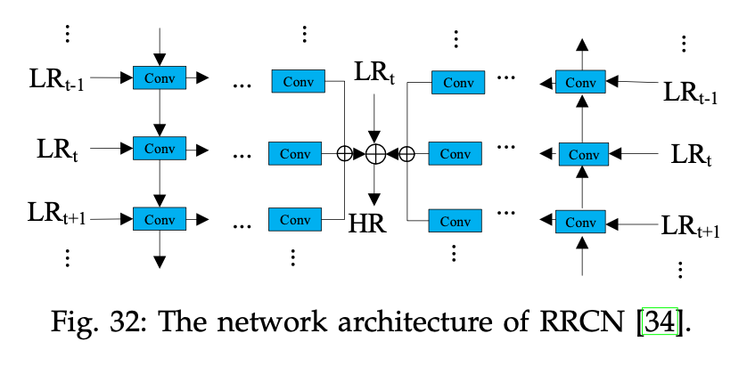

RRCN由15个卷积层组成，除最后一层外，其他层的前向卷积使用3×3卷积核和32个特征映射。在最后一层，使用3×3卷积核，但特征映射的数量取决于最终的输出格式。循环卷积采用1×1核和32个特征映射。此外，RRCN使用Myanmar视频作为训练集，并使用Myanmar、Vid4和YUV21作为测试集。损失函数MSE，RMSProp用作优化方法。输入帧数为5，patch size大小为81×81。上采样和补偿的LR帧用作RRCN的输入。

### Non-Local Methods

基于非局部的方法是另一种利用视频帧中的空间和时间信息实现超分辨率的方法。该方法得益于（用于捕获视频分类的长距离相关性）非局部神经网络[73]的关键思想。它克服了卷积和循环计算局限于局部区域的缺陷。直观地说，非局部操作是计算位置的响应值，该值等于输入特征图中所有可能位置的权重和。

$y_i=\frac{1}{\mathcal C(x)}\sum\limits_{\forall j}f(x_i,x_j)g(x_j)$

其中i是需要计算响应值的输出位置索引，j是所有可能位置的索引，x和y分别是具有相同维数的输入和输出数据，f是计算i和j之间相关性的函数如高斯、点乘等，g是计算输入特征的函数，$\mathcal C(x)$是归一化因子。这里g通常定义为：$g(x_j)=W_gx_j$，其中$W_g$是需要计算的权重，下图给出了上述过程建立的相应卷积计算。其中f是embedded Gaussian函数。

$f(x_i,x_j) = e^{\theta(x_i)^T \phi(x_j)}$

其中， $\theta(x_i) = W_\theta x_i, \phi(x_j) = W_\phi x_j, \mathcal C(x) =\sum\limits_{\forall j}(x_i,x_j)$

非局部块可以很容易地加入到现有的深度卷积神经网络中。虽然非局部网络能够有效地捕获时空信息，但和3D卷积一样，不足之处在于计算量大。

#### 1. PFNL

progressive fusion non-local

基于非局部块的一种典型方法是渐进式融合非局部（PFNL）[36]方法，如图34所示。

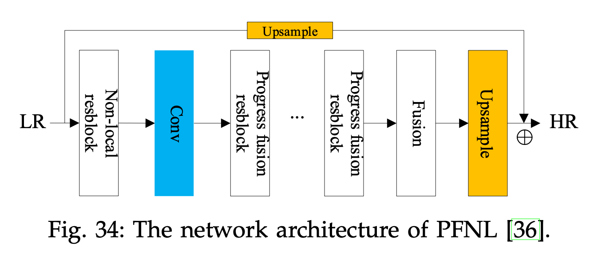

PFNL使用非局部残差块来提取时空特征，并提出渐进式融合残差块（PFRB）来进行融合。最后，通过亚像素卷积层的输出加到通过双三次插值上采样的输入帧中，得到SR图像。

PFRB由三个卷积层组成。首先，对输入帧进行3×3卷积，串联后通过1×1卷积降低通道维数。并将结果分别与之前的卷积特征图串联，进行3×3卷积。

最后的结果被加到每一个输入帧中，得到当前PFRB的输出。此外，为了减少PFRB叠加带来的参数增加，PFNL采用了通道参数共享机制，有效地平衡了参数个数与网络性能之间的权衡。损失函数为Charbonnier函数，使用Adam作为优化器，初始学习速率为$10^{-3}$。

## Performance Comparison

从PSNR和SSIM两方面总结了具有代表性的视频超分方法，放大因子包括2、3、4，退化类型为带图像resize function的双三次下采样(BI)和高斯模糊下采样(BD)。

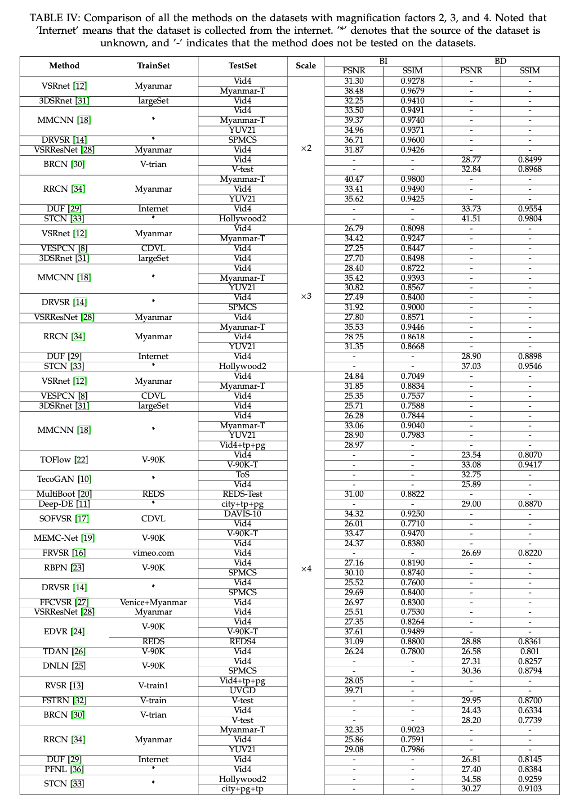

## Trend and Challenge

虽然基于深度学习的SoTA视频超分方法已经取得了很大的进展，尤其是在一些公共数据集上，但仍然存在一些挑战。

### 1. 轻量化超分模型

虽然基于深度学习的视频超分辨率方法具有较高的性能，但由于其模型参数庞大，需要大量的计算和存储资源，训练时间长，难以在实际问题中有效部署。随着移动设备在现代生活中的流行，人们希望能在移动设备上应用这些模型。如何设计和实现一个高效且轻量的模型用于实际应用是一个挑战。

### 2. 模型的可解释性

深度神经网络通常被认为是黑盒，也就是说，在现有的视频超分辨率模型中，无论性能是好是坏，我们都不知道模型学习到了什么真正的信息，在现有的视频超分模型中，卷积神经网络如何超分低分辨率视频序列还没有一个理论解释。

随着对深度神经网络可解释的深入研究，包括视频和图像超分辨率方法在内的超分辨率算法的性能可能会有很大的提高。

### 3. 大尺度视频超分辨率

对于视频超分任务，现有的工作主要集中在放大倍数为4的情况下。而更具挑战性的尺度，如x8和x16，很少有研究。随着高分辨率(如4K、8K和16K)显示器件的普及，更大倍数的超分辨率有待进一步研究。显然，随着规模的增大，视频序列中未知信息的预测和恢复面临着更大的挑战。这可能会导致算法的性能下降，模型的鲁棒性下降。因此，如何开发稳定的深度学习算法以获得更大规模的视频超分辨率仍然是一个重要的问题。

### 4. 更合理、更恰当的视频质量退化处理

在现有的工作中，一般通过两种方法获得退化的LR视频。一种是使用插值(如双三次插值)直接对HR视频进行下采样；另一种方法是对HR视频进行高斯模糊，然后对视频序列进行下采样。虽然这两种方法在理论上都表现得很好，但在实践中总是表现不佳。

众所周知，真实世界的退化过程非常复杂，包括许多现实问题中的不确定性，模糊和插值不足以对真实问题建模。因此，在构建LR视频时，在理论上对退化进行建模时应符合实际情况，以缩小研究与实践之间的差距。

大多数最先进的视频超分辨率方法都是有监督学习。由于降质过程是复杂的和HR/LR对获取是比较难获取的。或许无监督的超分方法可能会成为解决这个问题的一个方法。

### 5. Unsupervised Super-resolution Methods

大多数最先进的视频超分辨率方法都是有监督的学习方法。深度神经网络需要大量成对的LR和HR视频帧进行训练。然而，这样的配对数据集在实践中很少且成本很高。虽然可以合成LR/HR视频帧，但由于退化模型过于简单，无法刻画真实问题，导致HR/LR数据集不准确，因此超分辨率方法的性能仍然不能令人满意。

### 6. 更有效的场景切换算法

现有的视频超分辨率方法很少涉及场景变化的视频。实际上，视频序列通常有许多不同的场景。在设计视频超分辨率算法时，视频被分割成多个片段，没有场景变化和单独处理。这可能会导致计算时间激增。因此，能够处理场景变化的视频的深度学习方法对于实际应用是很有必要的。

### 7. 更合理的视频质量评价标准

评价超分辨率质量的标准主要有PSNR和SSIM。然而，它们的值不能反映人类感知的视频质量。也就是说，即使视频的PSNR值非常高，视频对人类来说也不一定质量好。因此，需要开发与人类感知一致的新视频评价标准。虽然研究人员已经提出了一些评价标准，但仍然需要更多可被广泛接受的标准。

### 8. 利用帧间信息的更有效方法

视频超分辨率的一个重要特征是利用帧间信息。是否能有效利用帧间信息直接影响超分算法的性能。尽管已经提出了许多方法，但他们仍然存在一些缺点。例如，3D卷积和non-local modules非局部模块计算量非常大，光学估计的精度得不到保证。因此，能够有效利用帧间信息的方法值得进一步研究。

## Conclusions

本文回顾了近年来视频超分辨率深度学习的研究进展，对现有的视频超分辨率算法按照帧内信息利用的方式进行了分类。

虽然基于深度学习的视频超分辨率算法已经取得了很大的进展，但是仍然存在一些潜在的和有待解决的问题，我们总结了八个方面。深度学习的发展已经进入了一个充满挑战的时期。随着研究人员的进一步探索，相信上述问题是可以进一步解决的。
