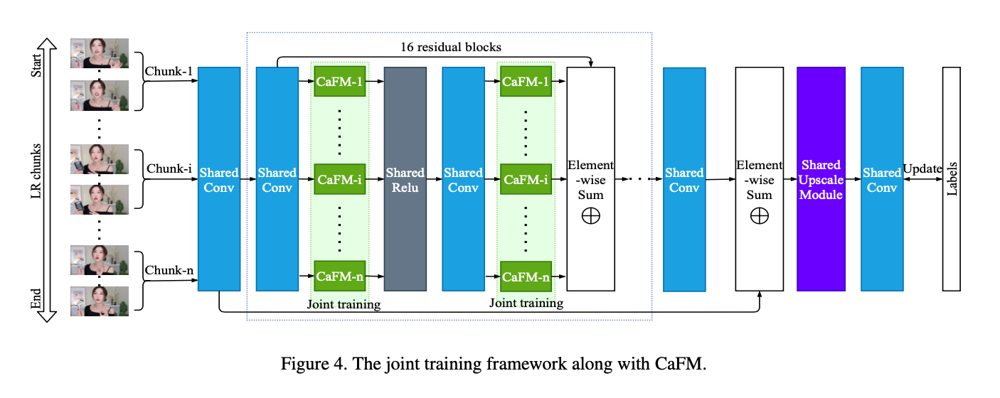

# 过拟合超分CaFM

Overfitting the Data: Compact Neural Video Delivery via Content-aware Feature Modulation

北邮，Intel中国

## 摘要

将视频划分为块，并将LR视频块和相应的内容感知模型传输到客户端。客户端超分LR块。因此大量模型需要传输。

首先仔细研究了不同块的模型之间的关系，然后设计了一个联合训练框架以及内容感知特征调制CaFM层来压缩这些模型。

每个视频块仅需要原始参数量的1%，还实现了更好的超分性能。

初步实验表明，在相同的存储下，比H.264和H.265的视频质量更好。

## 一、简介

### 1.1 Motivation

### 1.2 效果

### 1.3 Contributions

## 二、相关工作

### 2.1

### 2.2

### 2.3 Neural Video Delivery

Yeo，2018年提出Neural adaptive content-aware internet video delivery（NAS），能够解决带宽受限时视频质量变差的问题。video quality degradation problem when bandwidth becomes congested。NAS在相同的贷款在能够提高QoE 43.08%，在相同的QoE下能够节省17.13% 的带宽。

NAS的核心思想是利用DNN的过拟合特性，提高训练精度使性能增强。

NAS已用于UAV video streaming，Live Streaming，360 Video Streaming，Volumetric Video Streaming和Mobile Video Streaming。

## 三、方法

NAS方法使用LR视频和内容感知模型取代传统视频传输中的HR视频。整个过程分为三步：

1. 在服务器上为视频块训练模型；
2. 传输LR块和内容感知模型到客户端；
3. 在客户端超分。

将视频分为n个块，训练n个EDSR模型，其feature maps 如图。

计算余弦距离发现，虽然用不同的视频块训练不同的模型，但是 $f_{1,j,k}$ 和 $f_{2,j,k}$ 之间的关系近似线性的。**因此可以共享大部分参数**。然后使用CaFM使每个DNN专有化。

然而，这样需要为每个视频块传输一个模型，额外的带宽消耗。所以引入CaFM模块，但是对每个视频块微调CaFM模块效果并不好。

### 3.1 Content-aware Feature Modulation

将CaFM表示为通道线性函数：

$$
CaFM(x_j)=a_j*x_j+b_j,0<j<C
$$

使用CaFM来调整baseline模型每个滤波器的输出特征。以EDSR为例，CaFM的参数约占EDSR的0.6%。因此，一个有n个块的视频，可以将模型的大小从n个EDSR减少到1个共享EDSR加上n个专用的CaFM。

### 3.2 联合训练框架

与单独训练的模型相比，对每个专有的CaFM模块进行微调效果并不好，所以设计了一个联合训练框架，同时训练所有的模型，$I_{SR}^{i,s}=g(I_{LR}^{i,s},W_s,W_i)$，其中 $W_s$ 代表共享的参数，$W_i$ 代表第i个视频块专有的CaFM参数。

## 四、实验

因为CaFM可以应用于不同的SR，所以用不同的SR网络做了大量的实验，（EDSR、VDSR、ESPCN和SRCNN）。

这里以EDSR为例，将CaFM模块加到EDSR中每个卷积层的输出后，其中CaFM为1×1 depth-wise卷积，EDSR可以相应的修改为不同的SR网络。

- External learning：

EDSR和EDVR等，在大规模数据集上训练，并使用训练后的DNN超分LR输入帧。叫外部学习。

- Content-aware learning：

对于neural video delivery，视频提前就知道了，所以可以训练一个过拟合模型，每个视频匹配一个模型，从而使SR性能更好。

### 4.1 数据集

由于Vimeo-90K和REDS仅由相邻帧序列组成，不适用于视频传输。

### 4.2 模型设置

### 4.3 实验结果

与H.264和H.265对比结果：

### 4.4 消融实验

## 五、总结

## 六、思考
