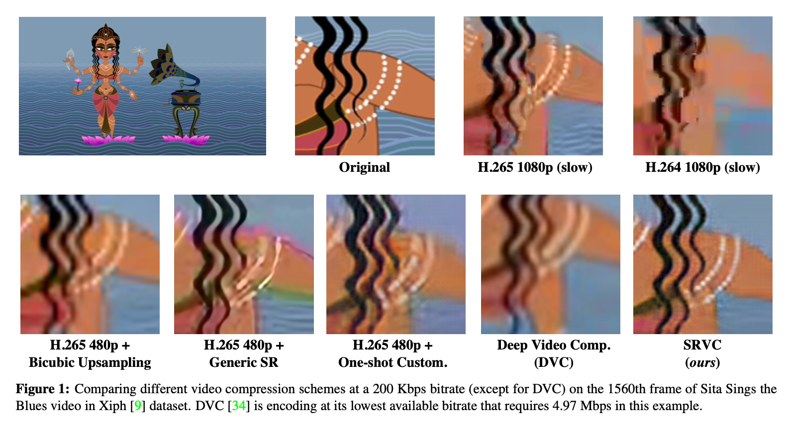
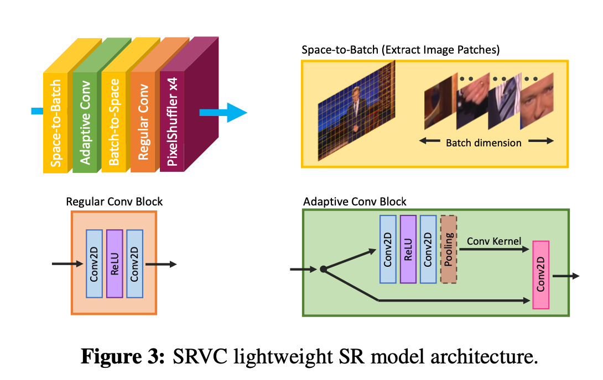

# 过拟合超分

Efficient Video Compression via Content-Adaptive Super-Resolution

MIT

## 摘要

视频压缩。通过小型的、内容自适应的超分模型来增强现有的视频编解码器，从而提高视频质量。

SRVC编码端将视频编码为两个流：

1. 内容流：使用现有的编解码器压缩下采样的低分辨率视频
2. 模型流：周期性更新，为视频短片段定制的轻量级超分模型。

解码端将低分辨率视频帧解码，然后用（time-varying）时变超分模型重建HR帧。

结果表明，达到相同PSNR的情况下，SRVC比H.265节省了20%bpp。而DVC仅能减少3%。

SRVC在NVIDIA V100 GPU上每秒90帧。

## 一、简介

### 1.1 Motivation

### 1.2 效果

### 1.3 Contributions

## 二、相关工作

### 2.1

### 2.2

### 2.3

## 三、方法

SRVC 将视频压缩为两个流：

1. 内容流

编码器下采样输入视频帧，使用基于区域的下采样。然后使用现成的视频编码器编码LR帧。解码器解码出来LR帧，然后超分。整个过程有损的。

2. 模型流

第二个比特流，对SR模型进行编码。将视频分为短片段，然后为每一段适配SR模型。编码器训练SR模型以将该段LR解码帧映射到高分辨率帧。

编码模型流时，t 时刻使用 t-1 时刻的模型参数 $\Theta_{t-1}$ 初始化 $\Theta_t$，然后编码的时候仅编码 $\Delta_t=\Theta_{t}-\Theta_{t-1}$。

模型流会增大整个传输的比特流，为了减少这个开销，设计了一个非常适合特定内容的SR小模型。同时还设计了一个算法，仅训练对SR质量有最大影响的一小部分参数，显著降低了模型自适应的开销。

### 3.1 轻量化模型架构

轻量级的网络，但是在基于内容的适应方面非常有效。受bicubic启发，bicubic只使用一个卷积层和一个固定的核对整张图像上采样，而这里的轻量化模型使用一样的架构，只是将固定核替换为针对输入帧的不同区域定制的空间自适应核。

将每帧图像分为不同的patch，为每个patch生成不同的空间自适应核，使用浅层CNN处理patch。

具体：

- 使用space-to-batch生成不同的patch，
- patch-specific block（Adaptive Conv Block）计算3×3卷积，输入3通道，输出F通道，2层CNN。
- 集合这些特征patch（batch-to-space），最后使用两层CNN和一个pixel shuffler（depth-to-space）。

### 3.2 模型自适应和编码

L2损失。在训练过程中，在每个维度上随机裁剪样本大小的一半。

为了减少传输的模型的大小，仅更新最重要的参数。梯度最大的参数。

首先，在每个新视频片段的开头保存模型的备份，并对新视频片段中的所有帧迭代训练一次，然后选择一部分（变化最大的）参数在下一次迭代中更新。

编码时，记录索引和模型参数的变化，将模型更新编码为比特流。模型编码是**无损的**。这样压缩下来，对1080p视频，仅需要使用82 Kbits/sec的码流。Netflix建议在1080p分辨率下的带宽为5 Mbits/sec，所以码流实际上是很小的。模型可以用有损压缩或者根据场景动态变化选择更少一部分参数，进一步压缩。

问题：训练每分钟视频需要12分钟。通过在V100 GPU上并行训练5组，相当于每分钟视频需要2.5分钟。仅对于离线压缩场景可行。

未来一步，通过一些技术（例如，对采样帧而不是所有帧进行训练）和进一步的工程设计，编码速度有很大的提升空间。

## 四、实验

### 4.1 数据集

### 4.2 模型设置

### 4.3 实验结果

### 4.4 消融实验

## 五、总结

## 六、思考
